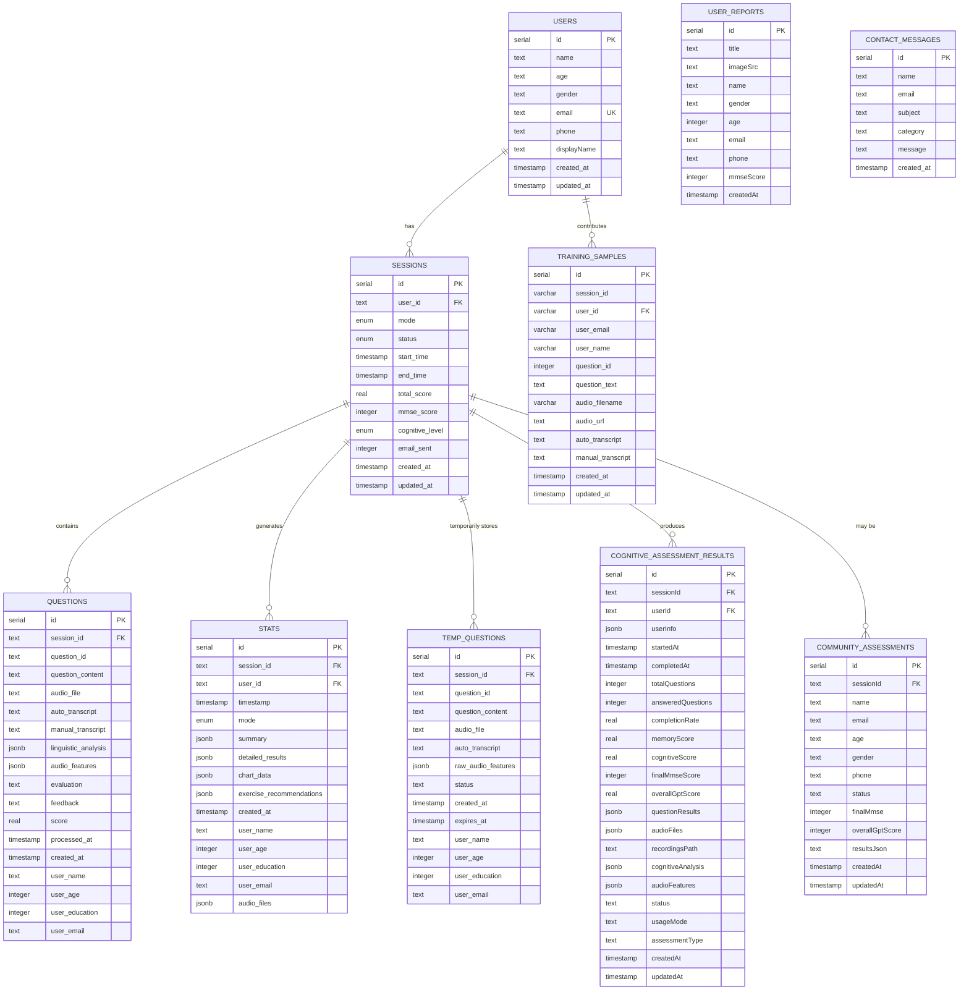

# PHẦN 3: DATABASE SCHEMA

## 1. Database Overview

**Database Type:** PostgreSQL (Neon)  
**ORM:** Drizzle ORM  
**Migration Tool:** Drizzle Kit  
**Migration Files Location:** `frontend/drizzle/*.sql`

## 2. Database Tables

### 2.1. Enums

```sql
CREATE TYPE "public"."user_mode" AS ENUM('personal', 'community');
CREATE TYPE "public"."session_status" AS ENUM('in_progress', 'completed', 'error');
CREATE TYPE "public"."cognitive_level" AS ENUM('mild', 'moderate', 'severe', 'normal');
```

### 2.2. Table: users

**Purpose:** Store user account information

**CREATE TABLE Statement:**
```sql
CREATE TABLE "users" (
    "id" SERIAL PRIMARY KEY NOT NULL,
    "name" TEXT NOT NULL,
    "age" TEXT NOT NULL,
    "gender" TEXT NOT NULL,
    "email" TEXT NOT NULL UNIQUE,
    "phone" TEXT,
    "avatar" TEXT,
    "title" TEXT,
    "imageSrc" TEXT,
    "mmseScore" TEXT,
    "displayName" TEXT,
    "created_at" TIMESTAMP WITH TIME ZONE DEFAULT NOW(),
    "updated_at" TIMESTAMP WITH TIME ZONE DEFAULT NOW()
);
```

**Columns:**

| Column | Type | Constraints | Description |
|--------|------|-------------|-------------|
| `id` | SERIAL | PRIMARY KEY, NOT NULL | Auto-increment ID |
| `name` | TEXT | NOT NULL | User's full name |
| `age` | TEXT | NOT NULL | User's age |
| `gender` | TEXT | NOT NULL | User's gender |
| `email` | TEXT | NOT NULL, UNIQUE | User's email (unique) |
| `phone` | TEXT | NULL | User's phone number |
| `avatar` | TEXT | NULL | Avatar URL |
| `title` | TEXT | NULL | User title |
| `imageSrc` | TEXT | NULL | Profile image URL |
| `mmseScore` | TEXT | NULL | MMSE score (stored as text) |
| `displayName` | TEXT | NULL | Display name |
| `created_at` | TIMESTAMP WITH TIME ZONE | DEFAULT NOW() | Creation timestamp |
| `updated_at` | TIMESTAMP WITH TIME ZONE | DEFAULT NOW() | Last update timestamp |

**Indexes:**
- Primary Key: `id`
- Unique Index: `email`

**Sample Data:**
```sql
INSERT INTO "users" (
    "name", "age", "gender", "email", "phone", "displayName"
) VALUES (
    'Nguyen Van A',
    '65',
    'male',
    'nguyenvana@example.com',
    '+84901234567',
    'Nguyen Van A'
);
```

---

### 2.3. Table: sessions

**Purpose:** Store assessment sessions

**CREATE TABLE Statement:**
```sql
CREATE TABLE "sessions" (
    "id" SERIAL PRIMARY KEY NOT NULL,
    "user_id" TEXT,
    "mode" "user_mode" NOT NULL DEFAULT 'personal',
    "status" "session_status" DEFAULT 'in_progress',
    "start_time" TIMESTAMP WITH TIME ZONE DEFAULT NOW(),
    "end_time" TIMESTAMP WITH TIME ZONE,
    "total_score" REAL,
    "mmse_score" INTEGER,
    "cognitive_level" "cognitive_level",
    "email_sent" INTEGER DEFAULT 0,
    "created_at" TIMESTAMP WITH TIME ZONE DEFAULT NOW(),
    "updated_at" TIMESTAMP WITH TIME ZONE DEFAULT NOW(),
    
    CONSTRAINT "sessions_mode_check" CHECK ("mode" IN ('personal', 'community')),
    CONSTRAINT "sessions_status_check" CHECK ("status" IN ('in_progress', 'completed', 'error')),
    CONSTRAINT "sessions_cognitive_level_check" CHECK ("cognitive_level" IN ('mild', 'moderate', 'severe', 'normal'))
);
```

**Columns:**

| Column | Type | Constraints | Description |
|--------|------|-------------|-------------|
| `id` | SERIAL | PRIMARY KEY, NOT NULL | Auto-increment ID |
| `user_id` | TEXT | NULL | Reference to user (no FK constraint) |
| `mode` | user_mode ENUM | NOT NULL, DEFAULT 'personal' | Session mode: personal or community |
| `status` | session_status ENUM | DEFAULT 'in_progress' | Session status |
| `start_time` | TIMESTAMP WITH TIME ZONE | DEFAULT NOW() | Session start time |
| `end_time` | TIMESTAMP WITH TIME ZONE | NULL | Session end time |
| `total_score` | REAL | NULL | Total assessment score |
| `mmse_score` | INTEGER | NULL | MMSE score (0-30) |
| `cognitive_level` | cognitive_level ENUM | NULL | Cognitive level classification |
| `email_sent` | INTEGER | DEFAULT 0 | Email notification sent (0=no, 1=yes) |
| `created_at` | TIMESTAMP WITH TIME ZONE | DEFAULT NOW() | Creation timestamp |
| `updated_at` | TIMESTAMP WITH TIME ZONE | DEFAULT NOW() | Last update timestamp |

**Indexes:**
- Primary Key: `id`
- Index: `idx_sessions_user_id` ON `user_id`
- Index: `idx_sessions_mode` ON `mode`
- Index: `idx_sessions_status` ON `status`

**Check Constraints:**
- `mode` must be 'personal' or 'community'
- `status` must be 'in_progress', 'completed', or 'error'
- `cognitive_level` must be 'mild', 'moderate', 'severe', or 'normal'

**Sample Data:**
```sql
INSERT INTO "sessions" (
    "user_id", "mode", "status", "mmse_score", "cognitive_level", "total_score"
) VALUES (
    'user_123',
    'personal',
    'completed',
    24,
    'mild',
    24.5
);
```

---

### 2.4. Table: questions

**Purpose:** Store individual question responses and analysis results

**CREATE TABLE Statement:**
```sql
CREATE TABLE "questions" (
    "id" SERIAL PRIMARY KEY NOT NULL,
    "session_id" TEXT NOT NULL,
    "question_id" TEXT NOT NULL,
    "question_content" TEXT NOT NULL,
    "audio_file" TEXT,
    "auto_transcript" TEXT,
    "manual_transcript" TEXT,
    "linguistic_analysis" JSONB,
    "audio_features" JSONB,
    "evaluation" TEXT,
    "feedback" TEXT,
    "score" REAL,
    "processed_at" TIMESTAMP WITH TIME ZONE,
    "created_at" TIMESTAMP WITH TIME ZONE DEFAULT NOW(),
    "user_name" TEXT,
    "user_age" INTEGER,
    "user_education" INTEGER,
    "user_email" TEXT
);
```

**Columns:**

| Column | Type | Constraints | Description |
|--------|------|-------------|-------------|
| `id` | SERIAL | PRIMARY KEY, NOT NULL | Auto-increment ID |
| `session_id` | TEXT | NOT NULL | Reference to session |
| `question_id` | TEXT | NOT NULL | MMSE question ID |
| `question_content` | TEXT | NOT NULL | Question text |
| `audio_file` | TEXT | NULL | Audio file path/URL |
| `auto_transcript` | TEXT | NULL | Auto-transcribed text (Gemini ASR) |
| `manual_transcript` | TEXT | NULL | Manually corrected transcript |
| `linguistic_analysis` | JSONB | NULL | Linguistic analysis results |
| `audio_features` | JSONB | NULL | Extracted audio features |
| `evaluation` | TEXT | NULL | AI evaluation text |
| `feedback` | TEXT | NULL | User feedback |
| `score` | REAL | NULL | Question score |
| `processed_at` | TIMESTAMP WITH TIME ZONE | NULL | Processing timestamp |
| `created_at` | TIMESTAMP WITH TIME ZONE | DEFAULT NOW() | Creation timestamp |
| `user_name` | TEXT | NULL | User name (denormalized) |
| `user_age` | INTEGER | NULL | User age (denormalized) |
| `user_education` | INTEGER | NULL | Education years (denormalized) |
| `user_email` | TEXT | NULL | User email (denormalized) |

**Indexes:**
- Primary Key: `id`
- Index: `idx_questions_session_id` ON `session_id`
- Index: `idx_questions_question_id` ON `question_id`
- Index: `idx_questions_user_email` ON `user_email`

**Sample Data:**
```sql
INSERT INTO "questions" (
    "session_id", "question_id", "question_content", 
    "auto_transcript", "score", "user_name", "user_age", "user_email"
) VALUES (
    'session_12345',
    'q1',
    'Hãy mô tả một ngày gần đây của bạn.',
    'Hôm nay tôi thức dậy lúc 6 giờ sáng, ăn sáng, rồi đi làm.',
    3.5,
    'Nguyen Van A',
    65,
    'nguyenvana@example.com'
);
```

---

### 2.5. Table: stats

**Purpose:** Store statistics and reports for sessions

**CREATE TABLE Statement:**
```sql
CREATE TABLE "stats" (
    "id" SERIAL PRIMARY KEY NOT NULL,
    "session_id" TEXT NOT NULL,
    "user_id" TEXT,
    "timestamp" TIMESTAMP WITH TIME ZONE DEFAULT NOW(),
    "mode" "user_mode" NOT NULL,
    "summary" JSONB,
    "detailed_results" JSONB,
    "chart_data" JSONB,
    "exercise_recommendations" JSONB,
    "created_at" TIMESTAMP WITH TIME ZONE DEFAULT NOW(),
    "user_name" TEXT,
    "user_age" INTEGER,
    "user_education" INTEGER,
    "user_email" TEXT,
    "audio_files" JSONB,
    
    CONSTRAINT "stats_mode_check" CHECK ("mode" IN ('personal', 'community'))
);
```

**Columns:**

| Column | Type | Constraints | Description |
|--------|------|-------------|-------------|
| `id` | SERIAL | PRIMARY KEY, NOT NULL | Auto-increment ID |
| `session_id` | TEXT | NOT NULL | Reference to session |
| `user_id` | TEXT | NULL | Reference to user |
| `timestamp` | TIMESTAMP WITH TIME ZONE | DEFAULT NOW() | Stats timestamp |
| `mode` | user_mode ENUM | NOT NULL | Session mode |
| `summary` | JSONB | NULL | Summary statistics |
| `detailed_results` | JSONB | NULL | Detailed results |
| `chart_data` | JSONB | NULL | Chart data (for personal mode) |
| `exercise_recommendations` | JSONB | NULL | Exercise recommendations |
| `created_at` | TIMESTAMP WITH TIME ZONE | DEFAULT NOW() | Creation timestamp |
| `user_name` | TEXT | NULL | User name (denormalized) |
| `user_age` | INTEGER | NULL | User age (denormalized) |
| `user_education` | INTEGER | NULL | Education years (denormalized) |
| `user_email` | TEXT | NULL | User email (denormalized) |
| `audio_files` | JSONB | NULL | Audio files metadata |

**Indexes:**
- Primary Key: `id`
- Index: `idx_stats_session_id` ON `session_id`
- Index: `idx_stats_user_id` ON `user_id`

**Check Constraints:**
- `mode` must be 'personal' or 'community'

**Sample Data:**
```sql
INSERT INTO "stats" (
    "session_id", "user_id", "mode", "summary", "user_name", "user_age"
) VALUES (
    'session_12345',
    'user_123',
    'personal',
    '{"totalScore": 24.5, "mmseScore": 24, "cognitiveLevel": "mild"}'::jsonb,
    'Nguyen Van A',
    65
);
```

---

### 2.6. Table: temp_questions

**Purpose:** Temporary storage for questions during assessment processing

**CREATE TABLE Statement:**
```sql
CREATE TABLE "temp_questions" (
    "id" SERIAL PRIMARY KEY NOT NULL,
    "session_id" TEXT NOT NULL,
    "question_id" TEXT NOT NULL,
    "question_content" TEXT NOT NULL,
    "audio_file" TEXT,
    "auto_transcript" TEXT,
    "raw_audio_features" JSONB,
    "status" TEXT DEFAULT 'pending',
    "created_at" TIMESTAMP WITH TIME ZONE DEFAULT NOW(),
    "expires_at" TIMESTAMP WITH TIME ZONE,
    "user_name" TEXT,
    "user_age" INTEGER,
    "user_education" INTEGER,
    "user_email" TEXT
);
```

**Columns:**

| Column | Type | Constraints | Description |
|--------|------|-------------|-------------|
| `id` | SERIAL | PRIMARY KEY, NOT NULL | Auto-increment ID |
| `session_id` | TEXT | NOT NULL | Reference to session |
| `question_id` | TEXT | NOT NULL | Question ID |
| `question_content` | TEXT | NOT NULL | Question text |
| `audio_file` | TEXT | NULL | Audio file path |
| `auto_transcript` | TEXT | NULL | Auto-transcribed text |
| `raw_audio_features` | JSONB | NULL | Raw audio features |
| `status` | TEXT | DEFAULT 'pending' | Processing status |
| `created_at` | TIMESTAMP WITH TIME ZONE | DEFAULT NOW() | Creation timestamp |
| `expires_at` | TIMESTAMP WITH TIME ZONE | NULL | Expiration timestamp (for cleanup) |
| `user_name` | TEXT | NULL | User name |
| `user_age` | INTEGER | NULL | User age |
| `user_education` | INTEGER | NULL | Education years |
| `user_email` | TEXT | NULL | User email |

**Indexes:**
- Primary Key: `id`
- Index: `idx_temp_questions_session_id` ON `session_id`
- Index: `idx_temp_questions_status` ON `status`
- Index: `idx_temp_questions_expires_at` ON `expires_at`

**Sample Data:**
```sql
INSERT INTO "temp_questions" (
    "session_id", "question_id", "question_content", 
    "status", "expires_at", "user_email"
) VALUES (
    'session_12345',
    'q1',
    'Hãy mô tả một ngày gần đây của bạn.',
    'processing',
    NOW() + INTERVAL '1 hour',
    'nguyenvana@example.com'
);
```

---

### 2.7. Table: cognitive_assessment_results

**Purpose:** Store complete cognitive assessment results

**CREATE TABLE Statement:**
```sql
CREATE TABLE "cognitive_assessment_results" (
    "id" SERIAL PRIMARY KEY NOT NULL,
    "sessionId" TEXT NOT NULL,
    "userId" TEXT,
    "userInfo" JSONB,
    "startedAt" TIMESTAMP WITH TIME ZONE,
    "completedAt" TIMESTAMP WITH TIME ZONE DEFAULT NOW() NOT NULL,
    "totalQuestions" INTEGER DEFAULT 0,
    "answeredQuestions" INTEGER DEFAULT 0,
    "completionRate" REAL,
    "memoryScore" REAL,
    "cognitiveScore" REAL,
    "finalMmseScore" INTEGER,
    "overallGptScore" REAL,
    "questionResults" JSONB,
    "audioFiles" JSONB,
    "recordingsPath" TEXT,
    "cognitiveAnalysis" JSONB,
    "audioFeatures" JSONB,
    "status" TEXT DEFAULT 'completed',
    "usageMode" TEXT DEFAULT 'personal',
    "assessmentType" TEXT DEFAULT 'cognitive',
    "createdAt" TIMESTAMP WITH TIME ZONE DEFAULT NOW() NOT NULL,
    "updatedAt" TIMESTAMP WITH TIME ZONE DEFAULT NOW() NOT NULL
);
```

**Columns:**

| Column | Type | Constraints | Description |
|--------|------|-------------|-------------|
| `id` | SERIAL | PRIMARY KEY, NOT NULL | Auto-increment ID |
| `sessionId` | TEXT | NOT NULL | Session identifier |
| `userId` | TEXT | NULL | User identifier |
| `userInfo` | JSONB | NULL | User information object |
| `startedAt` | TIMESTAMP WITH TIME ZONE | NULL | Assessment start time |
| `completedAt` | TIMESTAMP WITH TIME ZONE | DEFAULT NOW(), NOT NULL | Assessment completion time |
| `totalQuestions` | INTEGER | DEFAULT 0 | Total number of questions |
| `answeredQuestions` | INTEGER | DEFAULT 0 | Number of answered questions |
| `completionRate` | REAL | NULL | Completion rate (0-1) |
| `memoryScore` | REAL | NULL | Memory score |
| `cognitiveScore` | REAL | NULL | Cognitive score |
| `finalMmseScore` | INTEGER | NULL | Final MMSE score (0-30) |
| `overallGptScore` | REAL | NULL | Overall GPT evaluation score |
| `questionResults` | JSONB | NULL | Results for each question |
| `audioFiles` | JSONB | NULL | Audio files metadata |
| `recordingsPath` | TEXT | NULL | Path to recordings |
| `cognitiveAnalysis` | JSONB | NULL | Cognitive analysis results |
| `audioFeatures` | JSONB | NULL | Aggregated audio features |
| `status` | TEXT | DEFAULT 'completed' | Assessment status |
| `usageMode` | TEXT | DEFAULT 'personal' | Usage mode |
| `assessmentType` | TEXT | DEFAULT 'cognitive' | Assessment type |
| `createdAt` | TIMESTAMP WITH TIME ZONE | DEFAULT NOW(), NOT NULL | Creation timestamp |
| `updatedAt` | TIMESTAMP WITH TIME ZONE | DEFAULT NOW(), NOT NULL | Last update timestamp |

**Indexes:**
- Primary Key: `id`
- Index on `sessionId` (recommended)
- Index on `userId` (recommended)

**Sample Data:**
```sql
INSERT INTO "cognitive_assessment_results" (
    "sessionId", "userId", "finalMmseScore", "totalQuestions", 
    "answeredQuestions", "status", "usageMode"
) VALUES (
    'session_12345',
    'user_123',
    24,
    10,
    10,
    'completed',
    'personal'
);
```

---

### 2.8. Table: community_assessments

**Purpose:** Store community assessment submissions

**CREATE TABLE Statement:**
```sql
CREATE TABLE "community_assessments" (
    "id" SERIAL PRIMARY KEY NOT NULL,
    "sessionId" TEXT NOT NULL,
    "name" TEXT,
    "email" TEXT NOT NULL,
    "age" TEXT,
    "gender" TEXT,
    "phone" TEXT,
    "status" TEXT DEFAULT 'pending',
    "finalMmse" INTEGER,
    "overallGptScore" INTEGER,
    "resultsJson" TEXT,
    "createdAt" TIMESTAMP WITH TIME ZONE DEFAULT NOW(),
    "updatedAt" TIMESTAMP WITH TIME ZONE DEFAULT NOW()
);
```

**Columns:**

| Column | Type | Constraints | Description |
|--------|------|-------------|-------------|
| `id` | SERIAL | PRIMARY KEY, NOT NULL | Auto-increment ID |
| `sessionId` | TEXT | NOT NULL | Session identifier |
| `name` | TEXT | NULL | Participant name |
| `email` | TEXT | NOT NULL | Participant email |
| `age` | TEXT | NULL | Participant age |
| `gender` | TEXT | NULL | Participant gender |
| `phone` | TEXT | NULL | Participant phone |
| `status` | TEXT | DEFAULT 'pending' | Assessment status |
| `finalMmse` | INTEGER | NULL | Final MMSE score |
| `overallGptScore` | INTEGER | NULL | Overall GPT score |
| `resultsJson` | TEXT | NULL | Results as JSON string |
| `createdAt` | TIMESTAMP WITH TIME ZONE | DEFAULT NOW() | Creation timestamp |
| `updatedAt` | TIMESTAMP WITH TIME ZONE | DEFAULT NOW() | Last update timestamp |

**Indexes:**
- Primary Key: `id`
- Index on `sessionId` (recommended)
- Index on `email` (recommended)

**Sample Data:**
```sql
INSERT INTO "community_assessments" (
    "sessionId", "name", "email", "age", "gender", "status", "finalMmse"
) VALUES (
    'community_session_001',
    'Tran Thi B',
    'tranthib@example.com',
    '70',
    'female',
    'completed',
    22
);
```

---

### 2.9. Table: training_samples

**Purpose:** Store training data samples for ML model training

**CREATE TABLE Statement:**
```sql
CREATE TABLE "training_samples" (
    "id" SERIAL PRIMARY KEY NOT NULL,
    "session_id" VARCHAR(255) NOT NULL,
    "user_id" VARCHAR(255) NOT NULL,
    "user_email" VARCHAR(255),
    "user_name" VARCHAR(255),
    "question_id" INTEGER,
    "question_text" TEXT,
    "audio_filename" VARCHAR(255),
    "audio_url" TEXT,
    "auto_transcript" TEXT,
    "manual_transcript" TEXT,
    "created_at" TIMESTAMP WITH TIME ZONE DEFAULT NOW(),
    "updated_at" TIMESTAMP WITH TIME ZONE DEFAULT NOW()
);
```

**Columns:**

| Column | Type | Constraints | Description |
|--------|------|-------------|-------------|
| `id` | SERIAL | PRIMARY KEY, NOT NULL | Auto-increment ID |
| `session_id` | VARCHAR(255) | NOT NULL | Session identifier |
| `user_id` | VARCHAR(255) | NOT NULL | User identifier |
| `user_email` | VARCHAR(255) | NULL | User email |
| `user_name` | VARCHAR(255) | NULL | User name |
| `question_id` | INTEGER | NULL | Question ID |
| `question_text` | TEXT | NULL | Question text |
| `audio_filename` | VARCHAR(255) | NULL | Audio filename |
| `audio_url` | TEXT | NULL | Audio file URL |
| `auto_transcript` | TEXT | NULL | Auto-transcribed text |
| `manual_transcript` | TEXT | NULL | Manually corrected transcript |
| `created_at` | TIMESTAMP WITH TIME ZONE | DEFAULT NOW() | Creation timestamp |
| `updated_at` | TIMESTAMP WITH TIME ZONE | DEFAULT NOW() | Last update timestamp |

**Indexes:**
- Primary Key: `id`
- Index on `session_id` (recommended)
- Index on `user_id` (recommended)

**Sample Data:**
```sql
INSERT INTO "training_samples" (
    "session_id", "user_id", "user_email", "user_name", 
    "question_id", "question_text", "auto_transcript"
) VALUES (
    'training_001',
    'user_123',
    'nguyenvana@example.com',
    'Nguyen Van A',
    1,
    'What is your name?',
    'My name is Nguyen Van A'
);
```

---

### 2.10. Table: user_reports

**Purpose:** Legacy table for user reports (backward compatibility)

**CREATE TABLE Statement:**
```sql
CREATE TABLE "user_reports" (
    "id" SERIAL PRIMARY KEY NOT NULL,
    "title" TEXT NOT NULL,
    "imageSrc" TEXT NOT NULL,
    "name" TEXT NOT NULL,
    "gender" TEXT NOT NULL,
    "age" INTEGER NOT NULL,
    "email" TEXT NOT NULL,
    "phone" TEXT NOT NULL,
    "mmseScore" INTEGER NOT NULL,
    "createdAt" TIMESTAMP WITH TIME ZONE DEFAULT NOW() NOT NULL
);
```

**Columns:**

| Column | Type | Constraints | Description |
|--------|------|-------------|-------------|
| `id` | SERIAL | PRIMARY KEY, NOT NULL | Auto-increment ID |
| `title` | TEXT | NOT NULL | Report title |
| `imageSrc` | TEXT | NOT NULL | Image source URL |
| `name` | TEXT | NOT NULL | User name |
| `gender` | TEXT | NOT NULL | User gender |
| `age` | INTEGER | NOT NULL | User age |
| `email` | TEXT | NOT NULL | User email |
| `phone` | TEXT | NOT NULL | User phone |
| `mmseScore` | INTEGER | NOT NULL | MMSE score |
| `createdAt` | TIMESTAMP WITH TIME ZONE | DEFAULT NOW(), NOT NULL | Creation timestamp |

**Indexes:**
- Primary Key: `id`

**Sample Data:**
```sql
INSERT INTO "user_reports" (
    "title", "imageSrc", "name", "gender", "age", 
    "email", "phone", "mmseScore"
) VALUES (
    'Cognitive Assessment Report',
    '/images/report.png',
    'Nguyen Van A',
    'male',
    65,
    'nguyenvana@example.com',
    '+84901234567',
    24
);
```

---

### 2.11. Table: contact_messages

**Purpose:** Store contact form messages

**CREATE TABLE Statement:**
```sql
CREATE TABLE "contact_messages" (
    "id" SERIAL PRIMARY KEY NOT NULL,
    "name" TEXT NOT NULL,
    "email" TEXT NOT NULL,
    "subject" TEXT,
    "category" TEXT,
    "message" TEXT NOT NULL,
    "created_at" TIMESTAMP WITH TIME ZONE DEFAULT NOW()
);
```

**Columns:**

| Column | Type | Constraints | Description |
|--------|------|-------------|-------------|
| `id` | SERIAL | PRIMARY KEY, NOT NULL | Auto-increment ID |
| `name` | TEXT | NOT NULL | Sender name |
| `email` | TEXT | NOT NULL | Sender email |
| `subject` | TEXT | NULL | Message subject |
| `category` | TEXT | NULL | Message category |
| `message` | TEXT | NOT NULL | Message content |
| `created_at` | TIMESTAMP WITH TIME ZONE | DEFAULT NOW() | Creation timestamp |

**Indexes:**
- Primary Key: `id`
- Index on `email` (recommended)

**Sample Data:**
```sql
INSERT INTO "contact_messages" (
    "name", "email", "subject", "category", "message"
) VALUES (
    'Tran Thi B',
    'tranthib@example.com',
    'Question about assessment',
    'general',
    'I would like to know more about the cognitive assessment process.'
);
```

---

## 3. Entity Relationship Diagram (ERD)



## 4. Relationships Summary

### 4.1. Primary Relationships

| Relationship | Type | Description |
|--------------|------|-------------|
| `USERS` → `SESSIONS` | One-to-Many | One user can have multiple sessions |
| `SESSIONS` → `QUESTIONS` | One-to-Many | One session contains multiple questions |
| `SESSIONS` → `STATS` | One-to-Many | One session can generate multiple stats records |
| `SESSIONS` → `TEMP_QUESTIONS` | One-to-Many | One session has temporary questions during processing |
| `SESSIONS` → `COGNITIVE_ASSESSMENT_RESULTS` | One-to-One | One session produces one assessment result |
| `SESSIONS` → `COMMUNITY_ASSESSMENTS` | One-to-One | One session may be a community assessment |
| `USERS` → `TRAINING_SAMPLES` | One-to-Many | One user can contribute multiple training samples |

### 4.2. Foreign Key Relationships

**Note:** Most relationships are logical (using TEXT fields) rather than enforced foreign keys. This allows flexibility but requires application-level referential integrity.

**Logical Foreign Keys:**
- `sessions.user_id` → `users.id` (TEXT, not enforced)
- `questions.session_id` → `sessions.id` (TEXT, not enforced)
- `stats.session_id` → `sessions.id` (TEXT, not enforced)
- `stats.user_id` → `users.id` (TEXT, not enforced)
- `temp_questions.session_id` → `sessions.id` (TEXT, not enforced)
- `cognitive_assessment_results.sessionId` → `sessions.id` (TEXT, not enforced)
- `cognitive_assessment_results.userId` → `users.id` (TEXT, not enforced)
- `community_assessments.sessionId` → `sessions.id` (TEXT, not enforced)
- `training_samples.user_id` → `users.id` (TEXT, not enforced)

## 5. Indexes Summary

### 5.1. Primary Keys

All tables have `id` as SERIAL PRIMARY KEY.

### 5.2. Indexes Created

```sql
-- Sessions indexes
CREATE INDEX idx_sessions_user_id ON sessions(user_id);
CREATE INDEX idx_sessions_mode ON sessions(mode);
CREATE INDEX idx_sessions_status ON sessions(status);

-- Questions indexes
CREATE INDEX idx_questions_session_id ON questions(session_id);
CREATE INDEX idx_questions_question_id ON questions(question_id);
CREATE INDEX idx_questions_user_email ON questions(user_email);

-- Stats indexes
CREATE INDEX idx_stats_session_id ON stats(session_id);
CREATE INDEX idx_stats_user_id ON stats(user_id);

-- Temp questions indexes
CREATE INDEX idx_temp_questions_session_id ON temp_questions(session_id);
CREATE INDEX idx_temp_questions_status ON temp_questions(status);
CREATE INDEX idx_temp_questions_expires_at ON temp_questions(expires_at);
```

### 5.3. Recommended Additional Indexes

```sql
-- For cognitive_assessment_results
CREATE INDEX idx_cognitive_results_session_id ON cognitive_assessment_results("sessionId");
CREATE INDEX idx_cognitive_results_user_id ON cognitive_assessment_results("userId");
CREATE INDEX idx_cognitive_results_status ON cognitive_assessment_results("status");

-- For community_assessments
CREATE INDEX idx_community_assessments_session_id ON community_assessments("sessionId");
CREATE INDEX idx_community_assessments_email ON community_assessments("email");

-- For training_samples
CREATE INDEX idx_training_samples_session_id ON training_samples("session_id");
CREATE INDEX idx_training_samples_user_id ON training_samples("user_id");

-- For contact_messages
CREATE INDEX idx_contact_messages_email ON contact_messages("email");
CREATE INDEX idx_contact_messages_created_at ON contact_messages("created_at");
```

## 6. Sample Data Examples

### 6.1. Complete Assessment Flow Sample

```sql
-- 1. User
INSERT INTO "users" ("name", "age", "gender", "email", "displayName") VALUES
('Nguyen Van A', '65', 'male', 'nguyenvana@example.com', 'Nguyen Van A');

-- 2. Session
INSERT INTO "sessions" ("user_id", "mode", "status", "mmse_score", "cognitive_level") VALUES
('user_123', 'personal', 'completed', 24, 'mild');

-- 3. Questions (multiple)
INSERT INTO "questions" (
    "session_id", "question_id", "question_content", 
    "auto_transcript", "score", "user_email"
) VALUES
('session_12345', 'q1', 'Hãy mô tả một ngày gần đây của bạn.', 
 'Hôm nay tôi thức dậy lúc 6 giờ sáng...', 3.5, 'nguyenvana@example.com'),
('session_12345', 'q2', 'Hãy kể lại kỷ niệm tuổi thơ đáng nhớ.', 
 'Tôi nhớ khi còn nhỏ...', 4.0, 'nguyenvana@example.com');

-- 4. Stats
INSERT INTO "stats" (
    "session_id", "user_id", "mode", "summary", "user_email"
) VALUES
('session_12345', 'user_123', 'personal', 
 '{"totalScore": 24.5, "mmseScore": 24, "cognitiveLevel": "mild"}'::jsonb,
 'nguyenvana@example.com');

-- 5. Cognitive Assessment Results
INSERT INTO "cognitive_assessment_results" (
    "sessionId", "userId", "finalMmseScore", "totalQuestions", 
    "answeredQuestions", "status"
) VALUES
('session_12345', 'user_123', 24, 10, 10, 'completed');
```

## 7. Data Types & Constraints Summary

### 7.1. Common Data Types

| Type | Usage | Examples |
|------|-------|----------|
| `SERIAL` | Auto-increment IDs | `id` columns |
| `TEXT` | Variable-length strings | Names, emails, transcripts |
| `VARCHAR(n)` | Fixed-length strings | IDs, filenames |
| `INTEGER` | Whole numbers | Ages, scores, counts |
| `REAL` | Floating-point numbers | Scores, rates |
| `JSONB` | JSON data (binary) | Analysis results, features |
| `TIMESTAMP WITH TIME ZONE` | Timestamps | Created/updated times |
| `ENUM` | Enumerated values | Status, mode, level |

### 7.2. Common Constraints

| Constraint | Usage | Examples |
|------------|-------|----------|
| `PRIMARY KEY` | Unique identifier | All `id` columns |
| `NOT NULL` | Required field | Email, session_id |
| `UNIQUE` | Unique value | Email in users |
| `DEFAULT` | Default value | NOW(), 0, 'pending' |
| `CHECK` | Value validation | Enum-like checks |

## 8. Migration History

### 8.1. Migration Files

| File | Description |
|------|-------------|
| `0000_cooing_kate_bishop.sql` | Initial schema: user_reports |
| `0001_yielding_magma.sql` | Add users table |
| `0002_quick_cammi.sql` | Add sessions, questions, stats |
| `0003_dry_northstar.sql` | Add cognitive_assessment_results, enums |
| `0003_create_cognitive_assessment_results.sql` | Create cognitive_assessment_results |
| `0004_moaning_mimic.sql` | Add user info fields to questions, stats, temp_questions |
| `0005_absurd_deadpool.sql` | Add training_samples |
| `0006_familiar_maximus.sql` | Add snake_case columns |
| `0007_material_layla_miller.sql` | Add contact_messages |
| `0008_flat_king_cobra.sql` | Modify training_samples |
| `0009_outgoing_piledriver.sql` | Finalize training_samples structure |

### 8.2. Schema Evolution

1. **Initial**: Basic user_reports table
2. **Phase 1**: Add users, sessions, questions, stats
3. **Phase 2**: Add cognitive_assessment_results, enums
4. **Phase 3**: Add user info fields (denormalization)
5. **Phase 4**: Add training_samples, contact_messages
6. **Phase 5**: Refactor column names (camelCase → snake_case)

## Notes

1. **Foreign Keys**: Most relationships use TEXT fields without enforced foreign keys. This provides flexibility but requires application-level referential integrity.

2. **Denormalization**: User information (name, age, education, email) is stored in multiple tables for performance and historical accuracy.

3. **JSONB Usage**: JSONB is used extensively for flexible schema (analysis results, features, metadata).

4. **Temporary Data**: `temp_questions` table stores temporary data during processing. Consider implementing cleanup job for expired records.

5. **Indexes**: Additional indexes may be needed based on query patterns. Monitor query performance and add indexes as needed.

6. **Migration Strategy**: Drizzle Kit is used for migrations. Always backup database before running migrations in production.


