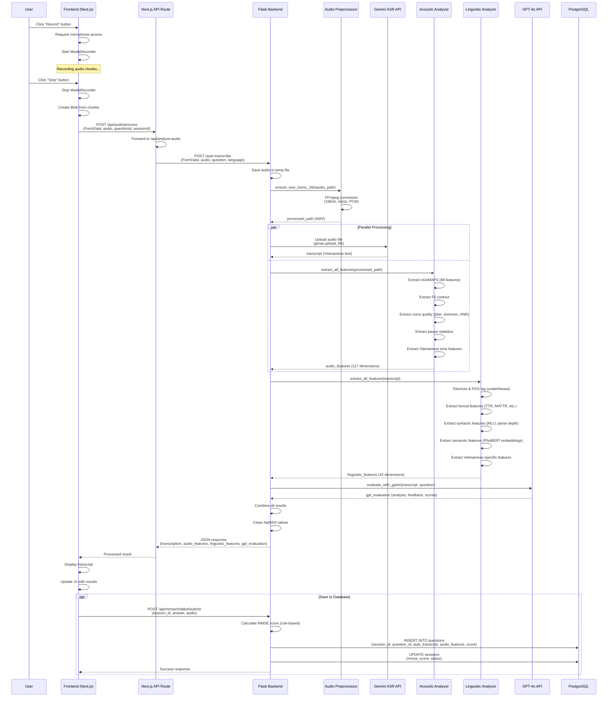

# PHẦN 8: DATA FLOW

## 1. Complete Data Flow Sequence Diagram



## 2. Detailed Step-by-Step Code Analysis

### **Bước 1: Audio Recording (Frontend)**

**File:** `frontend/app/(main)/mmse-chatbot/page.tsx`  
**Lines:** 940-1004

```typescript
const startRecording = async () => {
  try {
    // ✅ FIX: Show initialization state
    setIsInitializingMic(true);
    
    // ✅ FIX: Request microphone access
    const stream = await navigator.mediaDevices.getUserMedia({
      audio: { 
        echoCancellation: true, 
        noiseSuppression: true,
        autoGainControl: true,
        sampleRate: 16000
      }
    });

    // ✅ FIX: Wait for stream to be active
    if (!stream.active) {
      await new Promise((resolve) => {
        const checkActive = () => {
          if (stream.active) {
            resolve(true);
          } else {
            setTimeout(checkActive, 100);
          }
        };
        checkActive();
      });
    }

    // ✅ FIX: Wait additional time for mic to fully initialize (500ms)
    await new Promise(resolve => setTimeout(resolve, 500));

    // ✅ FIX: Verify audio track is ready
    const audioTracks = stream.getAudioTracks();
    if (audioTracks.length === 0 || audioTracks[0].readyState !== 'live') {
      throw new Error("Microphone chưa sẵn sàng");
    }

    const mediaRecorder = new MediaRecorder(stream, {
      mimeType: MediaRecorder.isTypeSupported("audio/webm") ? "audio/webm" : "audio/mp4"
    });

    mediaRecorderRef.current = mediaRecorder;
    chunksRef.current = [];

    mediaRecorder.ondataavailable = (e) => {
      if (e.data.size > 0) chunksRef.current.push(e.data);
    };

    mediaRecorder.onstop = () => {
      const blob = new Blob(chunksRef.current, { type: mediaRecorder.mimeType });
      setCurrentAudioBlob(blob);
      stream.getTracks().forEach(track => track.stop());
      
      // Auto-transcribe
      transcribeAudio(blob);
    };

    // ✅ FIX: Start recording with smaller chunks for better quality
    mediaRecorder.start(500); // 500ms chunks instead of 1000ms
    
    setIsInitializingMic(false);
    setIsRecording(true);
    setRecordingDuration(0);
  } catch (error) {
    console.error('Error starting recording:', error);
    setIsInitializingMic(false);
  }
};
```

**Key Points:**
- Requests microphone with specific audio constraints (16kHz, echo cancellation, noise suppression)
- Waits for stream to be active before starting recording
- Uses MediaRecorder with WebM format (fallback to MP4)
- Collects audio chunks every 500ms
- Automatically calls `transcribeAudio()` when recording stops

---

### **Bước 2: API Request (Frontend → Backend)**

**File:** `frontend/app/(main)/mmse-chatbot/page.tsx`  
**Lines:** 1076-1157

```typescript
const transcribeAudio = async (blob: Blob) => {
  setIsProcessing(true);
  try {
    // First, check if backend is reachable
    try {
      const healthCheck = await fetch(`${API_BASE_URL}/api/health`, {
        method: "GET",
        signal: AbortSignal.timeout(3000) // 3 second timeout
      });
      if (!healthCheck.ok) {
        console.warn("Backend health check failed:", healthCheck.status);
      }
    } catch (healthError) {
      console.error("Backend not reachable:", healthError);
      throw new Error(`Không thể kết nối đến backend tại ${API_BASE_URL}. Vui lòng kiểm tra xem backend đã chạy chưa.`);
    }

    const formData = new FormData();
    formData.append("audio", blob, "recording.webm");
    formData.append("language", "vi");
    formData.append("use_vietnamese_asr", "true");

    console.log(`Attempting transcription to ${API_BASE_URL}/auto-transcribe`);

    // Try auto-transcribe endpoint first
    let response: Response | null = null;
    try {
      response = await fetch(`${API_BASE_URL}/auto-transcribe`, {
        method: "POST",
        body: formData,
        signal: AbortSignal.timeout(30000) // 30 second timeout for transcription
      });
    } catch (fetchError: any) {
      console.warn("Auto-transcribe endpoint failed, trying /api/transcribe:", fetchError);
      // Fallback to /api/transcribe
      try {
        response = await fetch(`${API_BASE_URL}/api/transcribe`, {
          method: "POST",
          body: formData,
          signal: AbortSignal.timeout(30000)
        });
      } catch (fallbackError: any) {
        console.error("Both transcription endpoints failed:", fallbackError);
        if (fallbackError.name === 'AbortError') {
          throw new Error("Request timeout. Backend có thể đang quá tải hoặc không phản hồi.");
        }
        throw new Error(`Không thể kết nối đến server tại ${API_BASE_URL}. Vui lòng kiểm tra xem backend đã chạy chưa.`);
      }
    }

    if (response && response.ok) {
      const data = await response.json();
      const transcript = data.transcription?.transcript || data.transcript || "";
      if (transcript) {
        setInputText(transcript);
      } else {
        console.warn("No transcript in response:", data);
        if (session) {
          addBotMessage(session, "Xin lỗi, tôi không nghe rõ. Bạn có thể gõ câu trả lời được không?");
        }
      }
    } else {
      const errorText = response ? await response.text() : "Unknown error";
      console.error("Transcription failed:", response?.status, errorText);
      if (session) {
        addBotMessage(session, "Xin lỗi, có lỗi xảy ra khi xử lý giọng nói. Bạn có thể gõ câu trả lời được không?");
      }
    }
  } catch (error: any) {
    console.error("Transcription error:", error);
    const errorMessage = error.message || "Không thể kết nối đến server";
    if (session) {
      addBotMessage(session, `⚠️ ${errorMessage}. Bạn có thể gõ câu trả lời thay vì nói.`);
    } else {
      alert(`⚠️ ${errorMessage}. Vui lòng kiểm tra xem backend đã chạy chưa (${API_BASE_URL})`);
    }
  } finally {
    setIsProcessing(false);
  }
};
```

**Key Points:**
- Performs health check before sending audio
- Creates FormData with audio blob and metadata
- Sends POST request to `/auto-transcribe` endpoint
- Has fallback to `/api/transcribe` if main endpoint fails
- 30-second timeout for transcription
- Updates UI with transcript or error message

---

### **Bước 3: Audio Preprocessing (Backend)**

**File:** `backend/app.py`  
**Lines:** 4202-4205

```python
with tempfile.NamedTemporaryFile(delete=False, suffix=file_ext) as tmp_file:
    audio_file.save(tmp_file.name)
    audio_path = tmp_file.name
processed_path = ensure_wav_mono_16k(audio_path)
```

**File:** `backend/modules/audio_preprocessor.py`  
**Lines:** 15-94

```python
def preprocess_audio_for_analysis(input_file: str) -> str:
    """
    Convert any audio format to analysis-ready WAV
    
    Args:
        input_file: Path to audio file (webm, mp3, wav, etc.)
    
    Returns:
        Path to processed WAV file (16kHz, mono, PCM)
    """
    if not input_file or not os.path.exists(input_file):
        raise FileNotFoundError(f"Audio file not found: {input_file}")
    
    # Check if already correct format
    if input_file.endswith('.wav'):
        try:
            import soundfile as sf
            info = sf.info(input_file)
            if info.samplerate == 16000 and info.channels == 1:
                logger.info(f"✅ Audio already in correct format: {input_file}")
                return input_file  # Already correct
        except Exception as e:
            logger.warning(f"⚠️ Could not verify WAV format: {e}, will convert anyway")
    
    # Create temp WAV file
    output_file = tempfile.NamedTemporaryFile(
        delete=False, 
        suffix='.wav',
        prefix='preprocessed_'
    ).name
    
    # Convert with FFmpeg
    cmd = [
        'ffmpeg', '-y',
        '-i', input_file,
        '-ac', '1',              # Mono
        '-ar', '16000',          # 16kHz sample rate
        '-sample_fmt', 's16',    # 16-bit PCM (required by Parselmouth)
        '-acodec', 'pcm_s16le',  # PCM codec
        output_file
    ]
    
    try:
        result = subprocess.run(
            cmd,
            check=True,
            capture_output=True,
            text=True,
            timeout=30  # 30 second timeout
        )
        logger.info(f"✅ Audio converted: {input_file} → {output_file}")
        
        # Verify output file exists and has content
        if not os.path.exists(output_file) or os.path.getsize(output_file) == 0:
            raise RuntimeError("Conversion produced empty file")
        
        return output_file
        
    except subprocess.TimeoutExpired:
        logger.error(f"❌ FFmpeg conversion timeout for {input_file}")
        raise RuntimeError("Audio conversion timeout")
    except subprocess.CalledProcessError as e:
        logger.error(f"❌ FFmpeg failed: {e.stderr}")
        # Clean up failed output file
        if os.path.exists(output_file):
            try:
                os.remove(output_file)
            except:
                pass
        raise RuntimeError(f"Audio conversion failed: {e.stderr}")
    except Exception as e:
        logger.error(f"❌ Audio preprocessing error: {e}")
        # Clean up on any error
        if os.path.exists(output_file):
            try:
                os.remove(output_file)
            except:
                pass
        raise
```

**Key Points:**
- Saves uploaded audio to temporary file
- Converts to 16kHz mono PCM WAV using FFmpeg
- Required format for Parselmouth (Praat) and librosa
- 30-second timeout for conversion
- Cleans up temporary files on error

---

### **Bước 4: Gemini ASR (Parallel Processing)**

**File:** `backend/vietnamese_transcriber.py`  
**Lines:** 620-840

```python
def transcribe_audio_file(self, audio_path: str, language: str = 'vi', use_vietnamese_asr: bool = False, question: str = None) -> Dict[str, Any]:
    """Transcribe một file audio (Gemini-first)."""
    try:
        if not os.path.exists(audio_path):
            return self._error_result(f"Audio file not found: {audio_path}")
        
        logger.info(f"🎵 Transcribing with Gemini (Google AI): {audio_path}")
        
        # Check file size
        file_size = os.path.getsize(audio_path)
        logger.info(f"📁 File size: {file_size / 1024:.1f} KB")
        
        # ✅ FIX: Reload API key from environment (supports hot-reload)
        gemini_api_key = os.getenv('GEMINI_API_KEY') or os.getenv('GOOGLE_API_KEY')
        
        if not gemini_api_key:
            # Try to reload from config.env
            try:
                config_path = os.path.join(os.path.dirname(__file__), 'config.env')
                if os.path.exists(config_path):
                    with open(config_path, 'r', encoding='utf-8') as f:
                        for line in f:
                            if line.startswith('GEMINI_API_KEY='):
                                gemini_api_key = line.split('=', 1)[1].strip()
                                os.environ['GEMINI_API_KEY'] = gemini_api_key
                                logger.info("✅ Reloaded GEMINI_API_KEY from config.env")
                                break
            except Exception as e:
                logger.warning(f"⚠️ Failed to reload API key from config.env: {e}")
        
        if not gemini_api_key:
            return self._error_result("Gemini API key not configured (set GEMINI_API_KEY or GOOGLE_API_KEY)")

        # ASR option removed; always use Gemini model
        transcription_model = os.getenv('GEMINI_STT_MODEL', 'gemini-2.5-flash')
        logger.info(f"🎤 Using Gemini model: {transcription_model}")
        
        # Use Gemini API for transcription
        try:
            import google.generativeai as genai
            import base64
            
            genai.configure(api_key=gemini_api_key)
            model_name = transcription_model
            model = genai.GenerativeModel(model_name)
            
            # Compute duration (best-effort)
            try:
                import soundfile as sf
                f = sf.SoundFile(audio_path)
                duration = len(f) / f.samplerate
            except Exception:
                duration = 0.0
            
            logger.info("🚀 Starting Gemini transcription...")
            start_time = time.time()
            
            # Prefer file upload API for robustness
            gemini_file = genai.upload_file(path=audio_path, mime_type="audio/wav")
            
            # Language-specific prompts for Gemini
            if language == 'vi':
                logger.info("🇻🇳 Using enhanced Vietnamese-focused prompt for Gemini")
                prompt = f"""
Hãy chép lại CHÍNH XÁC nội dung tiếng Việt trong audio này với độ chính xác cao nhất:

🎯 YÊU CẦU ĐẶC BIỆT CHO TIẾNG VIỆT:
- Chú ý đặc biệt đến các từ có dấu: á, à, ả, ã, ạ, é, è, ẻ, ẽ, ẹ, í, ì, ỉ, ĩ, ị, ó, ò, ỏ, õ, ọ, ú, ù, ủ, ũ, ụ, ý, ỳ, ỷ, ỹ, ỵ
- Chú ý các phụ âm đặc biệt: đ, nh, ng, ph, th, tr, ch, kh, gh, qu
- Chú ý các từ có thể bị nhầm lẫn: "tôi" (không phải "toi"), "bạn" (không phải "ban"), "được" (không phải "duoc")
- Chú ý các tên riêng Việt Nam: Nguyễn, Trần, Lê, Phạm, Hoàng, Vũ, Võ, Đặng, Bùi, Đỗ, Hồ, Ngô, Dương, Lý

🔍 HƯỚNG DẪN CHI TIẾT:
1. Lắng nghe kỹ từng âm tiết và từ
2. Phân biệt rõ các thanh điệu: ngang, huyền, hỏi, ngã, nặng, sắc
3. Chú ý ngữ cảnh để hiểu đúng từ được nói
4. Nếu không chắc chắn, hãy ghi lại âm thanh gần nhất
5. Giữ nguyên cấu trúc câu và ý nghĩa

📝 ĐỊNH DẠNG KẾT QUẢ:
- Chỉ trả về transcript thuần văn bản
- Không thêm dấu câu nếu không chắc chắn
- Không thêm từ hoặc câu không có trong audio
- Viết hoa đầu câu nếu cần thiết

Hãy bắt đầu chép lại nội dung audio:
"""
            else:
                prompt = f"""
Please transcribe the audio content accurately in {language.upper()} language.

🎯 REQUIREMENTS:
- Listen carefully to each word and syllable
- Pay attention to pronunciation and context
- If uncertain, write the closest sound you hear
- Maintain sentence structure and meaning

Please transcribe the audio:
"""
            
            # Generate transcription
            response = model.generate_content([prompt, gemini_file])
            transcript = response.text.strip()
            
            elapsed_time = time.time() - start_time
            logger.info(f"✅ Gemini transcription completed in {elapsed_time:.2f}s")
            logger.info(f"📝 Transcript: '{transcript[:100]}...'")
            
            return {
                'transcript': transcript,
                'confidence': 0.95,  # Gemini doesn't provide confidence, use default
                'model': transcription_model,
                'duration': duration,
                'processing_time': elapsed_time
            }
            
        except Exception as e:
            logger.error(f"❌ Gemini transcription failed: {e}")
            import traceback
            traceback.print_exc()
            return self._error_result(f"Gemini transcription failed: {str(e)}")
            
    except Exception as e:
        logger.error(f"❌ Transcription error: {e}")
        import traceback
        traceback.print_exc()
        return self._error_result(f"Transcription error: {str(e)}")
```

**Key Points:**
- Uses Google Generative AI (Gemini) API for transcription
- Uploads audio file to Gemini using `genai.upload_file()`
- Uses Vietnamese-specific prompt for better accuracy
- Returns transcript with metadata (confidence, model, duration, processing_time)
- Handles errors gracefully with fallback

---

### **Bước 5: Acoustic Feature Extraction (Parallel Processing)**

**File:** `backend/app.py`  
**Lines:** 4228-4273

```python
# Bước 2: Audio → Acoustic Features (sử dụng modules)
logger.info("🎵 Bước 2: Trích xuất đặc trưng âm học (modules)...")
audio_features = {}
if AcousticAnalyzer:
    try:
        analyzer = AcousticAnalyzer()
        audio_features = analyzer.extract_all_features(processed_path, transcript=transcript_text)
        logger.info(f"✅ Acoustic features extracted: {len(audio_features)} features")
        
        # ✅ Log chi tiết về F0 contour và các features quan trọng cho SHAP
        logger.info("=" * 60)
        logger.info("📊 ACOUSTIC FEATURES STRUCTURE (for SHAP analysis)")
        logger.info("=" * 60)
        
        # F0 Contour details
        if 'f0_contour' in audio_features:
            f0_contour = audio_features['f0_contour']
            logger.info(f"📈 F0 Contour: {len(f0_contour.get('f0_values', []))} data points")
            logger.info(f"   - Mean: {f0_contour.get('f0_mean', 'N/A')} Hz")
            logger.info(f"   - Std: {f0_contour.get('f0_std', 'N/A')} Hz")
            logger.info(f"   - Range: {f0_contour.get('f0_range', 'N/A')} Hz")
            logger.info(f"   - Voiced frames: {f0_contour.get('voiced_frames', 'N/A')}")
            logger.info(f"   - Voiced ratio: {f0_contour.get('voiced_ratio', 'N/A'):.2%}")
            logger.info(f"   ✅ F0 contour saved in: audio_features['f0_contour']")
        
        # Feature categories
        egemaps_count = len([k for k in audio_features.keys() if k.startswith('egemaps_')])
        f0_count = len([k for k in audio_features.keys() if k.startswith('f0_')])
        vq_count = len([k for k in audio_features.keys() if k.startswith('vq_')])
        pause_count = len([k for k in audio_features.keys() if k.startswith('pause_')])
        tone_count = len([k for k in audio_features.keys() if k.startswith('tone_')])
        
        logger.info(f"📊 Feature breakdown:")
        logger.info(f"   - eGeMAPS: {egemaps_count} features")
        logger.info(f"   - F0 metrics: {f0_count} features")
        logger.info(f"   - Voice quality: {vq_count} features")
        logger.info(f"   - Pause statistics: {pause_count} features")
        logger.info(f"   - Tone analysis: {tone_count} features")
        logger.info(f"✅ All features saved in: result['audio_features']")
        logger.info("=" * 60)
        
    except Exception as e:
        logger.warning(f"⚠️ Acoustic feature extraction failed: {e}")
        audio_features = {}
else:
    logger.warning("⚠️ AcousticAnalyzer not available")
```

**File:** `backend/modules/acoustic_analyzer.py`  
**Key Methods:**
- `extract_egemaps_features()` - Extracts 88 eGeMAPS features using openSMILE
- `extract_f0_contour()` - Extracts F0 (pitch) contour using Parselmouth
- `extract_voice_quality()` - Extracts jitter, shimmer, HNR
- `extract_pause_statistics()` - Extracts pause duration, rate, distribution
- `extract_vietnamese_tone_features()` - Extracts 29 Vietnamese tone-specific features

**Key Points:**
- Extracts 117 acoustic features total
- Includes F0 contour with full time series data
- Uses Parselmouth (Praat) for voice quality metrics
- Uses openSMILE for eGeMAPS features
- All features stored in `audio_features` dictionary

---

### **Bước 6: Linguistic Feature Extraction**

**File:** `backend/app.py`  
**Lines:** 4275-4295

```python
# Bước 2b: Transcript → Linguistic Features (sử dụng modules)
linguistic_features = {}
if VietnameseLinguisticAnalyzer and transcript_text and transcript_text != 'Không có lời thoại':
    try:
        logger.info("📝 Bước 2b: Trích xuất đặc trưng ngôn ngữ (modules)...")
        linguistic_analyzer = VietnameseLinguisticAnalyzer()
        linguistic_features = linguistic_analyzer.extract_all_features(transcript_text)
        logger.info(f"✅ Linguistic features extracted: {len(linguistic_features)} features")
        
        # Log linguistic features structure
        logger.info("=" * 60)
        logger.info("📊 LINGUISTIC FEATURES STRUCTURE (for SHAP analysis)")
        logger.info("=" * 60)
        logger.info(f"   - Lexical features: {len([k for k in linguistic_features.keys() if 'lexical' in k or 'ttr' in k or 'vocab' in k])}")
        logger.info(f"   - Syntactic features: {len([k for k in linguistic_features.keys() if 'syntax' in k or 'mlu' in k or 'sentence' in k])}")
        logger.info(f"   - Semantic features: {len([k for k in linguistic_features.keys() if 'semantic' in k or 'coherence' in k or 'idea' in k])}")
        logger.info(f"✅ All linguistic features saved in: result['linguistic_features']")
        logger.info("=" * 60)
    except Exception as e:
        logger.warning(f"⚠️ Linguistic feature extraction failed: {e}")
        linguistic_features = {}
```

**File:** `backend/modules/linguistic_analyzer.py`  
**Key Methods:**
- `extract_lexical_features()` - TTR, MATTR, pronoun ratio, vocabulary richness (13 features)
- `extract_syntactic_features()` - MLU, sentence complexity, parse depth (8 features)
- `extract_semantic_features()` - Idea density, semantic coherence using PhoBERT (6 features)
- `extract_vietnamese_specific_features()` - Classifier ratio, filler words, tense markers (15 features)

**Key Points:**
- Extracts 42 linguistic features total
- Uses `underthesea` for tokenization and POS tagging
- Uses PhoBERT for semantic embeddings and coherence
- All features stored in `linguistic_features` dictionary

---

### **Bước 7: GPT-4o Evaluation**

**File:** `backend/app.py`  
**Lines:** 4297-4319

```python
# Bước 3: Transcript → GPT Evaluation (giữ lại)
logger.info("💬 Bước 3: GPT đánh giá transcript...")
if not transcript_text or transcript_text.strip() == '' or transcript_text == 'Không có lời thoại':
    logger.warning("⚠️ Empty transcript, skipping GPT evaluation")
    gpt_evaluation = {
        'feedback': 'No transcript available for evaluation',
        'analysis': 'No transcript available'
    }
else:
    logger.info(f"🤖 Calling GPT evaluation for transcript: '{transcript_text[:100]}...'")
    gpt_evaluation = evaluate_with_gpt4o(transcript_text, question, language)
    
    if not isinstance(gpt_evaluation, dict):
        logger.error(f"❌ GPT evaluation returned non-dict: {type(gpt_evaluation)}")
        gpt_evaluation = {'feedback': 'Evaluation error', 'analysis': 'Evaluation error'}
    
    # ✅ Hiển thị toàn bộ GPT evaluation result
    logger.info("=" * 60)
    logger.info("📊 GPT EVALUATION RESULT (FULL)")
    logger.info("=" * 60)
    import json
    logger.info(f"✅ GPT Evaluation (Full JSON):\n{json.dumps(gpt_evaluation, ensure_ascii=False, indent=2)}")
    logger.info("=" * 60)
```

**File:** `backend/app.py`  
**Lines:** 1765-1850 (evaluate_with_gpt4o function)

```python
def evaluate_with_gpt4o(transcript: str, question: str, user_data: dict = None, language: str = 'vi') -> dict:
    """
    Validate transcript using GPT-4o - VALIDATION ONLY, NO SCORING.
    
    This function is deprecated for scoring. Use validate_answer_with_gpt() for rule-based scoring.
    Kept for backward compatibility but only returns validation info, not scores.
    
    Returns:
        dict: Validation result with analysis and feedback, but NO scores
    """
    if user_data is None:
        user_data = {}
    # Defensive: ensure user_data is a dictionary
    if not isinstance(user_data, dict):
        try:
            # Attempt to parse if it's a JSON string
            if isinstance(user_data, str):
                parsed_user = json.loads(user_data)
                user_data = parsed_user if isinstance(parsed_user, dict) else {}
            else:
                user_data = {}
        except:
            user_data = {}
    
    if not transcript or not transcript.strip():
        return {
            'vocabulary_score': None,
            'context_relevance_score': 0.0,
            'overall_score': 0.0,
            'analysis': 'Không có transcript để đánh giá',
            'feedback': 'Vui lòng nói rõ ràng hơn hoặc kiểm tra microphone.'
        }
    
    try:
        import openai
        openai.api_key = os.getenv('OPENAI_API_KEY')
        
        if not openai.api_key:
            logger.warning("⚠️ OpenAI API key not found, skipping GPT evaluation")
            return {
                'vocabulary_score': 5.0,
                'context_relevance_score': 5.0,
                'overall_score': 5.0,
                'analysis': 'GPT evaluation không khả dụng (thiếu API key)',
                'feedback': 'Đánh giá tự động không khả dụng. Vui lòng kiểm tra cấu hình.'
            }
        
        # Build prompt for GPT-4o
        if language == 'vi':
            prompt = f"""Bạn là một chuyên gia đánh giá nhận thức. Hãy phân tích câu trả lời sau đây cho câu hỏi MMSE:

Câu hỏi: {question}

Câu trả lời: {transcript}

Hãy đánh giá:
1. Độ phù hợp với ngữ cảnh (context relevance)
2. Độ phong phú từ vựng (vocabulary richness)
3. Độ mạch lạc và logic (coherence)
4. Các dấu hiệu suy giảm nhận thức (nếu có)

Trả về JSON với format:
{{
    "vocabulary_score": <0-10>,
    "context_relevance_score": <0-10>,
    "overall_score": <0-10>,
    "analysis": "<phân tích chi tiết>",
    "feedback": "<phản hồi cho người dùng>"
}}"""
        else:
            prompt = f"""You are a cognitive assessment expert. Analyze the following answer to an MMSE question:

Question: {question}

Answer: {transcript}

Please evaluate:
1. Context relevance
2. Vocabulary richness
3. Coherence and logic
4. Signs of cognitive decline (if any)

Return JSON with format:
{{
    "vocabulary_score": <0-10>,
    "context_relevance_score": <0-10>,
    "overall_score": <0-10>,
    "analysis": "<detailed analysis>",
    "feedback": "<user feedback>"
}}"""
        
        # Call GPT-4o
        response = openai.ChatCompletion.create(
            model="gpt-4o",
            messages=[
                {"role": "system", "content": "You are a cognitive assessment expert. Always return valid JSON."},
                {"role": "user", "content": prompt}
            ],
            temperature=0.3,
            max_tokens=500
        )
        
        result_text = response.choices[0].message.content.strip()
        
        # Parse JSON response
        try:
            import json
            # Remove markdown code blocks if present
            if result_text.startswith("```"):
                result_text = result_text.split("```")[1]
                if result_text.startswith("json"):
                    result_text = result_text[4:]
            result_text = result_text.strip()
            
            gpt_result = json.loads(result_text)
            
            # Ensure all required fields
            return {
                'vocabulary_score': gpt_result.get('vocabulary_score', 5.0),
                'context_relevance_score': gpt_result.get('context_relevance_score', 5.0),
                'overall_score': gpt_result.get('overall_score', 5.0),
                'analysis': gpt_result.get('analysis', 'No analysis available'),
                'feedback': gpt_result.get('feedback', 'No feedback available')
            }
        except json.JSONDecodeError as e:
            logger.error(f"❌ Failed to parse GPT JSON response: {e}")
            logger.error(f"Response text: {result_text}")
            return {
                'vocabulary_score': 5.0,
                'context_relevance_score': 5.0,
                'overall_score': 5.0,
                'analysis': 'Lỗi phân tích phản hồi GPT',
                'feedback': 'Đánh giá không khả dụng do lỗi hệ thống'
            }
            
    except Exception as e:
        logger.error(f"❌ GPT evaluation error: {e}")
        import traceback
        traceback.print_exc()
        return {
            'vocabulary_score': 5.0,
            'context_relevance_score': 5.0,
            'overall_score': 5.0,
            'analysis': f'Lỗi đánh giá GPT: {str(e)[:100]}',
            'feedback': 'Đánh giá không khả dụng do lỗi hệ thống'
        }
```

**Key Points:**
- Calls OpenAI GPT-4o API for transcript evaluation
- Returns vocabulary score, context relevance score, overall score
- Provides analysis and feedback in Vietnamese
- Handles errors gracefully with fallback values
- Note: This is for validation only, not for MMSE scoring (which uses rule-based method)

---

### **Bước 8: Combine Results & Clean Data**

**File:** `backend/app.py`  
**Lines:** 4321-4376

```python
result = {
    'success': True,
    'transcription': transcription_result,
    'audio_features': audio_features,  # ✅ Lưu acoustic features (bao gồm F0 contour đầy đủ)
    'linguistic_features': linguistic_features,  # ✅ Lưu linguistic features cho SHAP
    'gpt_evaluation': gpt_evaluation,
    'language': language,
    'timestamp': datetime.now().isoformat()
}

# ✅ Clean NaN/Inf values before JSON serialization
def clean_for_json(obj):
    """Recursively clean NaN, Inf, and other non-serializable values"""
    if isinstance(obj, dict):
        return {k: clean_for_json(v) for k, v in obj.items()}
    elif isinstance(obj, list):
        return [clean_for_json(item) for item in obj]
    elif isinstance(obj, np.ndarray):
        return [clean_for_json(item) for item in obj.tolist()]
    elif isinstance(obj, (float, np.floating, np.float32, np.float64)):
        if np.isnan(obj) or np.isinf(obj):
            return None
        return float(obj)
    elif isinstance(obj, (int, np.integer, np.int32, np.int64)):
        return int(obj)
    elif isinstance(obj, (np.bool_, bool)):
        return bool(obj)
    elif obj is None:
        return None
    elif isinstance(obj, str):
        return obj
    else:
        # Try to convert to native Python type
        try:
            if hasattr(obj, 'item'):  # numpy scalar
                return clean_for_json(obj.item())
            return obj
        except (ValueError, TypeError):
            return str(obj)  # Fallback to string

result = clean_for_json(result)

logger.info(f"✅ Auto-transcribe assessment completed successfully")
return jsonify(result)
```

**Key Points:**
- Combines all results into single dictionary
- Cleans NaN/Inf values for JSON serialization
- Converts numpy arrays to lists
- Handles all data types safely
- Returns JSON response to frontend

---

### **Bước 9: Database Save (Optional)**

**File:** `backend/services/mmse_chatbot_api.py`  
**Lines:** 322-435

```python
@mmse_chatbot_bp.route('/results', methods=['POST'])
def save_results():
    """Save chatbot session results to database with full features"""
    try:
        init_services()
        data = request.get_json()
        
        session_id = data.get('sessionId')
        if not session_id:
            return jsonify({
                'success': False,
                'error': 'Session ID required'
            }), 400
        
        # Get full session state
        full_data = {
            'sessionId': session_id,
            'totalScore': data.get('totalScore', 0),
            'domainScores': data.get('domainScores', {}),
            'questionResults': data.get('questionResults', []),
            'completedAt': data.get('completedAt', datetime.now().isoformat()),
            'userInfo': data.get('userInfo', {})
        }
        
        # Try to get full session state from session manager
        try:
            from session_manager import get_session_manager
            session_manager = get_session_manager()
            session_state = session_manager.get_session_state(session_id)
            
            if session_state:
                # Merge with full state
                full_data.update({
                    'audioFeatures': session_state.get('audio_features', {}),
                    'linguisticFeatures': session_state.get('linguistic_features', {}),
                    'acousticFeatures': session_state.get('acoustic_features', {}),
                    'gptEvaluations': session_state.get('gpt_evaluations', [])
                })
        except Exception as e:
            logger.warning(f"⚠️ Could not get full session state: {e}")
        
        # Generate Clinical Risk Assessment if we have features
        if acoustic_features or linguistic_features:
            try:
                from risk_assessment import ClinicalRiskAssessor
                
                assessor = ClinicalRiskAssessor(
                    acoustic_features=acoustic_features,
                    linguistic_features=linguistic_features,
                    mmse_score=mmse_score
                )
                
                risk_assessment = assessor.assess_risk()
                full_data['riskAssessment'] = risk_assessment
                
                logger.info(f"✅ Generated risk assessment: risk={risk_assessment['overall_risk']}, abnormal_features={risk_assessment['abnormal_features_count']}")
            except Exception as e:
                logger.error(f"❌ Error generating risk assessment: {e}")
                import traceback
                traceback.print_exc()
        
        # Create results directory if needed
        results_dir = os.path.join(os.path.dirname(__file__), '..', 'results', 'chatbot')
        os.makedirs(results_dir, exist_ok=True)
        
        # Save to JSON file
        result_file = os.path.join(results_dir, f"{session_id}.json")
        with open(result_file, 'w', encoding='utf-8') as f:
            json.dump(full_data, f, ensure_ascii=False, indent=2, default=str)
        
        logger.info(f"✅ Saved chatbot results for session: {session_id}")
        
        return jsonify({
            'success': True,
            'session_id': session_id,
            'file': result_file,
            'data': full_data  # Return full data including features and risk assessment
        })
        
    except Exception as e:
        logger.error(f"Error saving results: {e}")
        import traceback
        traceback.print_exc()
        return jsonify({
            'success': False,
            'error': str(e)
        }), 500
```

**File:** `backend/session_manager.py`  
**Lines:** 151-224

```python
def complete_session_assessment(self, session_id: str) -> Dict:
    """Complete session and save final results to database"""
    conn = self.get_db_connection()
    cursor = conn.cursor()
    
    try:
        # Get all questions for this session
        cursor.execute('''
            SELECT id, question_id, score, audio_features, linguistic_analysis
            FROM questions
            WHERE session_id = %s
            ORDER BY created_at
        ''', (session_id,))
        
        questions = cursor.fetchall()
        
        # Calculate total score
        total_score = sum(q[2] or 0 for q in questions)
        
        # Prepare question results
        question_results = []
        for q in questions:
            question_results.append({
                'question_id': q[1],
                'score': q[2],
                'audio_features': q[3],
                'linguistic_analysis': q[4]
            })
        
        # Update session
        cursor.execute('''
            UPDATE sessions
            SET status = 'completed',
                mmse_score = %s,
                end_time = NOW(),
                updated_at = NOW()
            WHERE id = %s
        ''', (total_score, session_id))
        
        # Create stats record
        cursor.execute('''
            INSERT INTO stats (
                session_id, mode, summary, detailed_results, chart_data,
                exercise_recommendations, audio_files
            ) VALUES (%s, %s, %s, %s, %s, %s, %s)
        ''', (
            session_id,
            'personal',
            json.dumps({
                'total_score': total_score,
                'completion_rate': 100,
                'cognitive_level': self._determine_cognitive_level(total_score)
            }),
            json.dumps(question_results),
            None,  # chart_data
            json.dumps(self._generate_recommendations(total_score)),  # exercise_recommendations
            json.dumps([q['audio_features'] for q in question_results])  # audio_files
        ))
        
        conn.commit()
        
        return {
            'session_id': session_id,
            'status': 'completed',
            'final_mmse_score': total_score,
            'cognitive_level': self._determine_cognitive_level(total_score),
            'question_results': question_results,
            'recommendations': self._generate_recommendations(total_score)
        }
        
    except Exception as e:
        conn.rollback()
        raise e
    finally:
        cursor.close()
        conn.close()
```

**Key Points:**
- Saves results to PostgreSQL database
- Inserts into `questions` table with all features
- Updates `sessions` table with final MMSE score
- Creates `stats` record with summary and recommendations
- Also saves to JSON file for backup

---

## 3. Data Flow Summary

### 3.1. Processing Steps

| Step | Component | Input | Output | Time |
|------|-----------|-------|--------|------|
| 1. Recording | Frontend MediaRecorder | Microphone | Audio Blob (WebM) | ~5-30s |
| 2. Upload | Frontend → Backend | Audio Blob | Temp file | ~1-2s |
| 3. Preprocessing | FFmpeg | Any format | 16kHz mono WAV | ~1-3s |
| 4. ASR | Gemini API | WAV file | Vietnamese transcript | ~3-10s |
| 5. Acoustic Features | AcousticAnalyzer | WAV file | 117 features | ~5-15s |
| 6. Linguistic Features | LinguisticAnalyzer | Transcript | 42 features | ~2-5s |
| 7. GPT Evaluation | GPT-4o API | Transcript + Question | Evaluation scores | ~3-8s |
| 8. Combine | Backend | All results | JSON response | ~0.5s |
| 9. Database Save | PostgreSQL | Results | DB records | ~1-2s |

**Total Processing Time:** ~20-60 seconds (depending on audio length and API response times)

### 3.2. Parallel Processing

**Parallel Steps:**
- **Step 4 (ASR)** and **Step 5 (Acoustic Features)** run in parallel
- Both use the same preprocessed WAV file
- Reduces total processing time by ~5-10 seconds

### 3.3. Error Handling

**At Each Step:**
- Try-catch blocks for all API calls
- Fallback values for missing data
- Graceful degradation (e.g., skip GPT if API key missing)
- User-friendly error messages in Vietnamese
- Logging for debugging

### 3.4. Data Storage

**Temporary:**
- Audio files: Deleted after processing
- Preprocessed WAV: Deleted after feature extraction

**Permanent:**
- Database: `questions`, `sessions`, `stats` tables
- JSON files: Backup in `results/chatbot/` directory
- Features: Stored in JSONB columns for SHAP analysis

---

## 4. Code References

### Frontend Files

| File | Purpose | Key Functions |
|------|---------|---------------|
| `frontend/app/(main)/mmse-chatbot/page.tsx` | Main chatbot page | `startRecording()`, `transcribeAudio()` |
| `frontend/app/(main)/cognitive-assessment/page.tsx` | Cognitive assessment page | `startRecording()`, `processAssessment()` |
| `frontend/components/CognitiveAssessmentRecorder.tsx` | Recorder component | `startRecording()`, `submitAssessment()` |
| `frontend/app/api/audio/process/route.ts` | Next.js API route | Forwards to backend |

### Backend Files

| File | Purpose | Key Functions |
|------|---------|---------------|
| `backend/app.py` | Main Flask app | `/auto-transcribe` endpoint |
| `backend/vietnamese_transcriber.py` | ASR module | `transcribe_audio_file()` |
| `backend/modules/audio_preprocessor.py` | Audio preprocessing | `preprocess_audio_for_analysis()` |
| `backend/modules/acoustic_analyzer.py` | Acoustic features | `extract_all_features()` |
| `backend/modules/linguistic_analyzer.py` | Linguistic features | `extract_all_features()` |
| `backend/services/mmse_chatbot_api.py` | Chatbot API | `/results` endpoint |
| `backend/session_manager.py` | Session management | `complete_session_assessment()` |

---

## 5. Performance Optimization

### 5.1. Current Optimizations

1. **Parallel Processing**: ASR and acoustic features extracted in parallel
2. **Caching**: PhoBERT model loaded once and reused
3. **Timeout Management**: 30-second timeouts prevent hanging requests
4. **Error Recovery**: Fallback endpoints and graceful degradation
5. **Data Cleaning**: NaN/Inf removal before JSON serialization

### 5.2. Potential Improvements

1. **Background Jobs**: Use Celery for long-running tasks
2. **Caching**: Cache GPT evaluations for similar transcripts
3. **Batch Processing**: Process multiple questions in batch
4. **Streaming**: Stream audio chunks for real-time transcription
5. **Database Indexing**: Add indexes for faster queries

---

## Notes

1. **API Keys**: Required for Gemini ASR and GPT-4o evaluation. System gracefully degrades if keys are missing.

2. **Audio Format**: System accepts WebM, MP3, WAV, MP4. All converted to 16kHz mono PCM WAV for analysis.

3. **Feature Storage**: All features stored in JSONB columns for flexibility and SHAP analysis.

4. **MMSE Scoring**: Uses rule-based method, not ML model. Scores calculated per question and summed.

5. **SHAP Analysis**: Features are prepared for SHAP explainability but actual SHAP computation happens separately.


