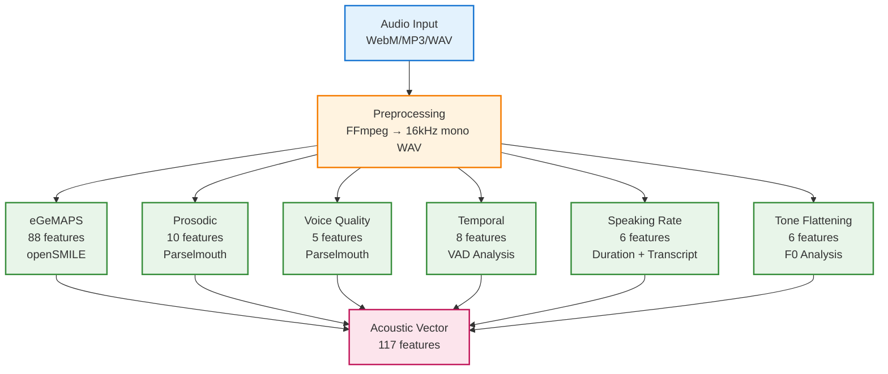
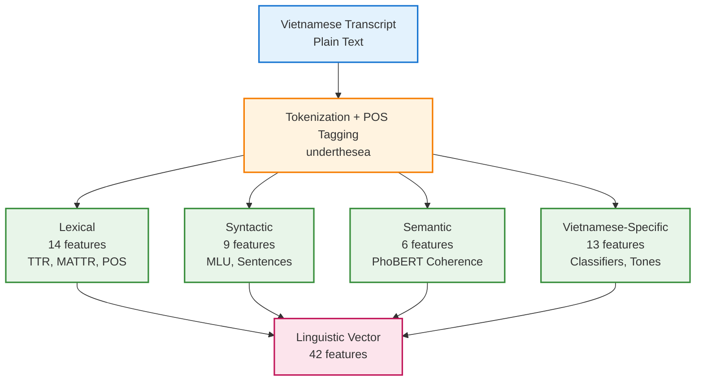
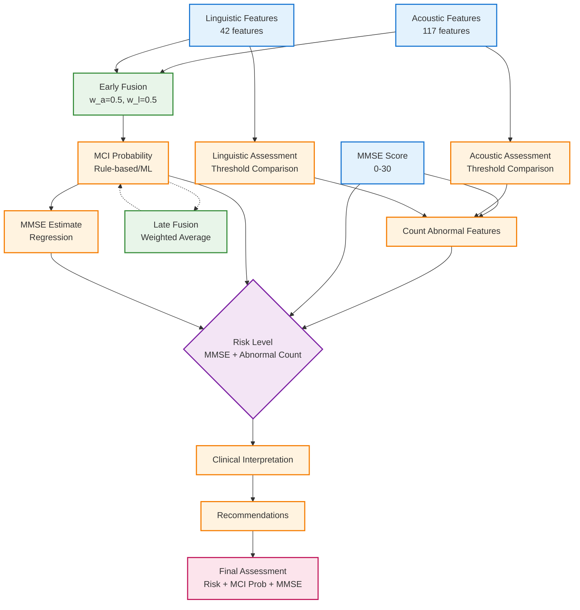

# PHÂN TÍCH PIPELINE TRÍCH XUẤT ĐẶC TRƯNG

---

# ACOUSTIC FEATURES PIPELINE

## Tổng quan
- **Input**: Audio file (WebM/MP3/WAV) → Preprocessed to WAV 16kHz mono
- **Total features**: **117 features**
- **Tools**: openSMILE, Parselmouth (Praat), librosa, scipy

## Nhóm features

### 1. **eGeMAPS (88 features)**
- **Method**: openSMILE toolkit (eGeMAPSv02)
- **Categories**:
  - F0 statistics: mean, std, range, percentiles (25th, 50th, 75th)
  - Jitter (local, rap, ppq5)
  - Shimmer (local, apq3, apq5, apq11)
  - HNR (Harmonics-to-Noise Ratio)
  - MFCC 1-13 (mean, std)
  - Spectral features: centroid, bandwidth, rolloff, flux
  - Energy: RMS, zero-crossing rate

### 2. **Prosodic / F0 Contour (10 features)**
- **Method**: Parselmouth (Praat) or librosa.pyin
- **Formula**: 
  ```
  f0_mean = Σ(f0_values > 0) / n_voiced
  f0_cv = (std(f0) / mean(f0)) × 100
  ```
- **Features**:
  - `f0_mean`, `f0_std`, `f0_range`, `f0_cv`
  - `f0_5th_percentile`, `f0_95th_percentile`
  - `f0_skewness`, `f0_kurtosis`
  - `voiced_frames`, `voiced_ratio`
- **Parameters**: fmin=75Hz, fmax=600Hz (optimized for Vietnamese tones)

### 3. **Voice Quality (5 features)**
- **Method**: Parselmouth (Praat)
- **Features**:
  - `jitter_local`: Cycle-to-cycle F0 perturbation (%)
  - `jitter_rap`: Relative Average Perturbation
  - `shimmer_local`: Cycle-to-cycle amplitude perturbation (%)
  - `shimmer_apq3`: Amplitude Perturbation Quotient
  - `hnr_mean`: Harmonics-to-Noise Ratio (dB)
- **Normal range**: Jitter < 1%, HNR > 13 dB

### 4. **Temporal / Pause Statistics (8 features)**
- **Method**: Parselmouth Intensity analysis or librosa VAD
- **Formula**:
  ```
  pause_ratio = total_pause_time / total_duration
  pause_rate = n_pauses / total_duration
  ```
- **Features**:
  - `total_pauses`, `mean_pause_duration`, `std_pause_duration`
  - `max_pause_duration`, `min_pause_duration`
  - `total_pause_time`, `pause_rate`, `pause_ratio`
- **Threshold**: min_pause_duration = 0.2s

### 5. **Speaking Rate (6 features)**
- **Method**: Audio duration + transcript word count
- **Formula**:
  ```
  speaking_rate = syllables / (total_duration - pause_time)
  words_per_minute = (total_words / duration) × 60
  ```
- **Features**:
  - `total_duration`, `total_words`, `total_syllables`
  - `words_per_second`, `words_per_minute`, `syllables_per_second`
- **Note**: Vietnamese is monosyllabic (1 word ≈ 1 syllable)

### 6. **Vietnamese Tone Flattening (6 features)**
- **Method**: F0 contour analysis (Vietnamese-specific biomarker)
- **Formula**:
  ```
  flattening_score = (norm_variability + norm_complexity + norm_direction) / 3
  f0_variability_index = f0_cv
  contour_complexity = std(diff(f0_values))
  ```
- **Features**:
  - `f0_variability_index`, `tone_accuracy`, `flattening_score`
  - `contour_complexity`, `direction_change_rate`, `f0_range_normalized`
- **Clinical significance**: MCI patients show reduced F0 variability (tone flattening)

## Mermaid Diagram



---

# LINGUISTIC FEATURES PIPELINE

## Tổng quan
- **Input**: Vietnamese transcript (plain text)
- **Total features**: **42 features**
- **Tools**: underthesea, PhoBERT (transformers), scikit-learn

## Nhóm features

### 1. **Lexical Features (14 features)**
- **Method**: underthesea tokenization + POS tagging
- **Formulas**:
  ```
  TTR = unique_words / total_words
  MATTR = mean(window_ttr) for sliding window=50
  Brunet's Index = N^(V^(-0.165))
  Honore's Stat = (100 × log(N)) / (1 - V1/V)
  ```
- **Features**:
  - `total_words`, `unique_words`
  - `ttr`, `mattr`, `brunet_index`, `honore_stat`, `hapax_ratio`
  - `pronoun_ratio`, `noun_ratio`, `verb_ratio`, `adj_ratio`
  - `content_word_ratio`, `noun_verb_ratio`, `mean_word_length`
- **Clinical significance**: MCI patients show ↓ TTR, ↑ pronoun usage

### 2. **Syntactic Features (9 features)**
- **Method**: Sentence segmentation + POS analysis
- **Formulas**:
  ```
  MLU = Σ(words_per_sentence) / n_sentences
  incomplete_ratio = n_incomplete / n_sentences
  clause_density = n_clause_markers / n_sentences
  ```
- **Features**:
  - `total_sentences`, `mlu_words`, `mlu_chars`
  - `std_sentence_length`, `incomplete_sentence_ratio`
  - `mean_parse_depth`, `clause_density`
  - `max_sentence_length`, `min_sentence_length`
- **Clinical significance**: MCI patients show ↓ MLU, ↑ incomplete sentences

### 3. **Semantic Features (6 features)**
- **Method**: PhoBERT embeddings + cosine similarity
- **Formulas**:
  ```
  semantic_coherence = mean(cosine_sim(embed[i], embed[i+1]))
  idea_density = (n_content_words / n_total_words) × 10
  information_entropy = -Σ(p × log2(p))
  ```
- **Features**:
  - `idea_density`, `semantic_coherence`, `coherence_std`
  - `mean_embedding_norm`, `information_entropy`, `total_sentences_semantic`
- **Clinical significance**: Idea density is the **strongest predictor** (Fraser 2016)

### 4. **Vietnamese-Specific Features (13 features)**
- **Method**: Pattern matching + POS tagging
- **Features**:
  - Classifiers: `classifier_count`, `classifier_ratio`
  - Reduplications: `reduplication_count`, `reduplication_ratio`
  - Tense markers: `tense_marker_count`, `tense_marker_ratio`
  - Aspect markers: `aspect_marker_count`, `aspect_marker_ratio`
  - Particles: `particle_count`, `particle_ratio`
  - Others: `question_ratio`, `negation_ratio`, `filler_ratio`
- **Clinical significance**: Reduced classifier usage, increased fillers in MCI

## Mermaid Diagram



---

---

# COGNITIVE ASSESSMENT EVALUATION PIPELINE

## Tổng quan
- **Input**: Acoustic features (117) + Linguistic features (42) + MMSE score (0-30)
- **Output**: Risk level (low/mild/moderate/severe) + MCI probability + Recommendations
- **Methods**: Feature thresholding + Multimodal fusion + Rule-based/ML prediction

## Quy trình đánh giá

### 1. **Feature Assessment (Threshold-based)**
Mỗi feature được so sánh với ngưỡng khoa học:

**Acoustic Thresholds:**
- **Jitter**: Normal < 1.5%, Mild 1.5-2.5%, Moderate 2.5-4.0%, Severe > 4.0%
- **F0 CV**: Normal 15-50 Hz, Mild 10-15 Hz, Moderate 5-10 Hz, Severe < 5 Hz
- **Speaking Rate**: Normal 3.0-5.5 syllables/sec, Mild 2.0-3.0, Moderate 1.0-2.0, Severe < 1.0
- **Pause Ratio**: Normal 0.2-0.4, Mild 0.4-0.5, Moderate 0.5-0.6, Severe > 0.6

**Linguistic Thresholds:**
- **TTR**: Normal > 0.5, Mild 0.4-0.5, Moderate 0.3-0.4, Severe < 0.3
- **Pronoun Ratio**: Normal < 0.15, Mild 0.15-0.25, Moderate 0.25-0.40, Severe > 0.40
- **MLU**: Normal 8-15 words, Mild 5-8, Moderate 3-5, Severe < 3
- **Idea Density**: Normal 0.5-0.8, Mild 0.35-0.5, Moderate 0.2-0.35, Severe < 0.2

**Formula:**
```
abnormal_count = Σ(features where severity ≠ 'normal')
```

### 2. **MMSE Score Classification**
**Formula:**
```
if MMSE ≥ 24: status = "Normal"
elif MMSE ≥ 18: status = "Mild MCI"
elif MMSE ≥ 10: status = "Moderate Dementia"
else: status = "Severe Dementia"
```

### 3. **Multimodal Fusion**

**Early Fusion (Feature-level):**
```
fused_vector = [acoustic_features × w_a, linguistic_features × w_l]
```
- Default weights: `w_a = 0.5`, `w_l = 0.5`
- Adaptive weights based on modality reliability:
  ```
  w_a = acoustic_reliability / (acoustic_reliability + linguistic_reliability)
  w_l = linguistic_reliability / (acoustic_reliability + linguistic_reliability)
  ```

**Late Fusion (Prediction-level):**
```
mci_probability = (acoustic_pred × w_a) + (linguistic_pred × w_l)
```

**Hybrid Fusion:**
- Combine early fusion features + late fusion predictions

### 4. **MCI Probability Calculation**

**Rule-based Formula:**
```
risk_score = 0.0
# MMSE component (50% weight)
if MMSE ≥ 24: risk_score += 0.1
elif MMSE ≥ 18: risk_score += 0.5
else: risk_score += 0.8

# Acoustic component (25% weight)
acoustic_risk = 0.0
if f0_cv < 0.15: acoustic_risk += 0.3
if jitter > 0.02: acoustic_risk += 0.2
if pause_rate > 0.4: acoustic_risk += 0.2
if hnr < 10.0: acoustic_risk += 0.3
risk_score += min(1.0, acoustic_risk) × 0.25

# Linguistic component (25% weight)
linguistic_risk = 0.0
if ttr < 0.5: linguistic_risk += 0.3
if pronoun_ratio > 0.3: linguistic_risk += 0.2
if idea_density < 0.3: linguistic_risk += 0.3
risk_score += min(1.0, linguistic_risk) × 0.25

# Sigmoid mapping
mci_probability = 1 / (1 + exp(-5 × (risk_score/10 - 0.4)))
```

### 5. **Risk Level Determination**

**Formula:**
```
if MMSE ≥ 25 AND abnormal_count < 3: risk = "low"
elif MMSE 21-24 AND abnormal_count 3-6: risk = "mild"
elif MMSE 15-20 AND abnormal_count 6-10: risk = "moderate"
else: risk = "severe"
```

**MCI Probability Interpretation:**
- `< 0.20`: Low risk (Normal cognition)
- `0.20-0.40`: Low-moderate risk (Monitor)
- `0.40-0.60`: Moderate risk (Clinical evaluation)
- `0.60-0.80`: High risk (Specialist consultation)
- `≥ 0.80`: Very high risk (Urgent evaluation)

### 6. **MMSE Estimation**

**Formula:**
```
mmse_estimate = 30 - (normalized_risk_score × 20)
# Clamped to [10, 30]
```

## Mermaid Diagram



## Assessment Decision Tree

| MMSE Score | Abnormal Features | Risk Level | MCI Probability | Action |
|------------|-------------------|------------|-----------------|--------|
| ≥ 25 | < 3 | **Low** | < 0.20 | Normal - Reassess in 6-12 months |
| 21-24 | 3-6 | **Mild** | 0.20-0.40 | Monitor - Clinical evaluation recommended |
| 15-20 | 6-10 | **Moderate** | 0.40-0.60 | Specialist consultation - Consider MRI |
| < 15 | > 10 | **Severe** | > 0.60 | Urgent evaluation - Neurology/Geriatrics |

## Key Formulas Summary

1. **Abnormal Feature Count:**
   ```
   abnormal_count = Σ(severity ≠ 'normal')
   ```

2. **MCI Probability (Rule-based):**
   ```
   mci_prob = sigmoid(MMSE_risk × 0.5 + acoustic_risk × 0.25 + linguistic_risk × 0.25)
   ```

3. **Fusion Weights (Adaptive):**
   ```
   w_a = reliability_a / (reliability_a + reliability_l)
   w_l = reliability_l / (reliability_a + reliability_l)
   ```

4. **MMSE Estimate:**
   ```
   mmse_est = 30 - (normalized_risk × 20), clamped to [10, 30]
   ```

5. **Risk Level:**
   ```
   risk = f(MMSE_score, abnormal_count)
   ```

---

# REFERENCES

- **eGeMAPS**: Eyben, F., et al. (2015). The Geneva Minimalistic Acoustic Parameter Set (GeMAPS) for Voice Research and Affective Computing. *IEEE Transactions on Affective Computing*, 7(2), 190-202.

- **Acoustic markers for MCI**: König, A., et al. (2015). Automatic speech analysis for the assessment of patients with predementia and Alzheimer's disease. *Alzheimer's & Dementia: Diagnosis, Assessment & Disease Monitoring*, 1(1), 112-124.

- **Linguistic markers for dementia**: Fraser, K. C., et al. (2016). Linguistic features identify Alzheimer's disease in narrative speech. *Journal of Alzheimer's Disease*, 49(2), 407-422.

- **Vietnamese tone analysis**: Tran, D. D., et al. (2006). Vietnamese tone modeling using prosodic features. *Proceedings of Interspeech*.

- **Idea density**: Pakhomov, S. V., et al. (2011). Computerized analysis of speech and language for identifying the early features of Alzheimer's disease and related dementias. *Alzheimer's & Dementia*, 7(4), S488-S489.

- **MMSE Clinical Cutoffs**: Folstein, M. F., et al. (1975). "Mini-mental state": A practical method for grading the cognitive state of patients for the clinician. *Journal of Psychiatric Research*, 12(3), 189-198.

---

# SUMMARY TABLE

| Feature Group | Count | Tools | Key Metrics |
|--------------|-------|-------|-------------|
| **Acoustic** | | | |
| eGeMAPS | 88 | openSMILE | F0, MFCC, Spectral |
| Prosodic | 10 | Parselmouth | F0 mean/std/range |
| Voice Quality | 5 | Parselmouth | Jitter, Shimmer, HNR |
| Temporal | 8 | VAD | Pause ratio, Rate |
| Speaking Rate | 6 | Duration | Words/min, Syllables/sec |
| Tone Flattening | 6 | F0 Analysis | Variability, Complexity |
| **Total Acoustic** | **123** | | |
| **Linguistic** | | | |
| Lexical | 14 | underthesea | TTR, MATTR, POS |
| Syntactic | 9 | Sentence analysis | MLU, Clause density |
| Semantic | 6 | PhoBERT | Coherence, Idea density |
| Vietnamese-Specific | 13 | Pattern matching | Classifiers, Particles |
| **Total Linguistic** | **42** | | |
| **GRAND TOTAL** | **165** | | |

