# MCI DETECTION PIPELINE - COMPLETE FLOWCHART

## Flowchart Mermaid Hoàn Chỉnh: Từ Input Đến Output

```mermaid
flowchart TD
    %% ============================================
    %% PHẦN 1: INPUT LAYER
    %% ============================================
    Start([🎤 Bắt Đầu Đánh Giá MCI]):::startNode
    
    InputAudio{{"🎤 Audio Input<br/>WebM/MP3/WAV"}}:::inputNode
    InputTranscript{{"📝 Transcript<br/>Gemini ASR<br/>Vietnamese Text"}}:::inputNode
    InputUser{{"👤 User Info<br/>Age, Gender, Education"}}:::inputNode
    
    Start --> InputAudio
    Start --> InputTranscript
    Start --> InputUser
    
    %% ============================================
    %% PHẦN 1: AUDIO PREPROCESSING
    %% ============================================
    PreprocessAudio["🔧 Audio Preprocessing<br/>FFmpeg: 16kHz mono PCM WAV<br/>-ac 1 -ar 16000<br/>-sample_fmt s16"]:::processNode
    
    InputAudio --> PreprocessAudio
    
    %% ============================================
    %% PHẦN 1 & 2: PARALLEL FEATURE EXTRACTION
    %% ============================================
    ExtractAcoustic["📊 Extract Acoustic Features<br/>(117 dimensions)<br/><br/>eGeMAPS: 88 features<br/>Vietnamese Tone: 29 features<br/><br/>Key: F0, jitter, shimmer,<br/>HNR, pauses, rate,<br/>flattening_score"]:::processNode
    
    ExtractLinguistic["📝 Extract Linguistic Features<br/>(42 dimensions)<br/><br/>Lexical: 13 features<br/>Syntactic: 8 features<br/>Semantic: 6 features<br/>Vietnamese: 15 features<br/><br/>Key: TTR, MLU, idea_density,<br/>coherence, pronoun_ratio"]:::processNode
    
    PreprocessAudio --> ExtractAcoustic
    InputTranscript --> ExtractLinguistic
    
    %% ============================================
    %% PHẦN 1: TONE FLATTENING CALCULATION
    %% ============================================
    CalcFlattening["🎯 Calculate Tone Flattening<br/><br/>norm_variability = 1 - min(F0_CV/30, 1)<br/>norm_complexity = 1 - min(std(F0_diff)/20, 1)<br/>norm_direction = 1 - min(direction_changes/0.2, 1)<br/><br/>flattening_score =<br/>(norm_variability +<br/> norm_complexity +<br/> norm_direction) / 3"]:::processNode
    
    ExtractAcoustic --> CalcFlattening
    
    CheckFlattening{"flattening_score<br/>> 0.5?"}:::decisionNode
    
    CalcFlattening --> CheckFlattening
    
    FlatteningNormal["✅ Normal<br/>≤ 0.5"]:::normalNode
    FlatteningAbnormal["⚠️ Abnormal<br/>> 0.5"]:::abnormalNode
    
    CheckFlattening -->|"≤ 0.5"| FlatteningNormal
    CheckFlattening -->|"> 0.5"| FlatteningAbnormal
    
    %% ============================================
    %% PHẦN 3: ABNORMALITY DETECTION
    %% ============================================
    AbnormalityDetection["🔍 ABNORMALITY DETECTION<br/>Initialize: abnormal_acoustic = 0<br/>abnormal_linguistic = 0"]:::sectionNode
    
    FlatteningNormal --> AbnormalityDetection
    FlatteningAbnormal --> AbnormalityDetection
    ExtractLinguistic --> AbnormalityDetection
    
    %% Acoustic Checks
    CheckJitter{"jitter > 1.5%?"}:::decisionNode
    CheckShimmer{"shimmer > 4.0%?"}:::decisionNode
    CheckHNR{"HNR < 12 dB?"}:::decisionNode
    CheckPause{"pause > 0.8s?"}:::decisionNode
    CheckRate{"rate < 60 wpm?"}:::decisionNode
    
    AbnormalityDetection --> CheckJitter
    CheckJitter -->|"Yes"| AddJitter["abnormal_acoustic++"]:::addNode
    CheckJitter -->|"No"| CheckShimmer
    AddJitter --> CheckShimmer
    CheckShimmer -->|"Yes"| AddShimmer["abnormal_acoustic++"]:::addNode
    CheckShimmer -->|"No"| CheckHNR
    AddShimmer --> CheckHNR
    CheckHNR -->|"Yes"| AddHNR["abnormal_acoustic++"]:::addNode
    CheckHNR -->|"No"| CheckPause
    AddPause["abnormal_acoustic++"]:::addNode
    CheckPause -->|"Yes"| AddPause
    CheckPause -->|"No"| CheckRate
    AddRate["abnormal_acoustic++"]:::addNode
    CheckRate -->|"Yes"| AddRate
    CheckRate -->|"No"| CheckLinguistic
    
    %% Linguistic Checks
    CheckLinguistic["🔍 Linguistic Checks"]:::processNode
    CheckTTR2{"TTR < 0.5?"}:::decisionNode
    CheckPronoun2{"pronoun > 0.15?"}:::decisionNode
    CheckMLU2{"MLU < 8?"}:::decisionNode
    CheckIdea2{"idea_density < 5?"}:::decisionNode
    CheckCoherence2{"coherence < 0.7?"}:::decisionNode
    
    CheckLinguistic --> CheckTTR2
    CheckTTR2 -->|"Yes"| AddTTR["abnormal_linguistic++"]:::addNode
    CheckTTR2 -->|"No"| CheckPronoun2
    AddTTR --> CheckPronoun2
    CheckPronoun2 -->|"Yes"| AddPronoun["abnormal_linguistic++"]:::addNode
    CheckPronoun2 -->|"No"| CheckMLU2
    AddPronoun --> CheckMLU2
    CheckMLU2 -->|"Yes"| AddMLU["abnormal_linguistic++"]:::addNode
    CheckMLU2 -->|"No"| CheckIdea2
    AddMLU --> CheckIdea2
    CheckIdea2 -->|"Yes"| AddIdea["abnormal_linguistic++"]:::addNode
    CheckIdea2 -->|"No"| CheckCoherence2
    AddIdea --> CheckCoherence2
    CheckCoherence2 -->|"Yes"| AddCoherence["abnormal_linguistic++"]:::addNode
    CheckCoherence2 -->|"No"| CalcTotalAbnormal
    
    CalcTotalAbnormal["🧮 Calculate Total Abnormal<br/><br/>total_abnormal =<br/>abnormal_acoustic +<br/>abnormal_linguistic"]:::processNode
    
    AddCoherence --> CalcTotalAbnormal
    
    %% ============================================
    %% PHẦN 4: MULTIMODAL FUSION
    %% ============================================
    FusionSection["🔀 MULTIMODAL FUSION"]:::sectionNode
    
    CalcTotalAbnormal --> FusionSection
    
    CalcReliability["⚖️ Calculate Reliability<br/><br/>acoustic_reliability =<br/>(1 - missing_ratio) × f0_quality<br/><br/>linguistic_reliability =<br/>(1 - missing_ratio) × word_factor"]:::processNode
    
    FusionSection --> CalcReliability
    
    CheckF0{"F0_CV < 5?"}:::decisionNode
    CheckWords{"words < 10?"}:::decisionNode
    
    CalcReliability --> CheckF0
    CheckF0 -->|"Yes"| AdjustAcoustic["acoustic × 0.5"]:::adjustNode
    CheckF0 -->|"No"| CheckWords
    AdjustAcoustic --> CheckWords
    CheckWords -->|"Yes"| AdjustLinguistic["linguistic × 0.3"]:::adjustNode
    CheckWords -->|"No"| CalcWeights
    
    CalcWeights["⚖️ Calculate Weights<br/><br/>w_acoustic =<br/>acoustic_reliability /<br/>(acoustic + linguistic)<br/><br/>w_linguistic =<br/>1 - w_acoustic"]:::processNode
    
    AdjustLinguistic --> CalcWeights
    
    NormalizeFeatures["📊 Normalize Features<br/><br/>Z_acoustic = (X - μ) / σ<br/>Z_linguistic = (X - μ) / σ"]:::processNode
    
    CalcWeights --> NormalizeFeatures
    
    ApplyWeights["⚖️ Apply Weights<br/><br/>weighted_acoustic = Z × w_acoustic<br/>weighted_linguistic = Z × w_linguistic"]:::processNode
    
    NormalizeFeatures --> ApplyWeights
    
    Concatenate["🔗 Concatenate<br/><br/>fused_vector =<br/>[weighted_acoustic;<br/> weighted_linguistic]<br/><br/>Dimensions: 159"]:::processNode
    
    ApplyWeights --> Concatenate
    
    %% ============================================
    %% PHẦN 5: MCI PREDICTION
    %% ============================================
    PredictionSection["🎯 MCI PREDICTION"]:::sectionNode
    
    Concatenate --> PredictionSection
    
    InitScore["📊 Initialize Score<br/>mci_score = 0"]:::processNode
    
    PredictionSection --> InitScore
    
    %% Acoustic Scoring
    ScoreAcoustic["📊 Acoustic Scoring<br/>(0-50 points)"]:::processNode
    
    InitScore --> ScoreAcoustic
    
    ScoreFlattening{"flattening > 0.5?"}:::decisionNode
    ScoreJitter{"jitter > 1.5%?"}:::decisionNode
    ScorePause{"pause_rate > 0.5?"}:::decisionNode
    ScoreRate{"rate < 60 wpm?"}:::decisionNode
    
    ScoreAcoustic --> ScoreFlattening
    ScoreFlattening -->|"Yes"| Add15["mci_score += 15"]:::scoreNode
    ScoreFlattening -->|"No"| ScoreJitter
    Add15 --> ScoreJitter
    ScoreJitter -->|"Yes"| Add10["mci_score += 10"]:::scoreNode
    ScoreJitter -->|"No"| ScorePause
    Add10 --> ScorePause
    ScorePause -->|"Yes"| Add10_2["mci_score += 10"]:::scoreNode
    ScorePause -->|"No"| ScoreRate
    Add10_2 --> ScoreRate
    ScoreRate -->|"Yes"| Add15_2["mci_score += 15"]:::scoreNode
    ScoreRate -->|"No"| ScoreLinguistic
    
    %% Linguistic Scoring
    ScoreLinguistic["📝 Linguistic Scoring<br/>(0-50 points)"]:::processNode
    
    ScoreTTR{"TTR < 0.3?"}:::decisionNode
    ScoreIdea{"idea_density < 3?"}:::decisionNode
    ScorePronoun{"pronoun > 0.15?"}:::decisionNode
    ScoreMLU{"MLU < 5?"}:::decisionNode
    
    ScoreLinguistic --> ScoreTTR
    ScoreTTR -->|"Yes"| Add15_3["mci_score += 15"]:::scoreNode
    ScoreTTR -->|"No"| ScoreIdea
    Add15_3 --> ScoreIdea
    ScoreIdea -->|"Yes"| Add20["mci_score += 20"]:::scoreNode
    ScoreIdea -->|"No"| ScorePronoun
    Add20 --> ScorePronoun
    ScorePronoun -->|"Yes"| Add10_3["mci_score += 10"]:::scoreNode
    ScorePronoun -->|"No"| ScoreMLU
    Add10_3 --> ScoreMLU
    ScoreMLU -->|"Yes"| Add5["mci_score += 5"]:::scoreNode
    ScoreMLU -->|"No"| CalcMCIProb
    
    CalcMCIProb["🧮 Calculate MCI Probability<br/><br/>mci_probability =<br/>mci_score / 100"]:::processNode
    
    Add5 --> CalcMCIProb
    
    %% MMSE Estimation
    EstimateMMSE["📊 MMSE Estimation<br/>mmse_base = 30"]:::processNode
    
    CalcMCIProb --> EstimateMMSE
    
    ApplyAbnormalDeduction["📊 Apply Deduction<br/><br/>mmse_estimate =<br/>30 - (total_abnormal × 0.5)"]:::processNode
    
    EstimateMMSE --> ApplyAbnormalDeduction
    
    CheckOrientation{"orientation_errors > 3?"}:::decisionNode
    CheckRecall{"recall_errors > 2?"}:::decisionNode
    CheckAttention{"attention_errors > 2?"}:::decisionNode
    
    ApplyAbnormalDeduction --> CheckOrientation
    CheckOrientation -->|"Yes"| Deduct3["mmse -= 3"]:::deductNode
    CheckOrientation -->|"No"| CheckRecall
    Deduct3 --> CheckRecall
    CheckRecall -->|"Yes"| Deduct3_2["mmse -= 3"]:::deductNode
    CheckRecall -->|"No"| CheckAttention
    Deduct3_2 --> CheckAttention
    CheckAttention -->|"Yes"| Deduct2["mmse -= 2"]:::deductNode
    CheckAttention -->|"No"| ClampMMSE
    
    ClampMMSE["🔒 CLAMP MMSE<br/><br/>mmse = CLAMP(mmse, 0, 30)"]:::processNode
    
    Deduct2 --> ClampMMSE
    
    %% ============================================
    %% PHẦN 6: RISK CLASSIFICATION
    %% ============================================
    ClassificationSection["🎯 RISK CLASSIFICATION"]:::sectionNode
    
    ClampMMSE --> ClassificationSection
    
    CheckNormalRisk{"MMSE ≥ 27<br/>AND<br/>abnormal < 5?"}:::decisionNode
    
    ClassificationSection --> CheckNormalRisk
    
    NormalRisk["✅ NORMAL<br/>(Bình thường)<br/><br/>MMSE ≥ 27<br/>abnormal < 5<br/>MCI Prob: < 10%<br/><br/>Recommendation:<br/>Tái đánh giá 6-12 tháng"]:::normalRiskNode
    
    CheckNormalRisk -->|"Yes"| NormalRisk
    
    CheckMildRisk{"24 ≤ MMSE < 27<br/>OR<br/>5 ≤ abnormal < 10?"}:::decisionNode
    
    CheckNormalRisk -->|"No"| CheckMildRisk
    
    MildRisk["⚠️ MILD RISK<br/>(Nguy cơ nhẹ)<br/><br/>24 ≤ MMSE < 27<br/>OR 5 ≤ abnormal < 10<br/>MCI Prob: 10-40%<br/><br/>Recommendation:<br/>Theo dõi và luyện tập"]:::mildRiskNode
    
    CheckMildRisk -->|"Yes"| MildRisk
    
    CheckModerateRisk{"20 ≤ MMSE < 24<br/>OR<br/>10 ≤ abnormal < 15?"}:::decisionNode
    
    CheckMildRisk -->|"No"| CheckModerateRisk
    
    ModerateRisk["🔶 MODERATE RISK<br/>(Nguy cơ trung bình)<br/><br/>20 ≤ MMSE < 24<br/>OR 10 ≤ abnormal < 15<br/>MCI Prob: 40-70%<br/><br/>Recommendation:<br/>Gặp bác sĩ chuyên khoa"]:::moderateRiskNode
    
    CheckModerateRisk -->|"Yes"| ModerateRisk
    
    CheckHighRisk{"MMSE < 20<br/>OR<br/>abnormal ≥ 15?"}:::decisionNode
    
    CheckModerateRisk -->|"No"| CheckHighRisk
    
    HighRisk["🚨 HIGH RISK<br/>(Nguy cơ cao)<br/><br/>MMSE < 20<br/>OR abnormal ≥ 15<br/>MCI Prob: > 70%<br/><br/>Recommendation:<br/>Gặp bác sĩ NGAY"]:::highRiskNode
    
    CheckHighRisk -->|"Yes"| HighRisk
    
    %% ============================================
    %% PHẦN 7: SHAP EXPLAINABILITY
    %% ============================================
    SHAPSection["🔍 SHAP EXPLAINABILITY"]:::sectionNode
    
    NormalRisk --> SHAPSection
    MildRisk --> SHAPSection
    ModerateRisk --> SHAPSection
    HighRisk --> SHAPSection
    
    ComputeSHAP["📊 Compute SHAP Values<br/><br/>TreeSHAP/KernelSHAP/<br/>Rule-Based<br/><br/>SHAP_value =<br/>feature contribution"]:::processNode
    
    SHAPSection --> ComputeSHAP
    
    RankFeatures["📊 Rank Features<br/><br/>importance = |SHAP_value|<br/>Sort descending"]:::processNode
    
    ComputeSHAP --> RankFeatures
    
    GroupFeatures["📁 Group by Category<br/><br/>- Acoustic prosody<br/>- Acoustic temporal<br/>- Lexical<br/>- Syntactic<br/>- Semantic"]:::processNode
    
    RankFeatures --> GroupFeatures
    
    InterpretSHAP{"SHAP > 0.1?"}:::decisionNode
    
    GroupFeatures --> InterpretSHAP
    
    RiskFactor["⚠️ Risk Factor<br/>Contributes to MCI"]:::riskFactorNode
    ProtectiveFactor{"SHAP < -0.1?"}:::decisionNode
    
    InterpretSHAP -->|"Yes"| RiskFactor
    InterpretSHAP -->|"No"| ProtectiveFactor
    
    ProtectiveFactorNode["✅ Protective Factor<br/>Decreases MCI risk"]:::protectiveNode
    
    ProtectiveFactor -->|"Yes"| ProtectiveFactorNode
    ProtectiveFactor -->|"No"| GenerateExplanation
    
    GenerateExplanation["📝 Generate Explanation<br/><br/>FOR top 5 features:<br/>- Feature name (VI)<br/>- Value & comparison<br/>- Interpretation<br/>- Recommendation"]:::processNode
    
    RiskFactor --> GenerateExplanation
    ProtectiveFactorNode --> GenerateExplanation
    
    %% ============================================
    %% FINAL OUTPUT
    %% ============================================
    BuildOutput["📋 Build Final Output<br/><br/>JSON Structure:<br/>- assessment_result<br/>- feature_summary<br/>- detailed_analysis<br/>- shap_explanation<br/>- recommendations"]:::processNode
    
    GenerateExplanation --> BuildOutput
    
    FinalOutput{{"📤 FINAL OUTPUT JSON<br/><br/>Complete assessment result<br/>with all explanations<br/><br/>Ready for:<br/>- Frontend display<br/>- Report generation<br/>- Clinical review"}}:::outputNode
    
    BuildOutput --> FinalOutput
    
    End([✅ Kết Thúc]):::endNode
    
    FinalOutput --> End
    
    %% STYLING
    classDef startNode fill:#f1f8e9,stroke:#558b2f,stroke-width:4px,color:#000
    classDef endNode fill:#f1f8e9,stroke:#558b2f,stroke-width:4px,color:#000
    classDef inputNode fill:#e1f5ff,stroke:#01579b,stroke-width:3px,color:#000
    classDef processNode fill:#fff3e0,stroke:#e65100,stroke-width:2px,color:#000
    classDef decisionNode fill:#f3e5f5,stroke:#4a148c,stroke-width:3px,color:#000
    classDef sectionNode fill:#fce4ec,stroke:#880e4f,stroke-width:3px,color:#000
    classDef normalNode fill:#c8e6c9,stroke:#2e7d32,stroke-width:2px,color:#000
    classDef abnormalNode fill:#ffcdd2,stroke:#c62828,stroke-width:2px,color:#000
    classDef addNode fill:#ffebee,stroke:#c62828,stroke-width:1px,color:#000
    classDef adjustNode fill:#fff3e0,stroke:#ef6c00,stroke-width:1px,color:#000
    classDef scoreNode fill:#ffebee,stroke:#c62828,stroke-width:1px,color:#000
    classDef deductNode fill:#ffebee,stroke:#c62828,stroke-width:1px,color:#000
    classDef normalRiskNode fill:#c8e6c9,stroke:#2e7d32,stroke-width:4px,color:#000
    classDef mildRiskNode fill:#fff9c4,stroke:#f57f17,stroke-width:4px,color:#000
    classDef moderateRiskNode fill:#ffe0b2,stroke:#ef6c00,stroke-width:4px,color:#000
    classDef highRiskNode fill:#ffcdd2,stroke:#c62828,stroke-width:4px,color:#000
    classDef riskFactorNode fill:#ffcdd2,stroke:#c62828,stroke-width:2px,color:#000
    classDef protectiveNode fill:#c8e6c9,stroke:#2e7d32,stroke-width:2px,color:#000
    classDef outputNode fill:#e8f5e9,stroke:#1b5e20,stroke-width:4px,color:#000
```



## Tổng Quan Pipeline

### Flow Chính (Top to Bottom)

1. **INPUT LAYER** → Audio, Transcript, User Info
2. **FEATURE EXTRACTION** → Parallel: Acoustic (117) + Linguistic (42)
3. **ABNORMALITY DETECTION** → Count abnormal features
4. **MULTIMODAL FUSION** → Combine features with adaptive weights
5. **MCI PREDICTION** → Rule-based scoring + MMSE estimation
6. **RISK CLASSIFICATION** → 4 risk levels (Normal/Mild/Moderate/High)
7. **SHAP EXPLAINABILITY** → Feature importance + explanations
8. **FINAL OUTPUT** → Complete JSON result

### Key Thresholds

#### Acoustic Features
- `flattening_score > 0.5` → Abnormal
- `jitter > 1.5%` → Abnormal
- `shimmer > 4.0%` → Abnormal
- `HNR < 12 dB` → Abnormal
- `pause_duration > 0.8s` → Abnormal
- `speaking_rate < 60 wpm` → Abnormal

#### Linguistic Features
- `TTR < 0.5` → Abnormal
- `pronoun_ratio > 0.15` → Abnormal
- `MLU < 8 words` → Abnormal
- `idea_density < 5.0` → Abnormal
- `coherence < 0.7` → Abnormal

#### Risk Classification
- **NORMAL**: MMSE ≥ 27 AND abnormal < 5
- **MILD**: 24 ≤ MMSE < 27 OR 5 ≤ abnormal < 10
- **MODERATE**: 20 ≤ MMSE < 24 OR 10 ≤ abnormal < 15
- **HIGH**: MMSE < 20 OR abnormal ≥ 15

### Color Coding

- **GREEN** (#2e7d32): Normal risk path
- **YELLOW** (#f57f17): Mild risk path
- **ORANGE** (#ef6c00): Moderate risk path
- **RED** (#c62828): High risk path

### Key Formulas

1. **Tone Flattening**:
   ```
   flattening_score = (norm_variability + norm_complexity + norm_direction) / 3
   ```

2. **Total Abnormal**:
   ```
   total_abnormal = abnormal_acoustic + abnormal_linguistic
   ```

3. **Adaptive Weights**:
   ```
   w_acoustic = acoustic_reliability / (acoustic + linguistic)
   w_linguistic = 1 - w_acoustic
   ```

4. **MCI Probability**:
   ```
   mci_probability = mci_score / 100
   ```

5. **MMSE Estimation**:
   ```
   mmse_estimate = 30 - (total_abnormal × 0.5) - domain_deductions
   mmse_estimate = CLAMP(mmse_estimate, 0, 30)
   ```

## Notes

1. **Parallel Processing**: Acoustic và Linguistic features được extract song song để tăng tốc độ.

2. **Decision Points**: Mỗi decision node có threshold rõ ràng, dễ hiểu và có thể điều chỉnh.

3. **Risk Paths**: Màu sắc được áp dụng tại risk classification để dễ nhận biết.

4. **Explainability**: SHAP values được tính cho tất cả features, không chỉ top contributors.

5. **Output Structure**: JSON output đầy đủ với tất cả thông tin cần thiết cho frontend và clinical review.


