# PHẦN 1: INPUT & FEATURE EXTRACTION - Acoustic Features

## Flowchart Mermaid: Input Layer và Trích Xuất Đặc Trưng Âm Thanh

```mermaid
flowchart TD
    %% INPUT LAYER - Parallelogram
    Start([Bắt Đầu Đánh Giá MCI]):::startNode
    
    InputAudio{{"🎤 Audio Input<br/>WebM/MP3/WAV"}}:::inputNode
    InputTranscript{{"📝 Transcript<br/>Gemini ASR<br/>Vietnamese Text"}}:::inputNode
    InputUser{{"👤 User Info<br/>Age, Gender<br/>Education, Location"}}:::inputNode
    
    Start --> InputAudio
    Start --> InputTranscript
    Start --> InputUser
    
    %% AUDIO PREPROCESSING
    CheckFormat{"Định dạng<br/>đã đúng?"}:::decisionNode
    
    InputAudio --> CheckFormat
    
    PreprocessAudio["🔧 Audio Preprocessing<br/>FFmpeg Conversion<br/>-ac 1 (mono)<br/>-ar 16000 (16kHz)<br/>-sample_fmt s16 (PCM)<br/>-acodec pcm_s16le"]:::processNode
    
    CheckFormat -->|"Đã là WAV<br/>16kHz mono"| ReadyAudio["✅ Audio Ready<br/>16kHz Mono PCM WAV"]:::readyNode
    CheckFormat -->|"Cần chuyển đổi"| PreprocessAudio
    PreprocessAudio --> ReadyAudio
    
    %% FEATURE EXTRACTION - ACOUSTIC
    ExtractEGEMAPS["📊 Extract eGeMAPS Features<br/>(88 features via openSMILE)<br/><br/>F0 Statistics:<br/>- mean, std, CV%, range<br/>- percentiles (25th, 50th, 75th)<br/><br/>Voice Quality:<br/>- jitter_local (%)<br/>- shimmer_local (%)<br/>- HNR_mean (dB)<br/><br/>Spectral Features:<br/>- MFCC 1-13<br/>- spectral_centroid<br/>- spectral_bandwidth<br/>- spectral_rolloff<br/><br/>Temporal Features:<br/>- pause_duration_mean<br/>- pause_rate<br/>- speaking_rate (wpm)"]:::processNode
    
    ReadyAudio --> ExtractEGEMAPS
    
    %% VIETNAMESE TONE FEATURES
    ExtractF0Contour["🎵 Extract F0 Contour<br/>(Parselmouth/librosa)<br/><br/>- F0 values array<br/>- F0 mean, std, range<br/>- F0 CV = std/mean"]:::processNode
    
    ExtractEGEMAPS --> ExtractF0Contour
    
    CalcVariability["📈 Calculate F0 Variability<br/>f0_variability_index = F0_CV<br/>(Coefficient of Variation)"]:::processNode
    
    ExtractF0Contour --> CalcVariability
    
    CalcComplexity["🔀 Calculate Contour Complexity<br/>contour_complexity = std(F0_diff)<br/>(Standard deviation of F0 differences)"]:::processNode
    
    CalcVariability --> CalcComplexity
    
    CalcDirection["↔️ Calculate Direction Changes<br/>direction_change_rate =<br/>count(direction_changes) / duration"]:::processNode
    
    CalcComplexity --> CalcDirection
    
    %% NORMALIZATION
    NormVariability["📊 Normalize Variability<br/>norm_variability =<br/>1 - min(F0_CV / 30, 1)"]:::processNode
    
    NormComplexity["📊 Normalize Complexity<br/>norm_complexity =<br/>1 - min(std(F0_diff) / 20, 1)"]:::processNode
    
    NormDirection["📊 Normalize Direction<br/>norm_direction =<br/>1 - min(direction_changes / 0.2, 1)"]:::processNode
    
    CalcDirection --> NormVariability
    CalcDirection --> NormComplexity
    CalcDirection --> NormDirection
    
    %% TONE FLATTENING SCORE
    CalcFlattening["🎯 Calculate Tone Flattening Score<br/><br/>flattening_score =<br/>(norm_variability +<br/> norm_complexity +<br/> norm_direction) / 3"]:::processNode
    
    NormVariability --> CalcFlattening
    NormComplexity --> CalcFlattening
    NormDirection --> CalcFlattening
    
    %% DECISION NODES - THRESHOLDS
    CheckFlattening{"flattening_score<br/>threshold?"}:::decisionNode
    
    CalcFlattening --> CheckFlattening
    
    NormalFlattening["✅ Normal Range<br/>flattening_score < 0.3<br/><br/>→ Tone preservation tốt<br/>→ Không có dấu hiệu MCI"]:::normalNode
    
    MCIFlattening["⚠️ MCI Risk<br/>flattening_score > 0.5<br/><br/>→ Tone flattening cao<br/>→ Biomarker MCI"]:::mciNode
    
    CheckFlattening -->|"< 0.3"| NormalFlattening
    CheckFlattening -->|"> 0.5"| MCIFlattening
    CheckFlattening -->|"0.3 - 0.5"| Borderline["⚡ Borderline<br/>0.3 ≤ score ≤ 0.5<br/><br/>→ Cần đánh giá thêm"]:::borderlineNode
    
    %% FEATURE SUMMARY
    FeatureSummary["📋 Acoustic Feature Summary<br/><br/>Total: 117 dimensions<br/>- eGeMAPS: 88 features<br/>- Vietnamese Tone: 29 features<br/><br/>Key Features:<br/>- F0 statistics (mean, std, CV)<br/>- Voice quality (jitter, shimmer, HNR)<br/>- Spectral (MFCC, centroid, bandwidth)<br/>- Temporal (pauses, speaking rate)<br/>- Tone flattening score"]:::summaryNode
    
    NormalFlattening --> FeatureSummary
    MCIFlattening --> FeatureSummary
    Borderline --> FeatureSummary
    
    %% OUTPUT
    OutputAcoustic{{"📤 Acoustic Features Output<br/>117-dimensional vector<br/>+ metadata<br/>+ flattening_score"}}:::outputNode
    
    FeatureSummary --> OutputAcoustic
    
    %% STYLING
    classDef inputNode fill:#e1f5ff,stroke:#01579b,stroke-width:3px,color:#000
    classDef processNode fill:#fff3e0,stroke:#e65100,stroke-width:2px,color:#000
    classDef decisionNode fill:#f3e5f5,stroke:#4a148c,stroke-width:2px,color:#000
    classDef normalNode fill:#c8e6c9,stroke:#2e7d32,stroke-width:3px,color:#000
    classDef mciNode fill:#ffcdd2,stroke:#c62828,stroke-width:3px,color:#000
    classDef borderlineNode fill:#fff9c4,stroke:#f57f17,stroke-width:2px,color:#000
    classDef outputNode fill:#e8f5e9,stroke:#1b5e20,stroke-width:3px,color:#000
    classDef summaryNode fill:#e3f2fd,stroke:#0277bd,stroke-width:2px,color:#000
    classDef readyNode fill:#e8f5e9,stroke:#2e7d32,stroke-width:2px,color:#000
    classDef startNode fill:#f1f8e9,stroke:#558b2f,stroke-width:3px,color:#000
```



## Chi Tiết Công Thức Tính Toán

### 1. Audio Preprocessing
```
Input: WebM/MP3/WAV (bất kỳ định dạng)
Process: FFmpeg conversion
  -ac 1              → Mono channel
  -ar 16000          → 16kHz sample rate
  -sample_fmt s16    → 16-bit PCM
  -acodec pcm_s16le  → PCM codec
Output: 16kHz mono PCM WAV
```

### 2. eGeMAPS Feature Extraction (88 features)

#### F0 Statistics (Fundamental Frequency)
```
F0_mean = mean(F0_values)
F0_std = std(F0_values)
F0_CV = (F0_std / F0_mean) × 100%  (Coefficient of Variation)
F0_range = max(F0) - min(F0)
F0_percentiles = [25th, 50th, 75th]
```

#### Voice Quality Indicators
```
jitter_local = mean(|F0[i] - F0[i+1]|) / mean(F0) × 100%
shimmer_local = mean(|A[i] - A[i+1]|) / mean(A) × 100%
HNR_mean = Harmonic-to-Noise Ratio (dB)
```

#### Spectral Features
```
MFCC 1-13 = Mel-Frequency Cepstral Coefficients
spectral_centroid = weighted mean of frequency spectrum
spectral_bandwidth = std of frequency spectrum
spectral_rolloff = frequency below which 85% of energy is contained
```

#### Temporal Features
```
pause_duration_mean = mean(pause_lengths)
pause_rate = count(pauses) / total_duration
speaking_rate = total_words / total_speaking_time (wpm)
```

### 3. Vietnamese Tone Flattening Score (29 features)

#### Step 1: Extract F0 Contour
```
F0_values = extract_f0(audio, method='parselmouth' or 'librosa')
F0_mean = mean(F0_values)
F0_std = std(F0_values)
F0_CV = F0_std / F0_mean
```

#### Step 2: Calculate Components
```
# F0 Variability Index
f0_variability_index = F0_CV

# Contour Complexity
F0_diff = [F0[i+1] - F0[i] for i in range(len(F0)-1)]
contour_complexity = std(F0_diff)

# Direction Change Rate
direction_changes = count(sign_changes in F0_diff)
direction_change_rate = direction_changes / duration
```

#### Step 3: Normalization
```
norm_variability = 1.0 - min(f0_variability_index / 30.0, 1.0)
norm_complexity = 1.0 - min(contour_complexity / 20.0, 1.0)
norm_direction = 1.0 - min(direction_change_rate / 0.2, 1.0)
```

#### Step 4: Final Score
```
flattening_score = (norm_variability + norm_complexity + norm_direction) / 3.0
```

### 4. Thresholds và Phân Loại

#### Tone Flattening Score Thresholds
```
Normal (Bình thường):    flattening_score < 0.3
  → Tone preservation tốt
  → Không có dấu hiệu MCI

Borderline (Biên giới):  0.3 ≤ flattening_score ≤ 0.5
  → Cần đánh giá thêm
  → Kết hợp với các features khác

MCI Risk (Nguy cơ MCI):  flattening_score > 0.5
  → Tone flattening cao
  → Biomarker MCI mạnh
```

## Tổng Kết Feature Dimensions

| Feature Group | Số Lượng | Mô Tả |
|--------------|----------|-------|
| **eGeMAPS** | 88 | F0 statistics, voice quality, spectral, temporal |
| **Vietnamese Tone** | 29 | F0 contour, flattening score, tone-specific features |
| **TOTAL** | **117** | Tổng số acoustic features |

## Output Format

```json
{
  "acoustic_features": {
    "egemaps": {
      "f0_mean": 180.5,
      "f0_std": 25.3,
      "f0_cv": 14.0,
      "jitter_local": 0.8,
      "shimmer_local": 3.2,
      "hnr_mean": 15.2,
      "mfcc_1": -5.2,
      "...": "..."
    },
    "tone_features": {
      "f0_variability_index": 14.0,
      "contour_complexity": 8.5,
      "direction_change_rate": 0.15,
      "norm_variability": 0.53,
      "norm_complexity": 0.58,
      "norm_direction": 0.25,
      "flattening_score": 0.45
    },
    "metadata": {
      "total_features": 117,
      "sample_rate": 16000,
      "duration": 45.2
    }
  }
}
```

## Notes

1. **Audio Preprocessing**: Tất cả audio đều được chuẩn hóa về 16kHz mono PCM WAV để đảm bảo tính nhất quán trong phân tích.

2. **eGeMAPS Features**: Được trích xuất qua openSMILE library, đây là bộ features chuẩn trong nghiên cứu về giọng nói và cảm xúc.

3. **Tone Flattening Score**: Đây là **innovation** của hệ thống, dựa trên giả thuyết rằng bệnh nhân MCI có xu hướng làm phẳng (flatten) các tone phức tạp trong tiếng Việt.

4. **Thresholds**: Các ngưỡng 0.3 và 0.5 được xác định dựa trên nghiên cứu lâm sàng và validation trên dataset thực tế.


