# PHẦN 2: LINGUISTIC FEATURES - Text Analysis

## Flowchart Mermaid: Trích Xuất Đặc Trưng Ngôn Ngữ

```mermaid
flowchart TD
    %% KẾT NỐI VỚI PHẦN 1
    FromPart1([Từ Phần 1:<br/>Acoustic Features]):::connectNode
    
    InputTranscript{{"📝 Transcript Input<br/>Gemini ASR<br/>Vietnamese Text"}}:::inputNode
    
    FromPart1 -.-> InputTranscript
    
    %% TEXT PREPROCESSING
    PreprocessText["🔧 Text Preprocessing<br/>- Clean text<br/>- Sentence segmentation<br/>- Tokenization (underthesea)"]:::processNode
    
    InputTranscript --> PreprocessText
    
    %% LEXICAL FEATURES (13 features)
    ExtractLexical["📚 Extract Lexical Features<br/>(13 dimensions)<br/><br/>1. Tokenization<br/>2. POS Tagging (underthesea)<br/>3. Word counting"]:::processNode
    
    PreprocessText --> ExtractLexical
    
    CalcTTR["📊 Calculate TTR<br/>TTR = unique_words / total_words<br/><br/>Vocabulary richness indicator"]:::processNode
    
    CalcMATTR["📊 Calculate MATTR<br/>MATTR = mean(TTR_window)<br/>window = 50 words<br/><br/>More stable than TTR"]:::processNode
    
    CalcPronoun["📊 Calculate Pronoun Ratio<br/>pronoun_ratio =<br/>count(pronouns) / total_words<br/><br/>Word-finding difficulty indicator"]:::processNode
    
    ExtractLexical --> CalcTTR
    ExtractLexical --> CalcMATTR
    ExtractLexical --> CalcPronoun
    
    %% LEXICAL DECISION NODES
    CheckTTR{"TTR<br/>threshold?"}:::decisionNode
    
    CalcTTR --> CheckTTR
    
    NormalTTR["✅ Normal TTR<br/>TTR > 0.5<br/><br/>→ Vocabulary richness tốt<br/>→ Không có dấu hiệu MCI"]:::normalNode
    
    MCITTR["⚠️ MCI Risk TTR<br/>TTR < 0.3<br/><br/>→ Reduced lexical diversity<br/>→ Biomarker MCI"]:::mciNode
    
    CheckTTR -->|"> 0.5"| NormalTTR
    CheckTTR -->|"< 0.3"| MCITTR
    CheckTTR -->|"0.3 - 0.5"| BorderlineTTR["⚡ Borderline TTR<br/>0.3 ≤ TTR ≤ 0.5"]:::borderlineNode
    
    CheckPronoun{"Pronoun Ratio<br/>threshold?"}:::decisionNode
    
    CalcPronoun --> CheckPronoun
    
    NormalPronoun["✅ Normal Pronoun<br/>pronoun_ratio < 0.10<br/><br/>→ Normal word usage"]:::normalNode
    
    MCIPronoun["⚠️ MCI Risk Pronoun<br/>pronoun_ratio > 0.15<br/><br/>→ Word-finding difficulty<br/>→ Increased pronoun usage"]:::mciNode
    
    CheckPronoun -->|"< 0.10"| NormalPronoun
    CheckPronoun -->|"> 0.15"| MCIPronoun
    CheckPronoun -->|"0.10 - 0.15"| BorderlinePronoun["⚡ Borderline Pronoun"]:::borderlineNode
    
    %% SYNTACTIC FEATURES (8 features)
    ExtractSyntactic["🔤 Extract Syntactic Features<br/>(8 dimensions)<br/><br/>1. Sentence segmentation<br/>2. Sentence length analysis<br/>3. Incomplete detection"]:::processNode
    
    PreprocessText --> ExtractSyntactic
    
    CalcMLU["📏 Calculate MLU<br/>MLU = mean(sentence_lengths)<br/>in words<br/><br/>Mean Length of Utterance"]:::processNode
    
    CalcIncomplete["📊 Calculate Incomplete Ratio<br/>incomplete_ratio =<br/>count(incomplete) / total_sentences<br/><br/>Heuristics:<br/>- Length < 3 words<br/>- Ends with conjunction"]:::processNode
    
    ExtractSyntactic --> CalcMLU
    ExtractSyntactic --> CalcIncomplete
    
    %% SYNTACTIC DECISION NODES
    CheckMLU{"MLU<br/>threshold?"}:::decisionNode
    
    CalcMLU --> CheckMLU
    
    NormalMLU["✅ Normal MLU<br/>MLU > 8 words<br/><br/>→ Normal utterance length"]:::normalNode
    
    MCIMLU["⚠️ MCI Risk MLU<br/>MLU < 5 words<br/><br/>→ Shorter utterances<br/>→ MCI indicator"]:::mciNode
    
    CheckMLU -->|"> 8"| NormalMLU
    CheckMLU -->|"< 5"| MCIMLU
    CheckMLU -->|"5 - 8"| BorderlineMLU["⚡ Borderline MLU<br/>5 ≤ MLU ≤ 8"]:::borderlineNode
    
    CheckIncomplete{"Incomplete Ratio<br/>threshold?"}:::decisionNode
    
    CalcIncomplete --> CheckIncomplete
    
    NormalIncomplete["✅ Normal Incomplete<br/>incomplete_ratio < 0.2<br/><br/>→ Most sentences complete"]:::normalNode
    
    MCIIncomplete["⚠️ MCI Risk Incomplete<br/>incomplete_ratio > 0.3<br/><br/>→ Many incomplete sentences<br/>→ MCI indicator"]:::mciNode
    
    CheckIncomplete -->|"< 0.2"| NormalIncomplete
    CheckIncomplete -->|"> 0.3"| MCIIncomplete
    CheckIncomplete -->|"0.2 - 0.3"| BorderlineIncomplete["⚡ Borderline Incomplete"]:::borderlineNode
    
    %% SEMANTIC FEATURES (6 features)
    ExtractSemantic["💭 Extract Semantic Features<br/>(6 dimensions)<br/><br/>1. Content word analysis<br/>2. PhoBERT embeddings<br/>3. Coherence calculation"]:::processNode
    
    PreprocessText --> ExtractSemantic
    
    CalcIdeaDensity["📊 Calculate Idea Density<br/>idea_density =<br/>(content_words / total_words) × 10<br/><br/>Propositions per 10 words"]:::processNode
    
    ExtractSemantic --> CalcIdeaDensity
    
    LoadPhoBERT["🤖 Load PhoBERT Model<br/>vinai/phobert-base<br/><br/>- Tokenize sentences<br/>- Generate embeddings<br/>- [CLS] token representation"]:::processNode
    
    ExtractSemantic --> LoadPhoBERT
    
    CalcCoherence["🔗 Calculate Semantic Coherence<br/>coherence =<br/>mean(cos_sim(embed[i], embed[i+1]))<br/><br/>Using PhoBERT embeddings<br/>Cosine similarity"]:::processNode
    
    LoadPhoBERT --> CalcCoherence
    
    %% SEMANTIC DECISION NODES
    CheckIdeaDensity{"Idea Density<br/>threshold?"}:::decisionNode
    
    CalcIdeaDensity --> CheckIdeaDensity
    
    NormalIdeaDensity["✅ Normal Idea Density<br/>idea_density > 5.0<br/><br/>→ High information content"]:::normalNode
    
    MCIIdeaDensity["⚠️ MCI Risk Idea Density<br/>idea_density < 3.0<br/><br/>→ Low information content<br/>→ MCI indicator"]:::mciNode
    
    CheckIdeaDensity -->|"> 5.0"| NormalIdeaDensity
    CheckIdeaDensity -->|"< 3.0"| MCIIdeaDensity
    CheckIdeaDensity -->|"3.0 - 5.0"| BorderlineIdeaDensity["⚡ Borderline Idea Density<br/>3.0 ≤ idea_density ≤ 5.0"]:::borderlineNode
    
    CheckCoherence{"Semantic Coherence<br/>threshold?"}:::decisionNode
    
    CalcCoherence --> CheckCoherence
    
    NormalCoherence["✅ Normal Coherence<br/>coherence > 0.7<br/><br/>→ High semantic coherence"]:::normalNode
    
    MCICoherence["⚠️ MCI Risk Coherence<br/>coherence < 0.5<br/><br/>→ Reduced coherence<br/>→ MCI indicator"]:::mciNode
    
    CheckCoherence -->|"> 0.7"| NormalCoherence
    CheckCoherence -->|"< 0.5"| MCICoherence
    CheckCoherence -->|"0.5 - 0.7"| BorderlineCoherence["⚡ Borderline Coherence<br/>0.5 ≤ coherence ≤ 0.7"]:::borderlineNode
    
    %% VIETNAMESE-SPECIFIC FEATURES (15 features)
    ExtractVietnamese["🇻🇳 Extract Vietnamese-Specific<br/>(15 dimensions)<br/><br/>1. Classifier detection<br/>2. Reduplication patterns<br/>3. Tense markers<br/>4. Filler words"]:::processNode
    
    PreprocessText --> ExtractVietnamese
    
    CalcClassifier["📊 Calculate Classifier Ratio<br/>classifier_ratio =<br/>count(classifiers) / total_words<br/><br/>Classifiers: cái, con, chiếc,<br/>quyển, tờ, bức..."]:::processNode
    
    CalcReduplication["📊 Calculate Reduplication<br/>reduplication_ratio =<br/>count(reduplications) / total_words<br/><br/>Pattern: word repetition<br/>e.g., 'đỏ đỏ', 'nhanh nhanh'"]:::processNode
    
    CalcTenseMarkers["📊 Calculate Tense Markers<br/>tense_marker_ratio =<br/>count(tense_markers) / total_words<br/><br/>Markers: đã, sẽ, đang, vừa,<br/>sắp, hãy, chưa, rồi"]:::processNode
    
    CalcFiller["📊 Calculate Filler Ratio<br/>filler_ratio =<br/>count(fillers) / total_words<br/><br/>Fillers: ừ, ờ, à, um, ơ,<br/>thì, là, cái"]:::processNode
    
    ExtractVietnamese --> CalcClassifier
    ExtractVietnamese --> CalcReduplication
    ExtractVietnamese --> CalcTenseMarkers
    ExtractVietnamese --> CalcFiller
    
    %% FEATURE SUMMARY
    LexicalSummary["📋 Lexical Features Summary<br/>(13 features)<br/><br/>- TTR, MATTR<br/>- Pronoun ratio<br/>- Noun/Verb/Adj ratios<br/>- Content word ratio"]:::summaryNode
    
    NormalTTR --> LexicalSummary
    MCITTR --> LexicalSummary
    BorderlineTTR --> LexicalSummary
    NormalPronoun --> LexicalSummary
    MCIPronoun --> LexicalSummary
    BorderlinePronoun --> LexicalSummary
    CalcMATTR --> LexicalSummary
    
    SyntacticSummary["📋 Syntactic Features Summary<br/>(8 features)<br/><br/>- MLU (words, chars)<br/>- Incomplete ratio<br/>- Clause density<br/>- Sentence length std"]:::summaryNode
    
    NormalMLU --> SyntacticSummary
    MCIMLU --> SyntacticSummary
    BorderlineMLU --> SyntacticSummary
    NormalIncomplete --> SyntacticSummary
    MCIIncomplete --> SyntacticSummary
    BorderlineIncomplete --> SyntacticSummary
    
    SemanticSummary["📋 Semantic Features Summary<br/>(6 features)<br/><br/>- Idea density<br/>- Semantic coherence<br/>- Embedding norm<br/>- Information entropy"]:::summaryNode
    
    NormalIdeaDensity --> SemanticSummary
    MCIIdeaDensity --> SemanticSummary
    BorderlineIdeaDensity --> SemanticSummary
    NormalCoherence --> SemanticSummary
    MCICoherence --> SemanticSummary
    BorderlineCoherence --> SemanticSummary
    
    VietnameseSummary["📋 Vietnamese-Specific Summary<br/>(15 features)<br/><br/>- Classifier ratio<br/>- Reduplication ratio<br/>- Tense marker ratio<br/>- Aspect marker ratio<br/>- Filler ratio"]:::summaryNode
    
    CalcClassifier --> VietnameseSummary
    CalcReduplication --> VietnameseSummary
    CalcTenseMarkers --> VietnameseSummary
    CalcFiller --> VietnameseSummary
    
    %% FINAL LINGUISTIC OUTPUT
    OutputLinguistic{{"📤 Linguistic Features Output<br/>42-dimensional vector<br/>+ metadata<br/>+ threshold flags"}}:::outputNode
    
    LexicalSummary --> OutputLinguistic
    SyntacticSummary --> OutputLinguistic
    SemanticSummary --> OutputLinguistic
    VietnameseSummary --> OutputLinguistic
    
    %% STYLING
    classDef inputNode fill:#e1f5ff,stroke:#01579b,stroke-width:3px,color:#000
    classDef processNode fill:#fff3e0,stroke:#e65100,stroke-width:2px,color:#000
    classDef decisionNode fill:#f3e5f5,stroke:#4a148c,stroke-width:2px,color:#000
    classDef normalNode fill:#c8e6c9,stroke:#2e7d32,stroke-width:3px,color:#000
    classDef mciNode fill:#ffcdd2,stroke:#c62828,stroke-width:3px,color:#000
    classDef borderlineNode fill:#fff9c4,stroke:#f57f17,stroke-width:2px,color:#000
    classDef outputNode fill:#e8f5e9,stroke:#1b5e20,stroke-width:3px,color:#000
    classDef summaryNode fill:#e3f2fd,stroke:#0277bd,stroke-width:2px,color:#000
    classDef connectNode fill:#f1f8e9,stroke:#558b2f,stroke-width:2px,color:#000,stroke-dasharray: 5 5
```



## Chi Tiết Công Thức Tính Toán

### 1. Text Preprocessing
```
Input: Vietnamese text (Gemini ASR output)
Process:
  1. Clean text (remove special chars)
  2. Sentence segmentation (split by punctuation)
  3. Tokenization using underthesea
  4. POS tagging using underthesea
Output: Tokenized sentences with POS tags
```

### 2. Lexical Features (13 features)

#### Type-Token Ratio (TTR)
```
tokens = tokenize(transcript)
total_words = len(tokens)
unique_words = len(set([t.lower() for t in tokens]))

TTR = unique_words / total_words
```

#### Moving-Average TTR (MATTR)
```
window = min(50, total_words)
mattr_values = []
for i in range(total_words - window + 1):
    window_tokens = tokens[i:i + window]
    window_unique = len(set([t.lower() for t in window_tokens]))
    mattr_values.append(window_unique / window)

MATTR = mean(mattr_values)
```

#### Pronoun Ratio
```
pos_tags = pos_tag(transcript)
pronouns = count(POS == 'PRON')
pronoun_ratio = pronouns / total_words
```

#### Other Lexical Features
```
noun_ratio = count(NOUN) / total_words
verb_ratio = count(VERB) / total_words
adj_ratio = count(ADJ) / total_words
content_word_ratio = (NOUN + VERB + ADJ) / total_words
noun_verb_ratio = count(NOUN) / count(VERB) if VERB > 0 else 0
```

### 3. Syntactic Features (8 features)

#### Mean Length of Utterance (MLU)
```
sentences = segment_sentences(transcript)
sentence_lengths_words = []
for sent in sentences:
    tokens = tokenize(sent)
    sentence_lengths_words.append(len(tokens))

MLU = mean(sentence_lengths_words)
```

#### Incomplete Sentence Ratio
```
incomplete_sentences = 0
for sent in sentences:
    tokens = tokenize(sent)
    # Heuristics for incomplete:
    if len(tokens) < 3:
        incomplete_sentences += 1
    elif tokens[-1] in ['và', 'hoặc', 'nhưng', 'mà', 'rồi', 'thì', 'nên']:
        incomplete_sentences += 1

incomplete_ratio = incomplete_sentences / len(sentences)
```

#### Other Syntactic Features
```
mlu_chars = mean([len(sent) for sent in sentences])
std_sentence_length = std(sentence_lengths_words)
clause_density = count(clause_markers) / len(sentences)
```

### 4. Semantic Features (6 features)

#### Idea Density
```
tokens = tokenize(transcript)
pos_tags = pos_tag(transcript)

# Content words = NOUN, VERB, ADJ
content_words = count(POS in ['NOUN', 'VERB', 'ADJ'])
propositions = content_words  # Simplified

idea_density = (propositions / len(tokens)) × 10
```

#### Semantic Coherence (PhoBERT)
```
sentences = segment_sentences(transcript)

# Generate embeddings for each sentence
sentence_embeddings = []
for sent in sentences:
    inputs = phobert_tokenizer(sent, return_tensors="pt", 
                               padding=True, truncation=True, max_length=256)
    with torch.no_grad():
        outputs = phobert_model(**inputs)
        embedding = outputs.last_hidden_state[:, 0, :].squeeze().numpy()
        sentence_embeddings.append(embedding)

# Calculate cosine similarity between consecutive sentences
coherence_scores = []
for i in range(len(sentence_embeddings) - 1):
    sim = cosine_similarity(
        sentence_embeddings[i].reshape(1, -1),
        sentence_embeddings[i + 1].reshape(1, -1)
    )[0][0]
    coherence_scores.append(sim)

semantic_coherence = mean(coherence_scores)
```

#### Information Entropy
```
word_counts = {}
for token in tokens:
    t = token.lower()
    word_counts[t] = word_counts.get(t, 0) + 1

total = sum(word_counts.values())
probs = [count / total for count in word_counts.values()]
entropy = -sum(p * log2(p) for p in probs if p > 0)
```

### 5. Vietnamese-Specific Features (15 features)

#### Classifier Ratio
```
classifier_words = ['cái', 'con', 'chiếc', 'quyển', 'tờ', 'bức', 
                    'người', 'cây', 'bông', 'viên']
pos_tags = pos_tag(transcript)

classifiers = [word for word, pos in pos_tags 
               if pos == 'L' or word.lower() in classifier_words]
classifier_ratio = len(classifiers) / total_words
```

#### Reduplication Ratio
```
reduplications = 0
for i in range(len(tokens) - 1):
    if tokens[i].lower() == tokens[i+1].lower():
        reduplications += 1

reduplication_ratio = reduplications / total_words
```

#### Tense Marker Ratio
```
tense_markers = ['đã', 'sẽ', 'đang', 'vừa', 'sắp', 'hãy', 'chưa', 'rồi']
tense_marker_count = sum(1 for token in tokens 
                         if token.lower() in tense_markers)
tense_marker_ratio = tense_marker_count / total_words
```

#### Filler Ratio
```
fillers = ['ừ', 'ờ', 'à', 'um', 'ơ', 'thì', 'là', 'cái']
filler_count = sum(1 for token in tokens 
                   if token.lower() in fillers)
filler_ratio = filler_count / total_words
```

## Thresholds và Phân Loại

### Lexical Features Thresholds
```
TTR:
  Normal:    TTR > 0.5
  Borderline: 0.3 ≤ TTR ≤ 0.5
  MCI Risk:  TTR < 0.3

Pronoun Ratio:
  Normal:    pronoun_ratio < 0.10
  Borderline: 0.10 ≤ pronoun_ratio ≤ 0.15
  MCI Risk:  pronoun_ratio > 0.15
```

### Syntactic Features Thresholds
```
MLU:
  Normal:    MLU > 8 words
  Borderline: 5 ≤ MLU ≤ 8 words
  MCI Risk:  MLU < 5 words

Incomplete Ratio:
  Normal:    incomplete_ratio < 0.2
  Borderline: 0.2 ≤ incomplete_ratio ≤ 0.3
  MCI Risk:  incomplete_ratio > 0.3
```

### Semantic Features Thresholds
```
Idea Density:
  Normal:    idea_density > 5.0
  Borderline: 3.0 ≤ idea_density ≤ 5.0
  MCI Risk:  idea_density < 3.0

Semantic Coherence:
  Normal:    coherence > 0.7
  Borderline: 0.5 ≤ coherence ≤ 0.7
  MCI Risk:  coherence < 0.5
```

## Tổng Kết Feature Dimensions

| Feature Group | Số Lượng | Mô Tả |
|--------------|----------|-------|
| **Lexical** | 13 | TTR, MATTR, pronoun ratio, POS distribution |
| **Syntactic** | 8 | MLU, incomplete ratio, clause density |
| **Semantic** | 6 | Idea density, semantic coherence, entropy |
| **Vietnamese-Specific** | 15 | Classifiers, reduplications, tense markers, fillers |
| **TOTAL** | **42** | Tổng số linguistic features |

## Output Format

```json
{
  "linguistic_features": {
    "lexical": {
      "ttr": 0.45,
      "mattr": 0.52,
      "pronoun_ratio": 0.12,
      "noun_ratio": 0.25,
      "verb_ratio": 0.18,
      "...": "..."
    },
    "syntactic": {
      "mlu_words": 6.5,
      "mlu_chars": 45.2,
      "incomplete_sentence_ratio": 0.25,
      "clause_density": 0.8,
      "...": "..."
    },
    "semantic": {
      "idea_density": 4.2,
      "semantic_coherence": 0.65,
      "mean_embedding_norm": 12.5,
      "information_entropy": 8.3,
      "...": "..."
    },
    "vietnamese_specific": {
      "classifier_ratio": 0.05,
      "reduplication_ratio": 0.02,
      "tense_marker_ratio": 0.08,
      "filler_ratio": 0.03,
      "...": "..."
    },
    "metadata": {
      "total_features": 42,
      "total_words": 156,
      "total_sentences": 12
    },
    "threshold_flags": {
      "ttr_normal": false,
      "ttr_mci_risk": true,
      "pronoun_normal": false,
      "pronoun_mci_risk": true,
      "mlu_normal": false,
      "mlu_mci_risk": true,
      "...": "..."
    }
  }
}
```

## Notes

1. **Tokenization & POS Tagging**: Sử dụng `underthesea` library, đây là công cụ NLP chuẩn cho tiếng Việt, thay thế VnCoreNLP.

2. **Semantic Coherence**: Sử dụng PhoBERT (vinai/phobert-base) để tạo sentence embeddings, sau đó tính cosine similarity giữa các câu liên tiếp.

3. **Idea Density**: Được tính dựa trên tỷ lệ content words (NOUN, VERB, ADJ) trong tổng số từ, nhân với 10 để có giá trị dễ đọc.

4. **Vietnamese-Specific Features**: Bao gồm các đặc trưng đặc thù của tiếng Việt như classifiers, reduplications, và tense markers, giúp phát hiện các dấu hiệu MCI trong ngữ cảnh tiếng Việt.

5. **Thresholds**: Các ngưỡng được xác định dựa trên nghiên cứu lâm sàng và validation trên dataset thực tế, với các giá trị borderline để xử lý các trường hợp không rõ ràng.


