# PHẦN 3: ABNORMALITY DETECTION - Feature Assessment

## Flowchart Mermaid: Phát Hiện Bất Thường Từ Features

```mermaid
flowchart TD
    %% KẾT NỐI VỚI PHẦN 1 & 2
    FromPart1([Từ Phần 1:<br/>Acoustic Features<br/>117 dimensions]):::connectNode
    FromPart2([Từ Phần 2:<br/>Linguistic Features<br/>42 dimensions]):::connectNode
    
    StartAssessment["🔍 Start Feature Assessment<br/>Initialize counters:<br/>abnormal_acoustic = 0<br/>abnormal_linguistic = 0"]:::processNode
    
    FromPart1 --> StartAssessment
    FromPart2 --> StartAssessment
    
    %% ============================================
    %% ACOUSTIC ABNORMALITY DETECTION
    %% ============================================
    AcousticSection["📊 ACOUSTIC ABNORMALITY DETECTION<br/>Loop through acoustic features"]:::sectionNode
    
    StartAssessment --> AcousticSection
    
    %% Jitter Check
    CheckJitter{"jitter_local<br/>> 1.5%?"}:::decisionNode
    
    AcousticSection --> CheckJitter
    
    JitterNormal["✅ Jitter Normal<br/>jitter ≤ 1.5%"]:::normalNode
    JitterAbnormal["⚠️ Jitter Abnormal<br/>jitter > 1.5%<br/>abnormal_acoustic++"]:::abnormalNode
    
    CheckJitter -->|"≤ 1.5%"| JitterNormal
    CheckJitter -->|"> 1.5%"| JitterAbnormal
    
    %% Shimmer Check
    CheckShimmer{"shimmer_local<br/>> 4.0%?"}:::decisionNode
    
    JitterNormal --> CheckShimmer
    JitterAbnormal --> CheckShimmer
    
    ShimmerNormal["✅ Shimmer Normal<br/>shimmer ≤ 4.0%"]:::normalNode
    ShimmerAbnormal["⚠️ Shimmer Abnormal<br/>shimmer > 4.0%<br/>abnormal_acoustic++"]:::abnormalNode
    
    CheckShimmer -->|"≤ 4.0%"| ShimmerNormal
    CheckShimmer -->|"> 4.0%"| ShimmerAbnormal
    
    %% HNR Check
    CheckHNR{"HNR_mean<br/>< 12 dB?"}:::decisionNode
    
    ShimmerNormal --> CheckHNR
    ShimmerAbnormal --> CheckHNR
    
    HNRNormal["✅ HNR Normal<br/>HNR ≥ 12 dB"]:::normalNode
    HNRAbnormal["⚠️ HNR Abnormal<br/>HNR < 12 dB<br/>abnormal_acoustic++"]:::abnormalNode
    
    CheckHNR -->|"≥ 12 dB"| HNRNormal
    CheckHNR -->|"< 12 dB"| HNRAbnormal
    
    %% Pause Duration Check
    CheckPause{"pause_duration_mean<br/>> 0.8s?"}:::decisionNode
    
    HNRNormal --> CheckPause
    HNRAbnormal --> CheckPause
    
    PauseNormal["✅ Pause Normal<br/>pause_duration ≤ 0.8s"]:::normalNode
    PauseAbnormal["⚠️ Pause Abnormal<br/>pause_duration > 0.8s<br/>abnormal_acoustic++"]:::abnormalNode
    
    CheckPause -->|"≤ 0.8s"| PauseNormal
    CheckPause -->|"> 0.8s"| PauseAbnormal
    
    %% Speaking Rate Check
    CheckSpeakingRate{"speaking_rate<br/>< 60 wpm?"}:::decisionNode
    
    PauseNormal --> CheckSpeakingRate
    PauseAbnormal --> CheckSpeakingRate
    
    RateNormal["✅ Speaking Rate Normal<br/>rate ≥ 60 wpm"]:::normalNode
    RateAbnormal["⚠️ Speaking Rate Abnormal<br/>rate < 60 wpm<br/>abnormal_acoustic++"]:::abnormalNode
    
    CheckSpeakingRate -->|"≥ 60 wpm"| RateNormal
    CheckSpeakingRate -->|"< 60 wpm"| RateAbnormal
    
    %% Flattening Score Check
    CheckFlattening{"flattening_score<br/>> 0.5?"}:::decisionNode
    
    RateNormal --> CheckFlattening
    RateAbnormal --> CheckFlattening
    
    FlatteningNormal["✅ Flattening Normal<br/>flattening_score ≤ 0.5"]:::normalNode
    FlatteningAbnormal["⚠️ Flattening Abnormal<br/>flattening_score > 0.5<br/>abnormal_acoustic++"]:::abnormalNode
    
    CheckFlattening -->|"≤ 0.5"| FlatteningNormal
    CheckFlattening -->|"> 0.5"| FlatteningAbnormal
    
    %% Acoustic Summary
    AcousticSummary["📋 Acoustic Abnormality Summary<br/>abnormal_acoustic = count<br/><br/>Features checked:<br/>- Jitter<br/>- Shimmer<br/>- HNR<br/>- Pause duration<br/>- Speaking rate<br/>- Tone flattening"]:::summaryNode
    
    FlatteningNormal --> AcousticSummary
    FlatteningAbnormal --> AcousticSummary
    
    %% ============================================
    %% LINGUISTIC ABNORMALITY DETECTION
    %% ============================================
    LinguisticSection["📝 LINGUISTIC ABNORMALITY DETECTION<br/>Loop through linguistic features"]:::sectionNode
    
    AcousticSummary --> LinguisticSection
    
    %% TTR Check
    CheckTTR{"TTR<br/>< 0.5?"}:::decisionNode
    
    LinguisticSection --> CheckTTR
    
    TTRNormal["✅ TTR Normal<br/>TTR ≥ 0.5"]:::normalNode
    TTRAbnormal["⚠️ TTR Abnormal<br/>TTR < 0.5<br/>abnormal_linguistic++"]:::abnormalNode
    
    CheckTTR -->|"≥ 0.5"| TTRNormal
    CheckTTR -->|"< 0.5"| TTRAbnormal
    
    %% Pronoun Ratio Check
    CheckPronoun{"pronoun_ratio<br/>> 0.15?"}:::decisionNode
    
    TTRNormal --> CheckPronoun
    TTRAbnormal --> CheckPronoun
    
    PronounNormal["✅ Pronoun Normal<br/>pronoun_ratio ≤ 0.15"]:::normalNode
    PronounAbnormal["⚠️ Pronoun Abnormal<br/>pronoun_ratio > 0.15<br/>abnormal_linguistic++"]:::abnormalNode
    
    CheckPronoun -->|"≤ 0.15"| PronounNormal
    CheckPronoun -->|"> 0.15"| PronounAbnormal
    
    %% MLU Check
    CheckMLU{"MLU<br/>< 8 words?"}:::decisionNode
    
    PronounNormal --> CheckMLU
    PronounAbnormal --> CheckMLU
    
    MLUNormal["✅ MLU Normal<br/>MLU ≥ 8 words"]:::normalNode
    MLUAbnormal["⚠️ MLU Abnormal<br/>MLU < 8 words<br/>abnormal_linguistic++"]:::abnormalNode
    
    CheckMLU -->|"≥ 8"| MLUNormal
    CheckMLU -->|"< 8"| MLUAbnormal
    
    %% Idea Density Check
    CheckIdeaDensity{"idea_density<br/>< 5.0?"}:::decisionNode
    
    MLUNormal --> CheckIdeaDensity
    MLUAbnormal --> CheckIdeaDensity
    
    IdeaDensityNormal["✅ Idea Density Normal<br/>idea_density ≥ 5.0"]:::normalNode
    IdeaDensityAbnormal["⚠️ Idea Density Abnormal<br/>idea_density < 5.0<br/>abnormal_linguistic++"]:::abnormalNode
    
    CheckIdeaDensity -->|"≥ 5.0"| IdeaDensityNormal
    CheckIdeaDensity -->|"< 5.0"| IdeaDensityAbnormal
    
    %% Coherence Check
    CheckCoherence{"semantic_coherence<br/>< 0.7?"}:::decisionNode
    
    IdeaDensityNormal --> CheckCoherence
    IdeaDensityAbnormal --> CheckCoherence
    
    CoherenceNormal["✅ Coherence Normal<br/>coherence ≥ 0.7"]:::normalNode
    CoherenceAbnormal["⚠️ Coherence Abnormal<br/>coherence < 0.7<br/>abnormal_linguistic++"]:::abnormalNode
    
    CheckCoherence -->|"≥ 0.7"| CoherenceNormal
    CheckCoherence -->|"< 0.7"| CoherenceAbnormal
    
    %% Linguistic Summary
    LinguisticSummary["📋 Linguistic Abnormality Summary<br/>abnormal_linguistic = count<br/><br/>Features checked:<br/>- TTR<br/>- Pronoun ratio<br/>- MLU<br/>- Idea density<br/>- Semantic coherence"]:::summaryNode
    
    CoherenceNormal --> LinguisticSummary
    CoherenceAbnormal --> LinguisticSummary
    
    %% ============================================
    %% TOTAL ABNORMALITY SCORE
    %% ============================================
    CalculateTotal["🧮 Calculate Total Abnormality Score<br/><br/>total_abnormal =<br/>abnormal_acoustic +<br/>abnormal_linguistic"]:::processNode
    
    LinguisticSummary --> CalculateTotal
    
    %% Total Score Interpretation
    InterpretTotal["📊 Interpret Total Score<br/><br/>total_abnormal = X<br/><br/>X < 5: Normal range<br/>5 ≤ X < 10: Mild risk<br/>10 ≤ X < 15: Moderate risk<br/>X ≥ 15: High risk"]:::interpretNode
    
    CalculateTotal --> InterpretTotal
    
    %% Final Output
    OutputAbnormality{{"📤 Abnormality Detection Output<br/><br/>abnormal_acoustic: X<br/>abnormal_linguistic: Y<br/>total_abnormal: X + Y<br/><br/>+ Detailed flags for each feature"}}:::outputNode
    
    InterpretTotal --> OutputAbnormality
    
    %% STYLING
    classDef processNode fill:#fff3e0,stroke:#e65100,stroke-width:2px,color:#000
    classDef decisionNode fill:#f3e5f5,stroke:#4a148c,stroke-width:3px,color:#000
    classDef normalNode fill:#c8e6c9,stroke:#2e7d32,stroke-width:2px,color:#000
    classDef abnormalNode fill:#ffcdd2,stroke:#c62828,stroke-width:3px,color:#000
    classDef outputNode fill:#e8f5e9,stroke:#1b5e20,stroke-width:3px,color:#000
    classDef summaryNode fill:#e3f2fd,stroke:#0277bd,stroke-width:2px,color:#000
    classDef sectionNode fill:#fce4ec,stroke:#880e4f,stroke-width:3px,color:#000
    classDef connectNode fill:#f1f8e9,stroke:#558b2f,stroke-width:2px,color:#000,stroke-dasharray: 5 5
    classDef interpretNode fill:#fff9c4,stroke:#f57f17,stroke-width:2px,color:#000
```



## Chi Tiết Logic Phát Hiện Bất Thường

### 1. Acoustic Abnormality Detection

#### Algorithm
```python
abnormal_acoustic = 0

# Check each acoustic feature against thresholds
if jitter_local > 1.5:  # percentage
    abnormal_acoustic += 1

if shimmer_local > 4.0:  # percentage
    abnormal_acoustic += 1

if hnr_mean < 12:  # dB
    abnormal_acoustic += 1

if pause_duration_mean > 0.8:  # seconds
    abnormal_acoustic += 1

if speaking_rate < 60:  # words per minute
    abnormal_acoustic += 1

if flattening_score > 0.5:  # normalized score (0-1)
    abnormal_acoustic += 1
```

#### Feature Thresholds

| Feature | Normal Range | Abnormal Threshold | MCI Indicator |
|---------|-------------|-------------------|---------------|
| **jitter_local** | ≤ 1.5% | > 1.5% | Voice instability |
| **shimmer_local** | ≤ 4.0% | > 4.0% | Amplitude variation |
| **HNR_mean** | ≥ 12 dB | < 12 dB | Voice clarity loss |
| **pause_duration_mean** | ≤ 0.8s | > 0.8s | Speech fluency issues |
| **speaking_rate** | ≥ 60 wpm | < 60 wpm | Slow speech |
| **flattening_score** | ≤ 0.5 | > 0.5 | Vietnamese tone flattening |

### 2. Linguistic Abnormality Detection

#### Algorithm
```python
abnormal_linguistic = 0

# Check each linguistic feature against thresholds
if ttr < 0.5:
    abnormal_linguistic += 1

if pronoun_ratio > 0.15:
    abnormal_linguistic += 1

if mlu_words < 8:
    abnormal_linguistic += 1

if idea_density < 5.0:
    abnormal_linguistic += 1

if semantic_coherence < 0.7:
    abnormal_linguistic += 1
```

#### Feature Thresholds

| Feature | Normal Range | Abnormal Threshold | MCI Indicator |
|---------|-------------|-------------------|---------------|
| **TTR** | ≥ 0.5 | < 0.5 | Reduced vocabulary diversity |
| **pronoun_ratio** | ≤ 0.15 | > 0.15 | Word-finding difficulty |
| **MLU** | ≥ 8 words | < 8 words | Shorter utterances |
| **idea_density** | ≥ 5.0 | < 5.0 | Low information content |
| **semantic_coherence** | ≥ 0.7 | < 0.7 | Reduced coherence |

### 3. Total Abnormality Score

#### Calculation
```python
total_abnormal = abnormal_acoustic + abnormal_linguistic
```

#### Interpretation

| Total Abnormal | Risk Level | Interpretation |
|---------------|------------|----------------|
| **< 5** | Normal | Most features within normal range |
| **5 - 9** | Mild Risk | Some abnormalities detected |
| **10 - 14** | Moderate Risk | Multiple abnormalities, MCI likely |
| **≥ 15** | High Risk | Severe abnormalities, strong MCI indicator |

## Ví Dụ Tính Toán

### Example 1: Normal Case
```
Acoustic Features:
  - jitter_local = 0.8% (≤ 1.5%) → Normal
  - shimmer_local = 2.5% (≤ 4.0%) → Normal
  - HNR_mean = 15 dB (≥ 12 dB) → Normal
  - pause_duration = 0.5s (≤ 0.8s) → Normal
  - speaking_rate = 75 wpm (≥ 60 wpm) → Normal
  - flattening_score = 0.25 (≤ 0.5) → Normal

abnormal_acoustic = 0

Linguistic Features:
  - TTR = 0.65 (≥ 0.5) → Normal
  - pronoun_ratio = 0.08 (≤ 0.15) → Normal
  - MLU = 10 words (≥ 8) → Normal
  - idea_density = 6.2 (≥ 5.0) → Normal
  - coherence = 0.82 (≥ 0.7) → Normal

abnormal_linguistic = 0

total_abnormal = 0 + 0 = 0
→ Risk Level: Normal
```

### Example 2: MCI Risk Case
```
Acoustic Features:
  - jitter_local = 2.1% (> 1.5%) → Abnormal (+1)
  - shimmer_local = 5.2% (> 4.0%) → Abnormal (+1)
  - HNR_mean = 10 dB (< 12 dB) → Abnormal (+1)
  - pause_duration = 1.2s (> 0.8s) → Abnormal (+1)
  - speaking_rate = 45 wpm (< 60 wpm) → Abnormal (+1)
  - flattening_score = 0.65 (> 0.5) → Abnormal (+1)

abnormal_acoustic = 6

Linguistic Features:
  - TTR = 0.28 (< 0.5) → Abnormal (+1)
  - pronoun_ratio = 0.18 (> 0.15) → Abnormal (+1)
  - MLU = 4.5 words (< 8) → Abnormal (+1)
  - idea_density = 2.8 (< 5.0) → Abnormal (+1)
  - coherence = 0.45 (< 0.7) → Abnormal (+1)

abnormal_linguistic = 5

total_abnormal = 6 + 5 = 11
→ Risk Level: Moderate Risk
```

## Output Format

```json
{
  "abnormality_detection": {
    "acoustic": {
      "abnormal_count": 3,
      "abnormal_features": [
        {
          "feature": "jitter_local",
          "value": 2.1,
          "threshold": 1.5,
          "status": "abnormal"
        },
        {
          "feature": "pause_duration_mean",
          "value": 1.2,
          "threshold": 0.8,
          "status": "abnormal"
        },
        {
          "feature": "flattening_score",
          "value": 0.65,
          "threshold": 0.5,
          "status": "abnormal"
        }
      ],
      "normal_features": [
        {
          "feature": "shimmer_local",
          "value": 3.5,
          "threshold": 4.0,
          "status": "normal"
        },
        {
          "feature": "HNR_mean",
          "value": 13.2,
          "threshold": 12.0,
          "status": "normal"
        },
        {
          "feature": "speaking_rate",
          "value": 65,
          "threshold": 60,
          "status": "normal"
        }
      ]
    },
    "linguistic": {
      "abnormal_count": 2,
      "abnormal_features": [
        {
          "feature": "TTR",
          "value": 0.35,
          "threshold": 0.5,
          "status": "abnormal"
        },
        {
          "feature": "MLU",
          "value": 6.5,
          "threshold": 8.0,
          "status": "abnormal"
        }
      ],
      "normal_features": [
        {
          "feature": "pronoun_ratio",
          "value": 0.12,
          "threshold": 0.15,
          "status": "normal"
        },
        {
          "feature": "idea_density",
          "value": 5.5,
          "threshold": 5.0,
          "status": "normal"
        },
        {
          "feature": "semantic_coherence",
          "value": 0.75,
          "threshold": 0.7,
          "status": "normal"
        }
      ]
    },
    "total": {
      "total_abnormal": 5,
      "risk_level": "mild",
      "interpretation": "Some abnormalities detected, mild risk of MCI"
    }
  }
}
```

## Notes

1. **Threshold Selection**: Các ngưỡng được xác định dựa trên:
   - Nghiên cứu lâm sàng về MCI và dementia
   - Validation trên dataset thực tế
   - So sánh với nhóm control (người bình thường)

2. **Feature Importance**: Không phải tất cả features đều có trọng số như nhau. Một số features quan trọng hơn (như `flattening_score` cho tiếng Việt, `idea_density` cho semantic) nhưng trong abnormality detection, chúng ta đếm đơn giản để có cái nhìn tổng quan.

3. **Total Score Interpretation**: 
   - Score thấp (< 5) không loại trừ hoàn toàn MCI, nhưng cho thấy ít dấu hiệu
   - Score cao (≥ 15) là indicator mạnh cho MCI, cần đánh giá lâm sàng

4. **Integration với Fusion**: Total abnormality score sẽ được sử dụng trong multimodal fusion và MCI prediction để điều chỉnh weights và confidence.

5. **Extensibility**: Có thể thêm nhiều features vào abnormality detection nếu cần, chỉ cần thêm decision node và threshold tương ứng.


