# PHẦN 4: MULTIMODAL FUSION - Feature Combination

## Flowchart Mermaid: Logic Kết Hợp Đa Phương Thức

```mermaid
flowchart TD
    %% KẾT NỐI VỚI PHẦN 3
    FromPart3([Từ Phần 3:<br/>Abnormality Detection<br/>+ Feature Vectors]):::connectNode
    
    StartFusion["🔀 Start Multimodal Fusion<br/>Input:<br/>- Acoustic features (117 dims)<br/>- Linguistic features (42 dims)"]:::processNode
    
    FromPart3 --> StartFusion
    
    %% ============================================
    %% ADAPTIVE WEIGHTING CALCULATION
    %% ============================================
    AdaptiveSection["⚖️ ADAPTIVE WEIGHTING<br/>Calculate modality reliability"]:::sectionNode
    
    StartFusion --> AdaptiveSection
    
    %% Acoustic Reliability
    CalcAcousticMissing["📊 Calculate Acoustic Missing Ratio<br/><br/>acoustic_missing =<br/>count(missing/zero) / total_features<br/><br/>missing = (value == 0 OR isnan(value))"]:::processNode
    
    AdaptiveSection --> CalcAcousticMissing
    
    CalcAcousticReliability["📊 Calculate Acoustic Reliability<br/><br/>acoustic_reliability =<br/>(1 - missing_ratio) × f0_quality_factor<br/><br/>Initial: reliability = 1.0<br/>reliability ×= (1 - missing_ratio)"]:::processNode
    
    CalcAcousticMissing --> CalcAcousticReliability
    
    CheckF0CV{"F0_CV<br/>< 5?"}:::decisionNode
    
    CalcAcousticReliability --> CheckF0CV
    
    F0CVNormal["✅ F0_CV Normal<br/>F0_CV ≥ 5<br/>No adjustment"]:::normalNode
    F0CVLow["⚠️ F0_CV Low<br/>F0_CV < 5<br/>acoustic_reliability × 0.5"]:::abnormalNode
    
    CheckF0CV -->|"≥ 5"| F0CVNormal
    CheckF0CV -->|"< 5"| F0CVLow
    
    %% Linguistic Reliability
    CalcLinguisticMissing["📊 Calculate Linguistic Missing Ratio<br/><br/>linguistic_missing =<br/>count(missing/zero) / total_features"]:::processNode
    
    AdaptiveSection --> CalcLinguisticMissing
    
    CalcLinguisticReliability["📊 Calculate Linguistic Reliability<br/><br/>linguistic_reliability =<br/>(1 - missing_ratio) × word_count_factor<br/><br/>Initial: reliability = 1.0<br/>reliability ×= (1 - missing_ratio × 0.5)"]:::processNode
    
    CalcLinguisticMissing --> CalcLinguisticReliability
    
    CheckTotalWords{"total_words<br/>< 10?"}:::decisionNode
    
    CalcLinguisticReliability --> CheckTotalWords
    
    WordsNormal["✅ Words Normal<br/>total_words ≥ 10<br/>No adjustment"]:::normalNode
    WordsLow["⚠️ Words Low<br/>total_words < 10<br/>linguistic_reliability × 0.3"]:::abnormalNode
    
    CheckTotalWords -->|"≥ 10"| WordsNormal
    CheckTotalWords -->|"< 10"| WordsLow
    
    %% Calculate Weights
    CalcWeights["⚖️ Calculate Adaptive Weights<br/><br/>w_acoustic =<br/>acoustic_reliability /<br/>(acoustic_reliability +<br/> linguistic_reliability)<br/><br/>w_linguistic =<br/>1 - w_acoustic<br/><br/>Normalization:<br/>sum = acoustic + linguistic<br/>w_acoustic = acoustic / sum<br/>w_linguistic = linguistic / sum"]:::processNode
    
    F0CVNormal --> CalcWeights
    F0CVLow --> CalcWeights
    WordsNormal --> CalcWeights
    WordsLow --> CalcWeights
    
    %% ============================================
    %% EARLY FUSION (FEATURE-LEVEL)
    %% ============================================
    EarlyFusionSection["🔗 EARLY FUSION<br/>Feature-Level Combination"]:::sectionNode
    
    CalcWeights --> EarlyFusionSection
    
    %% Normalize Acoustic
    NormalizeAcoustic["📊 Normalize Acoustic Features<br/><br/>Z_acoustic = (X - μ_acoustic) / σ_acoustic<br/><br/>Using StandardScaler:<br/>- Mean: μ_acoustic<br/>- Std: σ_acoustic<br/>- Normalized: Z = (X - μ) / σ"]:::processNode
    
    EarlyFusionSection --> NormalizeAcoustic
    
    %% Normalize Linguistic
    NormalizeLinguistic["📊 Normalize Linguistic Features<br/><br/>Z_linguistic = (X - μ_linguistic) / σ_linguistic<br/><br/>Using StandardScaler:<br/>- Mean: μ_linguistic<br/>- Std: σ_linguistic<br/>- Normalized: Z = (X - μ) / σ"]:::processNode
    
    EarlyFusionSection --> NormalizeLinguistic
    
    %% Apply Weights
    WeightAcoustic["⚖️ Apply Acoustic Weight<br/><br/>weighted_acoustic =<br/>Z_acoustic × w_acoustic<br/><br/>Element-wise multiplication:<br/>weighted[i] = Z[i] × w_acoustic"]:::processNode
    
    NormalizeAcoustic --> WeightAcoustic
    
    WeightLinguistic["⚖️ Apply Linguistic Weight<br/><br/>weighted_linguistic =<br/>Z_linguistic × w_linguistic<br/><br/>Element-wise multiplication:<br/>weighted[i] = Z[i] × w_linguistic"]:::processNode
    
    NormalizeLinguistic --> WeightLinguistic
    
    %% Concatenate
    Concatenate["🔗 Concatenate Feature Vectors<br/><br/>fused_vector =<br/>[weighted_acoustic; weighted_linguistic]<br/><br/>Shape:<br/>- acoustic: (117,)<br/>- linguistic: (42,)<br/>- fused: (159,)<br/><br/>fused = np.concatenate([acoustic, linguistic])"]:::processNode
    
    WeightAcoustic --> Concatenate
    WeightLinguistic --> Concatenate
    
    %% ============================================
    %% OPTIONAL: PCA DIMENSIONALITY REDUCTION
    %% ============================================
    CheckPCA{"Apply PCA<br/>dimensionality<br/>reduction?"}:::decisionNode
    
    Concatenate --> CheckPCA
    
    ApplyPCA["📉 Apply PCA<br/><br/>fused_pca = PCA.fit_transform(fused_vector)<br/><br/>Reduce from 159 to n_components<br/>(default: 50)<br/><br/>fused_pca = PCA(n_components=50).fit_transform(fused)"]:::processNode
    
    SkipPCA["⏭️ Skip PCA<br/>Use full feature vector"]:::skipNode
    
    CheckPCA -->|"Yes"| ApplyPCA
    CheckPCA -->|"No"| SkipPCA
    
    %% Final Output
    FusionSummary["📋 Fusion Summary<br/><br/>Fused Vector:<br/>- Dimensions: 159 (or PCA reduced)<br/>- Acoustic weight: w_acoustic<br/>- Linguistic weight: w_linguistic<br/>- Method: Early Fusion<br/><br/>Metadata:<br/>- Acoustic reliability<br/>- Linguistic reliability<br/>- Adaptive weights applied"]:::summaryNode
    
    ApplyPCA --> FusionSummary
    SkipPCA --> FusionSummary
    
    OutputFusion{{"📤 Fused Feature Vector Output<br/><br/>fused_vector: (159,) or (50,)<br/>feature_names: ['a_...', 'l_...']<br/>weights: {acoustic, linguistic}<br/>reliability: {acoustic, linguistic}<br/>fusion_method: 'early'<br/><br/>Ready for MCI Prediction"}}:::outputNode
    
    FusionSummary --> OutputFusion
    
    %% STYLING
    classDef processNode fill:#fff3e0,stroke:#e65100,stroke-width:2px,color:#000
    classDef decisionNode fill:#f3e5f5,stroke:#4a148c,stroke-width:3px,color:#000
    classDef normalNode fill:#c8e6c9,stroke:#2e7d32,stroke-width:2px,color:#000
    classDef abnormalNode fill:#ffcdd2,stroke:#c62828,stroke-width:2px,color:#000
    classDef outputNode fill:#e8f5e9,stroke:#1b5e20,stroke-width:3px,color:#000
    classDef summaryNode fill:#e3f2fd,stroke:#0277bd,stroke-width:2px,color:#000
    classDef sectionNode fill:#fce4ec,stroke:#880e4f,stroke-width:3px,color:#000
    classDef connectNode fill:#f1f8e9,stroke:#558b2f,stroke-width:2px,color:#000,stroke-dasharray: 5 5
    classDef skipNode fill:#f5f5f5,stroke:#616161,stroke-width:2px,color:#000
```



## Chi Tiết Công Thức Tính Toán

### 1. Adaptive Weighting - Acoustic Reliability

#### Step 1: Calculate Missing Ratio
```python
acoustic_values = list(acoustic_features.values())
acoustic_missing_count = sum(1 for v in acoustic_values 
                            if v == 0 or np.isnan(v))
acoustic_missing_ratio = acoustic_missing_count / len(acoustic_values)
```

#### Step 2: Calculate Base Reliability
```python
acoustic_reliability = 1.0
acoustic_reliability *= (1.0 - acoustic_missing_ratio)
```

#### Step 3: Adjust for F0 Quality
```python
f0_cv = acoustic_features.get('f0_f0_cv', 0)
if f0_cv < 5:  # Very low variability = poor quality
    acoustic_reliability *= 0.5
```

### 2. Adaptive Weighting - Linguistic Reliability

#### Step 1: Calculate Missing Ratio
```python
linguistic_values = list(linguistic_features.values())
linguistic_missing_count = sum(1 for v in linguistic_values 
                              if v == 0 or np.isnan(v))
linguistic_missing_ratio = linguistic_missing_count / len(linguistic_values)
```

#### Step 2: Calculate Base Reliability
```python
linguistic_reliability = 1.0
linguistic_reliability *= (1.0 - linguistic_missing_ratio * 0.5)
```

#### Step 3: Adjust for Word Count
```python
total_words = linguistic_features.get('lex_total_words', 0)
if total_words < 10:
    linguistic_reliability *= 0.3
elif total_words < 30:
    linguistic_reliability *= 0.7
```

### 3. Calculate Adaptive Weights

```python
# Normalize to sum to 1.0
total_reliability = acoustic_reliability + linguistic_reliability + 0.001  # Small epsilon to avoid division by zero

w_acoustic = acoustic_reliability / total_reliability
w_linguistic = linguistic_reliability / total_reliability

# Verify: w_acoustic + w_linguistic ≈ 1.0
```

### 4. Early Fusion - Normalization

#### Acoustic Normalization
```python
# Using StandardScaler
from sklearn.preprocessing import StandardScaler

scaler_acoustic = StandardScaler()
acoustic_array = np.array([acoustic_features[k] for k in sorted_keys])

# Fit and transform (or use pre-fitted scaler)
Z_acoustic = scaler_acoustic.fit_transform(acoustic_array.reshape(1, -1)).flatten()

# Formula: Z = (X - μ) / σ
# where μ = mean(X), σ = std(X)
```

#### Linguistic Normalization
```python
scaler_linguistic = StandardScaler()
linguistic_array = np.array([linguistic_features[k] for k in sorted_keys])

Z_linguistic = scaler_linguistic.fit_transform(linguistic_array.reshape(1, -1)).flatten()

# Formula: Z = (X - μ) / σ
```

### 5. Early Fusion - Weight Application

```python
# Apply weights element-wise
weighted_acoustic = Z_acoustic * w_acoustic
weighted_linguistic = Z_linguistic * w_linguistic

# For each element i:
# weighted_acoustic[i] = Z_acoustic[i] × w_acoustic
# weighted_linguistic[i] = Z_linguistic[i] × w_linguistic
```

### 6. Early Fusion - Concatenation

```python
# Concatenate into single vector
fused_vector = np.concatenate([weighted_acoustic, weighted_linguistic])

# Shape:
# - weighted_acoustic: (117,)
# - weighted_linguistic: (42,)
# - fused_vector: (159,)

# Alternative notation:
# fused_vector = [weighted_acoustic; weighted_linguistic]
```

### 7. Optional PCA Dimensionality Reduction

```python
from sklearn.decomposition import PCA

# If configured to use PCA
if use_pca:
    pca = PCA(n_components=50)  # Reduce to 50 dimensions
    fused_vector = pca.fit_transform(fused_vector.reshape(1, -1)).flatten()
    
    # Result: (50,) instead of (159,)
```

## Ví Dụ Tính Toán

### Example 1: Normal Case (Equal Reliability)

```
Acoustic Features:
  - Missing ratio: 0.05 (5% missing)
  - F0_CV: 12.5 (≥ 5) → Normal
  
  acoustic_reliability = 1.0 × (1 - 0.05) × 1.0 = 0.95

Linguistic Features:
  - Missing ratio: 0.03 (3% missing)
  - Total words: 150 (≥ 10) → Normal
  
  linguistic_reliability = 1.0 × (1 - 0.03 × 0.5) × 1.0 = 0.985

Weights:
  total_reliability = 0.95 + 0.985 = 1.935
  w_acoustic = 0.95 / 1.935 = 0.491
  w_linguistic = 0.985 / 1.935 = 0.509

Fusion:
  Z_acoustic = normalize(acoustic_features)  # (117,)
  Z_linguistic = normalize(linguistic_features)  # (42,)
  
  weighted_acoustic = Z_acoustic × 0.491
  weighted_linguistic = Z_linguistic × 0.509
  
  fused_vector = [weighted_acoustic; weighted_linguistic]  # (159,)
```

### Example 2: Low Quality Audio (Adaptive Weighting)

```
Acoustic Features:
  - Missing ratio: 0.20 (20% missing)
  - F0_CV: 3.2 (< 5) → Low quality
  
  acoustic_reliability = 1.0 × (1 - 0.20) × 0.5 = 0.40

Linguistic Features:
  - Missing ratio: 0.02 (2% missing)
  - Total words: 200 (≥ 10) → Normal
  
  linguistic_reliability = 1.0 × (1 - 0.02 × 0.5) × 1.0 = 0.99

Weights:
  total_reliability = 0.40 + 0.99 = 1.39
  w_acoustic = 0.40 / 1.39 = 0.288
  w_linguistic = 0.99 / 1.39 = 0.712

→ Linguistic features get higher weight due to better reliability
```

### Example 3: Short Transcript (Adaptive Weighting)

```
Acoustic Features:
  - Missing ratio: 0.05 (5% missing)
  - F0_CV: 15.0 (≥ 5) → Normal
  
  acoustic_reliability = 1.0 × (1 - 0.05) × 1.0 = 0.95

Linguistic Features:
  - Missing ratio: 0.10 (10% missing)
  - Total words: 7 (< 10) → Low word count
  
  linguistic_reliability = 1.0 × (1 - 0.10 × 0.5) × 0.3 = 0.285

Weights:
  total_reliability = 0.95 + 0.285 = 1.235
  w_acoustic = 0.95 / 1.235 = 0.769
  w_linguistic = 0.285 / 1.235 = 0.231

→ Acoustic features get higher weight due to short transcript
```

## Output Format

```json
{
  "multimodal_fusion": {
    "fused_vector": [0.12, -0.45, 0.78, ...],  // 159 or 50 dimensions
    "feature_names": [
      "a_f0_f0_mean", "a_f0_f0_std", ...,
      "l_lex_ttr", "l_lex_mattr", ...
    ],
    "n_acoustic_features": 117,
    "n_linguistic_features": 42,
    "n_total_features": 159,
    "fusion_method": "early",
    "weights": {
      "acoustic": 0.491,
      "linguistic": 0.509
    },
    "reliability": {
      "acoustic_reliability": 0.95,
      "linguistic_reliability": 0.985,
      "acoustic_missing_ratio": 0.05,
      "linguistic_missing_ratio": 0.03,
      "f0_cv": 12.5,
      "total_words": 150
    },
    "normalization": {
      "acoustic_mean": [180.5, 25.3, ...],
      "acoustic_std": [15.2, 8.1, ...],
      "linguistic_mean": [0.45, 0.52, ...],
      "linguistic_std": [0.12, 0.08, ...]
    },
    "pca_applied": false,
    "pca_components": null
  }
}
```

## Notes

1. **Adaptive Weighting Rationale**:
   - Nếu audio quality thấp (F0_CV < 5), giảm weight của acoustic features
   - Nếu transcript ngắn (< 10 words), giảm weight của linguistic features
   - Điều này đảm bảo hệ thống ưu tiên modality đáng tin cậy hơn

2. **Normalization Importance**:
   - Acoustic và linguistic features có scales khác nhau
   - Normalization đảm bảo cả hai có cùng scale trước khi kết hợp
   - StandardScaler (Z-score normalization) là lựa chọn phổ biến

3. **Weight Application**:
   - Weights được áp dụng sau normalization
   - Điều này cho phép điều chỉnh contribution của từng modality
   - Sum của weights luôn bằng 1.0

4. **PCA (Optional)**:
   - Có thể giảm dimensionality từ 159 xuống 50
   - Giúp giảm overfitting và tăng tốc training
   - Nhưng mất một số thông tin

5. **Extensibility**:
   - Có thể thêm các điều kiện khác cho adaptive weighting
   - Có thể sử dụng late fusion hoặc hybrid fusion thay vì early fusion
   - Có thể thêm feature selection trước khi fusion


