# PHẦN 5: MCI PREDICTION - Rule-Based Scoring

## Flowchart Mermaid: Logic Dự Đoán MCI và Ước Tính MMSE

```mermaid
flowchart TD
    %% KẾT NỐI VỚI PHẦN 4
    FromPart4([Từ Phần 4:<br/>Fused Feature Vector<br/>+ Abnormality Scores]):::connectNode
    
    StartPrediction["🎯 Start MCI Prediction<br/>Initialize:<br/>mci_score = 0<br/>Max score: 100 points"]:::processNode
    
    FromPart4 --> StartPrediction
    
    %% ============================================
    %% ACOUSTIC INDICATORS (0-50 points)
    %% ============================================
    AcousticScoring["📊 ACOUSTIC INDICATORS<br/>Max: 50 points"]:::sectionNode
    
    StartPrediction --> AcousticScoring
    
    %% Flattening Score Check
    CheckFlattening1{"flattening_score<br/>> 0.5?"}:::decisionNode
    
    AcousticScoring --> CheckFlattening1
    
    FlatteningNormal1["✅ Flattening Normal<br/>flattening_score ≤ 0.5<br/>No points added"]:::normalNode
    FlatteningAbnormal1["⚠️ Flattening Abnormal<br/>flattening_score > 0.5<br/>mci_score += 15"]:::abnormalNode
    
    CheckFlattening1 -->|"≤ 0.5"| FlatteningNormal1
    CheckFlattening1 -->|"> 0.5"| FlatteningAbnormal1
    
    %% Jitter Check
    CheckJitter1{"jitter_local<br/>> 1.5%?"}:::decisionNode
    
    FlatteningNormal1 --> CheckJitter1
    FlatteningAbnormal1 --> CheckJitter1
    
    JitterNormal1["✅ Jitter Normal<br/>jitter ≤ 1.5%<br/>No points added"]:::normalNode
    JitterAbnormal1["⚠️ Jitter Abnormal<br/>jitter > 1.5%<br/>mci_score += 10"]:::abnormalNode
    
    CheckJitter1 -->|"≤ 1.5%"| JitterNormal1
    CheckJitter1 -->|"> 1.5%"| JitterAbnormal1
    
    %% Pause Rate Check
    CheckPauseRate{"pause_rate<br/>> 0.5?"}:::decisionNode
    
    JitterNormal1 --> CheckPauseRate
    JitterAbnormal1 --> CheckPauseRate
    
    PauseRateNormal["✅ Pause Rate Normal<br/>pause_rate ≤ 0.5<br/>No points added"]:::normalNode
    PauseRateAbnormal["⚠️ Pause Rate Abnormal<br/>pause_rate > 0.5<br/>mci_score += 10"]:::abnormalNode
    
    CheckPauseRate -->|"≤ 0.5"| PauseRateNormal
    CheckPauseRate -->|"> 0.5"| PauseRateAbnormal
    
    %% Speaking Rate Check
    CheckSpeakingRate1{"speaking_rate<br/>< 60 wpm?"}:::decisionNode
    
    PauseRateNormal --> CheckSpeakingRate1
    PauseRateAbnormal --> CheckSpeakingRate1
    
    SpeakingRateNormal["✅ Speaking Rate Normal<br/>rate ≥ 60 wpm<br/>No points added"]:::normalNode
    SpeakingRateAbnormal["⚠️ Speaking Rate Abnormal<br/>rate < 60 wpm<br/>mci_score += 15"]:::abnormalNode
    
    CheckSpeakingRate1 -->|"≥ 60"| SpeakingRateNormal
    CheckSpeakingRate1 -->|"< 60"| SpeakingRateAbnormal
    
    AcousticSummary["📋 Acoustic Scoring Summary<br/>Points from acoustic: X<br/>Max possible: 50 points"]:::summaryNode
    
    SpeakingRateNormal --> AcousticSummary
    SpeakingRateAbnormal --> AcousticSummary
    
    %% ============================================
    %% LINGUISTIC INDICATORS (0-50 points)
    %% ============================================
    LinguisticScoring["📝 LINGUISTIC INDICATORS<br/>Max: 50 points"]:::sectionNode
    
    AcousticSummary --> LinguisticScoring
    
    %% TTR Check
    CheckTTR1{"TTR<br/>< 0.3?"}:::decisionNode
    
    LinguisticScoring --> CheckTTR1
    
    TTRNormal1["✅ TTR Normal<br/>TTR ≥ 0.3<br/>No points added"]:::normalNode
    TTRAbnormal1["⚠️ TTR Abnormal<br/>TTR < 0.3<br/>mci_score += 15"]:::abnormalNode
    
    CheckTTR1 -->|"≥ 0.3"| TTRNormal1
    CheckTTR1 -->|"< 0.3"| TTRAbnormal1
    
    %% Idea Density Check
    CheckIdeaDensity1{"idea_density<br/>< 3.0?"}:::decisionNode
    
    TTRNormal1 --> CheckIdeaDensity1
    TTRAbnormal1 --> CheckIdeaDensity1
    
    IdeaDensityNormal1["✅ Idea Density Normal<br/>idea_density ≥ 3.0<br/>No points added"]:::normalNode
    IdeaDensityAbnormal1["⚠️ Idea Density Abnormal<br/>idea_density < 3.0<br/>mci_score += 20"]:::abnormalNode
    
    CheckIdeaDensity1 -->|"≥ 3.0"| IdeaDensityNormal1
    CheckIdeaDensity1 -->|"< 3.0"| IdeaDensityAbnormal1
    
    %% Pronoun Ratio Check
    CheckPronoun1{"pronoun_ratio<br/>> 0.15?"}:::decisionNode
    
    IdeaDensityNormal1 --> CheckPronoun1
    IdeaDensityAbnormal1 --> CheckPronoun1
    
    PronounNormal1["✅ Pronoun Normal<br/>pronoun_ratio ≤ 0.15<br/>No points added"]:::normalNode
    PronounAbnormal1["⚠️ Pronoun Abnormal<br/>pronoun_ratio > 0.15<br/>mci_score += 10"]:::abnormalNode
    
    CheckPronoun1 -->|"≤ 0.15"| PronounNormal1
    CheckPronoun1 -->|"> 0.15"| PronounAbnormal1
    
    %% MLU Check
    CheckMLU1{"MLU<br/>< 5 words?"}:::decisionNode
    
    PronounNormal1 --> CheckMLU1
    PronounAbnormal1 --> CheckMLU1
    
    MLUNormal1["✅ MLU Normal<br/>MLU ≥ 5 words<br/>No points added"]:::normalNode
    MLUAbnormal1["⚠️ MLU Abnormal<br/>MLU < 5 words<br/>mci_score += 5"]:::abnormalNode
    
    CheckMLU1 -->|"≥ 5"| MLUNormal1
    CheckMLU1 -->|"< 5"| MLUAbnormal1
    
    LinguisticSummary["📋 Linguistic Scoring Summary<br/>Points from linguistic: Y<br/>Max possible: 50 points"]:::summaryNode
    
    MLUNormal1 --> LinguisticSummary
    MLUAbnormal1 --> LinguisticSummary
    
    %% ============================================
    %% MCI PROBABILITY CALCULATION
    %% ============================================
    CalculateMCIProb["🧮 Calculate MCI Probability<br/><br/>mci_probability =<br/>mci_score / 100<br/><br/>Range: 0.0 - 1.0<br/>Example:<br/>mci_score = 45<br/>→ probability = 0.45"]:::processNode
    
    LinguisticSummary --> CalculateMCIProb
    
    %% ============================================
    %% MMSE ESTIMATION
    %% ============================================
    MMSEEstimation["📊 MMSE ESTIMATION<br/>Base score: 30"]:::sectionNode
    
    CalculateMCIProb --> MMSEEstimation
    
    InitializeMMSE["📊 Initialize MMSE Estimate<br/><br/>mmse_base = 30<br/>mmse_estimate = 30<br/><br/>Start with perfect score"]:::processNode
    
    MMSEEstimation --> InitializeMMSE
    
    ApplyAbnormalityDeduction["📊 Apply Abnormality Deduction<br/><br/>mmse_estimate =<br/>mmse_base - (total_abnormal × 0.5)<br/><br/>Example:<br/>total_abnormal = 8<br/>→ deduction = 8 × 0.5 = 4<br/>→ mmse_estimate = 30 - 4 = 26"]:::processNode
    
    InitializeMMSE --> ApplyAbnormalityDeduction
    
    %% Orientation Errors Check
    CheckOrientation{"orientation_errors<br/>> 3?"}:::decisionNode
    
    ApplyAbnormalityDeduction --> CheckOrientation
    
    OrientationNormal["✅ Orientation Normal<br/>errors ≤ 3<br/>No deduction"]:::normalNode
    OrientationAbnormal["⚠️ Orientation Abnormal<br/>errors > 3<br/>mmse_estimate -= 3"]:::abnormalNode
    
    CheckOrientation -->|"≤ 3"| OrientationNormal
    CheckOrientation -->|"> 3"| OrientationAbnormal
    
    %% Recall Errors Check
    CheckRecall{"recall_errors<br/>> 2?"}:::decisionNode
    
    OrientationNormal --> CheckRecall
    OrientationAbnormal --> CheckRecall
    
    RecallNormal["✅ Recall Normal<br/>errors ≤ 2<br/>No deduction"]:::normalNode
    RecallAbnormal["⚠️ Recall Abnormal<br/>errors > 2<br/>mmse_estimate -= 3"]:::abnormalNode
    
    CheckRecall -->|"≤ 2"| RecallNormal
    CheckRecall -->|"> 2"| RecallAbnormal
    
    %% Attention Errors Check
    CheckAttention{"attention_errors<br/>> 2?"}:::decisionNode
    
    RecallNormal --> CheckAttention
    RecallAbnormal --> CheckAttention
    
    AttentionNormal["✅ Attention Normal<br/>errors ≤ 2<br/>No deduction"]:::normalNode
    AttentionAbnormal["⚠️ Attention Abnormal<br/>errors > 2<br/>mmse_estimate -= 2"]:::abnormalNode
    
    CheckAttention -->|"≤ 2"| AttentionNormal
    CheckAttention -->|"> 2"| AttentionAbnormal
    
    %% CLAMP MMSE
    ClampMMSE["🔒 CLAMP MMSE Score<br/><br/>mmse_estimate =<br/>CLAMP(mmse_estimate, 0, 30)<br/><br/>if mmse_estimate < 0:<br/>  → mmse_estimate = 0<br/>if mmse_estimate > 30:<br/>  → mmse_estimate = 30<br/><br/>Ensure valid range [0, 30]"]:::processNode
    
    AttentionNormal --> ClampMMSE
    AttentionAbnormal --> ClampMMSE
    
    %% ============================================
    %% FINAL OUTPUT
    %% ============================================
    PredictionSummary["📋 Prediction Summary<br/><br/>MCI Score: X/100<br/>MCI Probability: X/100<br/>MMSE Estimate: Y/30<br/><br/>Acoustic points: A/50<br/>Linguistic points: L/50"]:::summaryNode
    
    ClampMMSE --> PredictionSummary
    
    OutputPrediction{{"📤 MCI Prediction Output<br/><br/>mci_score: X/100<br/>mci_probability: X/100<br/>mmse_estimate: Y/30<br/><br/>+ Risk factors<br/>+ Recommendations<br/>+ Confidence score"}}:::outputNode
    
    PredictionSummary --> OutputPrediction
    
    %% STYLING
    classDef processNode fill:#fff3e0,stroke:#e65100,stroke-width:2px,color:#000
    classDef decisionNode fill:#f3e5f5,stroke:#4a148c,stroke-width:3px,color:#000
    classDef normalNode fill:#c8e6c9,stroke:#2e7d32,stroke-width:2px,color:#000
    classDef abnormalNode fill:#ffcdd2,stroke:#c62828,stroke-width:3px,color:#000
    classDef outputNode fill:#e8f5e9,stroke:#1b5e20,stroke-width:3px,color:#000
    classDef summaryNode fill:#e3f2fd,stroke:#0277bd,stroke-width:2px,color:#000
    classDef sectionNode fill:#fce4ec,stroke:#880e4f,stroke-width:3px,color:#000
    classDef connectNode fill:#f1f8e9,stroke:#558b2f,stroke-width:2px,color:#000,stroke-dasharray: 5 5
```



## Chi Tiết Logic Tính Toán

### 1. Initialize MCI Score

```python
mci_score = 0
max_score = 100  # Total possible points
```

### 2. Acoustic Indicators (0-50 points)

#### Scoring Rules
```python
# 1. Tone Flattening Score
if flattening_score > 0.5:
    mci_score += 15

# 2. Jitter
if jitter_local > 1.5:  # percentage
    mci_score += 10

# 3. Pause Rate
if pause_rate > 0.5:
    mci_score += 10

# 4. Speaking Rate
if speaking_rate < 60:  # words per minute
    mci_score += 15

# Total possible from acoustic: 15 + 10 + 10 + 15 = 50 points
```

#### Point Distribution

| Feature | Threshold | Points | Rationale |
|---------|-----------|--------|-----------|
| **flattening_score** | > 0.5 | +15 | Vietnamese-specific biomarker, strong indicator |
| **jitter_local** | > 1.5% | +10 | Voice instability |
| **pause_rate** | > 0.5 | +10 | Speech fluency issues |
| **speaking_rate** | < 60 wpm | +15 | Slow speech, processing difficulty |

### 3. Linguistic Indicators (0-50 points)

#### Scoring Rules
```python
# 1. TTR (Type-Token Ratio)
if ttr < 0.3:
    mci_score += 15

# 2. Idea Density
if idea_density < 3.0:
    mci_score += 20  # Strongest linguistic predictor

# 3. Pronoun Ratio
if pronoun_ratio > 0.15:
    mci_score += 10

# 4. MLU (Mean Length of Utterance)
if mlu < 5:  # words
    mci_score += 5

# Total possible from linguistic: 15 + 20 + 10 + 5 = 50 points
```

#### Point Distribution

| Feature | Threshold | Points | Rationale |
|---------|-----------|--------|-----------|
| **TTR** | < 0.3 | +15 | Reduced vocabulary diversity |
| **idea_density** | < 3.0 | +20 | Strongest predictor, low information content |
| **pronoun_ratio** | > 0.15 | +10 | Word-finding difficulty |
| **MLU** | < 5 words | +5 | Shorter utterances |

### 4. MCI Probability Calculation

```python
mci_probability = mci_score / 100

# Range: 0.0 - 1.0
# Example:
#   mci_score = 45 → mci_probability = 0.45 (45%)
#   mci_score = 75 → mci_probability = 0.75 (75%)
```

### 5. MMSE Estimation

#### Step 1: Initialize Base Score
```python
mmse_base = 30
mmse_estimate = 30  # Start with perfect score
```

#### Step 2: Apply Abnormality Deduction
```python
# From Part 3: total_abnormal = abnormal_acoustic + abnormal_linguistic
mmse_estimate = mmse_base - (total_abnormal × 0.5)

# Example:
#   total_abnormal = 8
#   deduction = 8 × 0.5 = 4
#   mmse_estimate = 30 - 4 = 26
```

#### Step 3: Domain-Specific Deductions
```python
# Orientation errors (spatial/temporal awareness)
if orientation_errors > 3:
    mmse_estimate -= 3

# Recall errors (memory)
if recall_errors > 2:
    mmse_estimate -= 3

# Attention errors (concentration)
if attention_errors > 2:
    mmse_estimate -= 2
```

#### Step 4: CLAMP to Valid Range
```python
mmse_estimate = CLAMP(mmse_estimate, 0, 30)

# Implementation:
if mmse_estimate < 0:
    mmse_estimate = 0
elif mmse_estimate > 30:
    mmse_estimate = 30

# Ensures valid range: [0, 30]
```

## Ví Dụ Tính Toán

### Example 1: Normal Case

```
Acoustic Indicators:
  - flattening_score = 0.25 (≤ 0.5) → 0 points
  - jitter = 0.8% (≤ 1.5%) → 0 points
  - pause_rate = 0.3 (≤ 0.5) → 0 points
  - speaking_rate = 75 wpm (≥ 60) → 0 points
  
  Acoustic points: 0/50

Linguistic Indicators:
  - TTR = 0.65 (≥ 0.3) → 0 points
  - idea_density = 6.2 (≥ 3.0) → 0 points
  - pronoun_ratio = 0.08 (≤ 0.15) → 0 points
  - MLU = 10 words (≥ 5) → 0 points
  
  Linguistic points: 0/50

MCI Score:
  mci_score = 0 + 0 = 0
  mci_probability = 0 / 100 = 0.0 (0%)

MMSE Estimation:
  total_abnormal = 0
  mmse_estimate = 30 - (0 × 0.5) = 30
  orientation_errors = 1 (≤ 3) → No deduction
  recall_errors = 0 (≤ 2) → No deduction
  attention_errors = 1 (≤ 2) → No deduction
  mmse_estimate = CLAMP(30, 0, 30) = 30

Result:
  - mci_score: 0/100
  - mci_probability: 0.0
  - mmse_estimate: 30/30
  - Risk Level: Normal
```

### Example 2: MCI Risk Case

```
Acoustic Indicators:
  - flattening_score = 0.65 (> 0.5) → +15 points
  - jitter = 2.1% (> 1.5%) → +10 points
  - pause_rate = 0.6 (> 0.5) → +10 points
  - speaking_rate = 45 wpm (< 60) → +15 points
  
  Acoustic points: 15 + 10 + 10 + 15 = 50/50

Linguistic Indicators:
  - TTR = 0.28 (< 0.3) → +15 points
  - idea_density = 2.5 (< 3.0) → +20 points
  - pronoun_ratio = 0.18 (> 0.15) → +10 points
  - MLU = 4.2 words (< 5) → +5 points
  
  Linguistic points: 15 + 20 + 10 + 5 = 50/50

MCI Score:
  mci_score = 50 + 50 = 100
  mci_probability = 100 / 100 = 1.0 (100%)

MMSE Estimation:
  total_abnormal = 11
  mmse_estimate = 30 - (11 × 0.5) = 30 - 5.5 = 24.5
  orientation_errors = 4 (> 3) → -3 → 21.5
  recall_errors = 3 (> 2) → -3 → 18.5
  attention_errors = 1 (≤ 2) → No deduction
  mmse_estimate = CLAMP(18.5, 0, 30) = 18.5

Result:
  - mci_score: 100/100
  - mci_probability: 1.0
  - mmse_estimate: 18.5/30
  - Risk Level: High Risk (Dementia)
```

### Example 3: Moderate Risk Case

```
Acoustic Indicators:
  - flattening_score = 0.35 (≤ 0.5) → 0 points
  - jitter = 1.8% (> 1.5%) → +10 points
  - pause_rate = 0.4 (≤ 0.5) → 0 points
  - speaking_rate = 55 wpm (< 60) → +15 points
  
  Acoustic points: 0 + 10 + 0 + 15 = 25/50

Linguistic Indicators:
  - TTR = 0.35 (≥ 0.3) → 0 points
  - idea_density = 3.5 (≥ 3.0) → 0 points
  - pronoun_ratio = 0.12 (≤ 0.15) → 0 points
  - MLU = 6.5 words (≥ 5) → 0 points
  
  Linguistic points: 0/50

MCI Score:
  mci_score = 25 + 0 = 25
  mci_probability = 25 / 100 = 0.25 (25%)

MMSE Estimation:
  total_abnormal = 3
  mmse_estimate = 30 - (3 × 0.5) = 30 - 1.5 = 28.5
  orientation_errors = 2 (≤ 3) → No deduction
  recall_errors = 1 (≤ 2) → No deduction
  attention_errors = 0 (≤ 2) → No deduction
  mmse_estimate = CLAMP(28.5, 0, 30) = 28.5

Result:
  - mci_score: 25/100
  - mci_probability: 0.25
  - mmse_estimate: 28.5/30
  - Risk Level: Mild Risk
```

## Output Format

```json
{
  "mci_prediction": {
    "scoring": {
      "mci_score": 45,
      "max_score": 100,
      "acoustic_points": 25,
      "acoustic_max": 50,
      "linguistic_points": 20,
      "linguistic_max": 50,
      "breakdown": {
        "acoustic": {
          "flattening_score": 15,
          "jitter": 0,
          "pause_rate": 10,
          "speaking_rate": 0
        },
        "linguistic": {
          "ttr": 0,
          "idea_density": 20,
          "pronoun_ratio": 0,
          "mlu": 0
        }
      }
    },
    "mci_probability": 0.45,
    "mmse_estimation": {
      "mmse_base": 30,
      "total_abnormal": 8,
      "abnormality_deduction": 4.0,
      "orientation_errors": 2,
      "orientation_deduction": 0,
      "recall_errors": 3,
      "recall_deduction": 3,
      "attention_errors": 1,
      "attention_deduction": 0,
      "mmse_estimate": 23.0,
      "mmse_clamped": 23.0
    },
    "risk_level": "moderate",
    "confidence": 0.75
  }
}
```

## Notes

1. **Scoring Rationale**:
   - Idea density được cho điểm cao nhất (20) vì là predictor mạnh nhất
   - Flattening score được cho điểm cao (15) vì là biomarker đặc thù cho tiếng Việt
   - MLU được cho điểm thấp (5) vì ít quan trọng hơn các features khác

2. **MMSE Estimation**:
   - Base score là 30 (perfect score)
   - Mỗi abnormal feature trừ 0.5 điểm
   - Domain-specific errors (orientation, recall, attention) trừ điểm trực tiếp
   - CLAMP đảm bảo score trong khoảng [0, 30]

3. **Probability Interpretation**:
   - 0.0 - 0.3: Normal (Bình thường)
   - 0.3 - 0.7: MCI Risk (Nguy cơ MCI)
   - 0.7 - 1.0: High Risk (Nguy cơ cao, có thể Dementia)

4. **Integration với Abnormality Detection**:
   - `total_abnormal` từ Part 3 được sử dụng trong MMSE estimation
   - Các thresholds trong scoring giống với thresholds trong abnormality detection

5. **Extensibility**:
   - Có thể thêm nhiều features vào scoring
   - Có thể điều chỉnh điểm số cho từng feature
   - Có thể thêm domain-specific deductions khác


