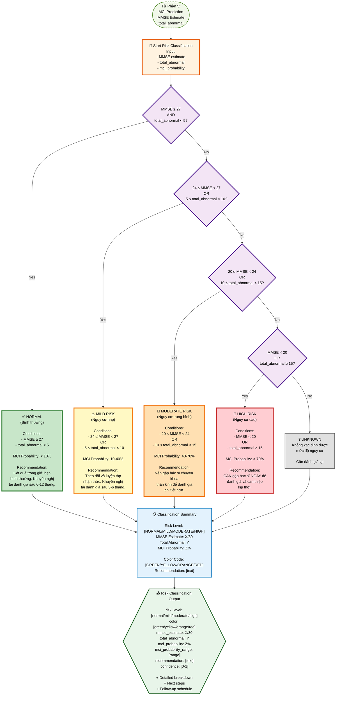

# PHẦN 6: RISK CLASSIFICATION - Final Assessment

## Flowchart Mermaid: Phân Loại Mức Độ Nguy Cơ



## Chi Tiết Logic Phân Loại

### Decision Tree Logic

```python
def classify_risk(mmse_estimate, total_abnormal, mci_probability):
    """
    Classify risk level based on MMSE and abnormality scores
    """
    # Level 1: NORMAL
    if mmse_estimate >= 27 and total_abnormal < 5:
        return {
            'risk_level': 'normal',
            'color': 'green',
            'mci_probability_range': '< 10%',
            'recommendation': 'Kết quả trong giới hạn bình thường. Khuyến nghị tái đánh giá sau 6-12 tháng.'
        }
    
    # Level 2: MILD RISK
    elif (24 <= mmse_estimate < 27) or (5 <= total_abnormal < 10):
        return {
            'risk_level': 'mild',
            'color': 'yellow',
            'mci_probability_range': '10-40%',
            'recommendation': 'Theo dõi và luyện tập nhận thức. Khuyến nghị tái đánh giá sau 3-6 tháng.'
        }
    
    # Level 3: MODERATE RISK
    elif (20 <= mmse_estimate < 24) or (10 <= total_abnormal < 15):
        return {
            'risk_level': 'moderate',
            'color': 'orange',
            'mci_probability_range': '40-70%',
            'recommendation': 'Nên gặp bác sĩ chuyên khoa thần kinh để đánh giá chi tiết hơn.'
        }
    
    # Level 4: HIGH RISK
    elif mmse_estimate < 20 or total_abnormal >= 15:
        return {
            'risk_level': 'high',
            'color': 'red',
            'mci_probability_range': '> 70%',
            'recommendation': 'CẦN gặp bác sĩ NGAY để đánh giá và can thiệp kịp thời.'
        }
    
    # Default (should not happen)
    else:
        return {
            'risk_level': 'unknown',
            'color': 'gray',
            'mci_probability_range': 'unknown',
            'recommendation': 'Cần đánh giá lại các thông số.'
        }
```

### Risk Level Details

#### 1. NORMAL (Bình thường) - GREEN

**Conditions:**
- `MMSE ≥ 27` AND `total_abnormal < 5`

**Characteristics:**
- Color: **GREEN** (#2e7d32)
- MCI Probability: **< 10%**
- Interpretation: Kết quả trong giới hạn bình thường
- Recommendation: "Kết quả trong giới hạn bình thường. Khuyến nghị tái đánh giá sau 6-12 tháng."

**Example:**
```
MMSE = 28, total_abnormal = 3
→ NORMAL (GREEN)
→ MCI Probability: 5%
→ Recommendation: Tái đánh giá sau 6-12 tháng
```

#### 2. MILD RISK (Nguy cơ nhẹ) - YELLOW

**Conditions:**
- `24 ≤ MMSE < 27` OR `5 ≤ total_abnormal < 10`

**Characteristics:**
- Color: **YELLOW** (#f57f17)
- MCI Probability: **10-40%**
- Interpretation: Có một số dấu hiệu bất thường nhẹ
- Recommendation: "Theo dõi và luyện tập nhận thức. Khuyến nghị tái đánh giá sau 3-6 tháng."

**Example:**
```
MMSE = 25, total_abnormal = 6
→ MILD RISK (YELLOW)
→ MCI Probability: 25%
→ Recommendation: Theo dõi và luyện tập nhận thức
```

#### 3. MODERATE RISK (Nguy cơ trung bình) - ORANGE

**Conditions:**
- `20 ≤ MMSE < 24` OR `10 ≤ total_abnormal < 15`

**Characteristics:**
- Color: **ORANGE** (#ef6c00)
- MCI Probability: **40-70%**
- Interpretation: Nhiều dấu hiệu bất thường, cần đánh giá chuyên sâu
- Recommendation: "Nên gặp bác sĩ chuyên khoa thần kinh để đánh giá chi tiết hơn."

**Example:**
```
MMSE = 22, total_abnormal = 12
→ MODERATE RISK (ORANGE)
→ MCI Probability: 55%
→ Recommendation: Nên gặp bác sĩ chuyên khoa
```

#### 4. HIGH RISK (Nguy cơ cao) - RED

**Conditions:**
- `MMSE < 20` OR `total_abnormal ≥ 15`

**Characteristics:**
- Color: **RED** (#c62828)
- MCI Probability: **> 70%**
- Interpretation: Dấu hiệu nghiêm trọng, cần can thiệp ngay
- Recommendation: "CẦN gặp bác sĩ NGAY để đánh giá và can thiệp kịp thời."

**Example:**
```
MMSE = 18, total_abnormal = 16
→ HIGH RISK (RED)
→ MCI Probability: 85%
→ Recommendation: CẦN gặp bác sĩ NGAY
```

## Ví Dụ Phân Loại

### Example 1: NORMAL Case

```
Input:
  MMSE estimate: 28
  total_abnormal: 3
  mci_probability: 0.05 (5%)

Decision:
  MMSE ≥ 27? → Yes (28 ≥ 27)
  total_abnormal < 5? → Yes (3 < 5)
  → Both conditions met

Result:
  Risk Level: NORMAL
  Color: GREEN
  MCI Probability Range: < 10%
  Recommendation: "Kết quả trong giới hạn bình thường. Khuyến nghị tái đánh giá sau 6-12 tháng."
```

### Example 2: MILD RISK Case

```
Input:
  MMSE estimate: 25
  total_abnormal: 7
  mci_probability: 0.30 (30%)

Decision:
  MMSE ≥ 27? → No (25 < 27)
  Check: 24 ≤ MMSE < 27? → Yes (24 ≤ 25 < 27)
  OR total_abnormal: 5 ≤ 7 < 10? → Yes

Result:
  Risk Level: MILD RISK
  Color: YELLOW
  MCI Probability Range: 10-40%
  Recommendation: "Theo dõi và luyện tập nhận thức. Khuyến nghị tái đánh giá sau 3-6 tháng."
```

### Example 3: MODERATE RISK Case

```
Input:
  MMSE estimate: 22
  total_abnormal: 12
  mci_probability: 0.60 (60%)

Decision:
  MMSE ≥ 27? → No
  24 ≤ MMSE < 27? → No (22 < 24)
  Check: 20 ≤ MMSE < 24? → Yes (20 ≤ 22 < 24)
  OR total_abnormal: 10 ≤ 12 < 15? → Yes

Result:
  Risk Level: MODERATE RISK
  Color: ORANGE
  MCI Probability Range: 40-70%
  Recommendation: "Nên gặp bác sĩ chuyên khoa thần kinh để đánh giá chi tiết hơn."
```

### Example 4: HIGH RISK Case

```
Input:
  MMSE estimate: 18
  total_abnormal: 16
  mci_probability: 0.85 (85%)

Decision:
  MMSE ≥ 27? → No
  24 ≤ MMSE < 27? → No
  20 ≤ MMSE < 24? → No (18 < 20)
  Check: MMSE < 20? → Yes (18 < 20)
  OR total_abnormal ≥ 15? → Yes (16 ≥ 15)

Result:
  Risk Level: HIGH RISK
  Color: RED
  MCI Probability Range: > 70%
  Recommendation: "CẦN gặp bác sĩ NGAY để đánh giá và can thiệp kịp thời."
```

### Example 5: Edge Case - OR Condition

```
Input:
  MMSE estimate: 26 (within normal range)
  total_abnormal: 8 (mild risk range)
  mci_probability: 0.25 (25%)

Decision:
  MMSE ≥ 27? → No (26 < 27)
  Check: 24 ≤ MMSE < 27? → Yes (24 ≤ 26 < 27)
  OR total_abnormal: 5 ≤ 8 < 10? → Yes

Result:
  Risk Level: MILD RISK (YELLOW)
  → OR condition: MMSE is in normal range but total_abnormal triggers mild risk
```

## Output Format

```json
{
  "risk_classification": {
    "risk_level": "moderate",
    "color": "orange",
    "color_hex": "#ef6c00",
    "mmse_estimate": 22.5,
    "total_abnormal": 12,
    "mci_probability": 0.55,
    "mci_probability_range": "40-70%",
    "conditions_met": {
      "mmse_range": "20 ≤ MMSE < 24",
      "abnormality_range": "10 ≤ total_abnormal < 15",
      "mmse_condition": true,
      "abnormality_condition": true
    },
    "recommendation": "Nên gặp bác sĩ chuyên khoa thần kinh để đánh giá chi tiết hơn.",
    "follow_up": {
      "schedule": "3-6 months",
      "priority": "medium",
      "actions": [
        "Gặp bác sĩ chuyên khoa thần kinh",
        "Thực hiện các test đánh giá nhận thức chi tiết",
        "Theo dõi tiến triển"
      ]
    },
    "confidence": 0.82,
    "interpretation": {
      "summary": "Nhiều dấu hiệu bất thường được phát hiện, cần đánh giá chuyên sâu",
      "details": [
        "MMSE score 22.5 cho thấy suy giảm nhận thức nhẹ đến trung bình",
        "12 abnormal features cho thấy nhiều khía cạnh bị ảnh hưởng",
        "MCI probability 55% cho thấy nguy cơ đáng kể"
      ]
    }
  }
}
```

## Color Coding Reference

| Risk Level | Color Name | Hex Code | RGB | Usage |
|------------|-----------|----------|-----|-------|
| **NORMAL** | Green | #2e7d32 | rgb(46, 125, 50) | Background, borders, text |
| **MILD RISK** | Yellow | #f57f17 | rgb(245, 127, 23) | Warning indicators |
| **MODERATE RISK** | Orange | #ef6c00 | rgb(239, 108, 0) | Alert indicators |
| **HIGH RISK** | Red | #c62828 | rgb(198, 40, 40) | Critical alerts |

## Decision Tree Visualization

```
                    Start
                     |
            [MMSE ≥ 27 AND abnormal < 5?]
                    / \
                  Yes  No
                  /     \
            NORMAL    [24 ≤ MMSE < 27 OR 5 ≤ abnormal < 10?]
           (GREEN)            / \
                            Yes  No
                            /     \
                      MILD RISK  [20 ≤ MMSE < 24 OR 10 ≤ abnormal < 15?]
                      (YELLOW)            / \
                                        Yes  No
                                        /     \
                                MODERATE RISK  [MMSE < 20 OR abnormal ≥ 15?]
                                (ORANGE)            / \
                                                  Yes  No
                                                  /     \
                                            HIGH RISK  UNKNOWN
                                            (RED)     (GRAY)
```

## Notes

1. **OR Logic**: Các điều kiện sử dụng OR, nghĩa là chỉ cần một trong hai điều kiện đúng là được phân loại vào risk level đó.

2. **Priority Order**: Decision tree được thực hiện theo thứ tự từ NORMAL → MILD → MODERATE → HIGH, dừng lại ở level đầu tiên thỏa mãn điều kiện.

3. **Color Consistency**: Màu sắc được sử dụng nhất quán trong toàn bộ hệ thống:
   - UI components
   - Reports
   - Visualizations
   - Alerts

4. **Recommendations**: Mỗi risk level có recommendation cụ thể và follow-up schedule phù hợp.

5. **Confidence Score**: Được tính dựa trên:
   - Số lượng features abnormal
   - Độ rõ ràng của các thresholds
   - Consistency giữa MMSE và abnormality scores

6. **Edge Cases**: 
   - Nếu MMSE và total_abnormal rơi vào các ranges khác nhau, ưu tiên risk level cao hơn
   - Nếu không thỏa mãn bất kỳ điều kiện nào, trả về UNKNOWN và yêu cầu đánh giá lại


