# PHẦN 7: SHAP EXPLAINABILITY & FINAL OUTPUT

## Flowchart Mermaid: Giải Thích và Kết Quả Cuối Cùng

```mermaid
flowchart TD
    %% KẾT NỐI VỚI PHẦN 6
    FromPart6([Từ Phần 6:<br/>Risk Classification<br/>+ All Features<br/>+ Predictions]):::connectNode
    
    StartSHAP["🔍 Start SHAP Explainability<br/>Input:<br/>- All features<br/>- Prediction result<br/>- Model (if available)"]:::processNode
    
    FromPart6 --> StartSHAP
    
    %% ============================================
    %% SHAP COMPUTATION
    %% ============================================
    SHAPSection["📊 SHAP COMPUTATION<br/>Feature Importance Analysis"]:::sectionNode
    
    StartSHAP --> SHAPSection
    
    CheckModel{"ML Model<br/>available?"}:::decisionNode
    
    SHAPSection --> CheckModel
    
    ComputeTreeSHAP["🌳 Compute TreeSHAP<br/>(for tree-based models)<br/><br/>Using TreeExplainer:<br/>- Fast, exact SHAP values<br/>- For RandomForest, XGBoost<br/><br/>SHAP_value =<br/>sum of feature contributions<br/>across all trees"]:::processNode
    
    ComputeKernelSHAP["🔬 Compute KernelSHAP<br/>(model-agnostic)<br/><br/>Using KernelExplainer:<br/>- Works with any model<br/>- Uses background data<br/><br/>SHAP_value =<br/>weighted average of<br/>marginal contributions"]:::processNode
    
    ComputeRuleBased["📋 Compute Rule-Based SHAP<br/>(fallback method)<br/><br/>Using threshold deviations:<br/>- Deviation from normal range<br/>- Feature importance ranking<br/><br/>contribution =<br/>|value - normal_center| /<br/>normal_range_width"]:::processNode
    
    CheckModel -->|"Yes<br/>(Tree model)"| ComputeTreeSHAP
    CheckModel -->|"Yes<br/>(Other model)"| ComputeKernelSHAP
    CheckModel -->|"No"| ComputeRuleBased
    
    %% SHAP Values Ready
    SHAPValuesReady["✅ SHAP Values Computed<br/><br/>Result:<br/>- shap_values: array<br/>- base_value: expected output<br/>- prediction: actual output<br/>- feature_contributions: dict"]:::readyNode
    
    ComputeTreeSHAP --> SHAPValuesReady
    ComputeKernelSHAP --> SHAPValuesReady
    ComputeRuleBased --> SHAPValuesReady
    
    %% ============================================
    %% FEATURE RANKING
    %% ============================================
    RankFeatures["📊 Rank Features by Importance<br/><br/>feature_importance =<br/>{feature: |SHAP_value|}<br/><br/>Sort by |SHAP_value| descending<br/><br/>Top features have highest<br/>absolute contribution"]:::processNode
    
    SHAPValuesReady --> RankFeatures
    
    %% ============================================
    %% FEATURE GROUPING
    %% ============================================
    GroupFeatures["📁 Group Features by Category<br/><br/>Categories:<br/>1. Acoustic prosody<br/>2. Acoustic temporal<br/>3. Acoustic voice quality<br/>4. Acoustic tone<br/>5. Lexical<br/>6. Syntactic<br/>7. Semantic<br/>8. Vietnamese-specific"]:::processNode
    
    RankFeatures --> GroupFeatures
    
    CalcGroupContributions["📊 Calculate Group Contributions<br/><br/>group_contribution =<br/>sum(SHAP_values in group)<br/><br/>For each category:<br/>- Sum all SHAP values<br/>- Get total contribution<br/>- Rank groups"]:::processNode
    
    GroupFeatures --> CalcGroupContributions
    
    %% ============================================
    %% FEATURE INTERPRETATION
    %% ============================================
    InterpretationSection["💭 FEATURE INTERPRETATION<br/>Classify each feature"]:::sectionNode
    
    CalcGroupContributions --> InterpretationSection
    
    LoopFeatures["🔄 FOR each feature:<br/>Check SHAP value"]:::processNode
    
    InterpretationSection --> LoopFeatures
    
    CheckSHAPPositive{"SHAP_value<br/>> 0.1?"}:::decisionNode
    
    LoopFeatures --> CheckSHAPPositive
    
    PositiveContribution["✅ Contributes to MCI Risk<br/><br/>SHAP_value > 0.1<br/><br/>Interpretation:<br/>Feature increases<br/>MCI probability<br/><br/>Example:<br/>High flattening_score<br/>→ Increases risk"]:::positiveNode
    
    CheckSHAPPositive -->|"Yes"| PositiveContribution
    
    CheckSHAPNegative{"SHAP_value<br/>< -0.1?"}:::decisionNode
    
    CheckSHAPPositive -->|"No"| CheckSHAPNegative
    
    NegativeContribution["✅ Protective Factor<br/><br/>SHAP_value < -0.1<br/><br/>Interpretation:<br/>Feature decreases<br/>MCI probability<br/><br/>Example:<br/>High idea_density<br/>→ Decreases risk"]:::negativeNode
    
    CheckSHAPNegative -->|"Yes"| NegativeContribution
    
    NeutralContribution["⚪ Neutral Contribution<br/><br/>-0.1 ≤ SHAP ≤ 0.1<br/><br/>Interpretation:<br/>Feature has minimal<br/>impact on prediction"]:::neutralNode
    
    CheckSHAPNegative -->|"No"| NeutralContribution
    
    %% ============================================
    %% TOP CONTRIBUTORS SELECTION
    %% ============================================
    SelectTop5["📊 Select Top 5 Contributors<br/><br/>Sort by |SHAP_value|<br/>Take top 5 features<br/><br/>These are the most<br/>important factors"]:::processNode
    
    PositiveContribution --> SelectTop5
    NegativeContribution --> SelectTop5
    NeutralContribution --> SelectTop5
    
    %% ============================================
    %% HUMAN-READABLE EXPLANATION
    %% ============================================
    ExplanationSection["📝 HUMAN-READABLE EXPLANATION<br/>Generate Vietnamese text"]:::sectionNode
    
    SelectTop5 --> ExplanationSection
    
    LoopTop5["🔄 FOR top 5 contributors:<br/>Generate explanation"]:::processNode
    
    ExplanationSection --> LoopTop5
    
    GetFeatureName["📝 Get Feature Name (Vietnamese)<br/><br/>From FEATURE_INTERPRETATIONS:<br/>- name_vi: Vietnamese name<br/>- name_en: English name<br/><br/>Example:<br/>'Độ phẳng thanh điệu'<br/>'Tone flattening score'"]:::processNode
    
    LoopTop5 --> GetFeatureName
    
    GetValueComparison["📊 Get Value & Comparison<br/><br/>feature_value = current value<br/>normal_range = (min, max)<br/><br/>comparison =<br/>'Cao hơn bình thường' if > max<br/>'Thấp hơn bình thường' if < min<br/>'Trong giới hạn bình thường' if in range"]:::processNode
    
    GetFeatureName --> GetValueComparison
    
    GetInterpretation["💭 Get Interpretation<br/><br/>Based on SHAP value:<br/><br/>IF SHAP > 0.1:<br/>  → 'Đóng góp vào nguy cơ MCI'<br/>IF SHAP < -0.1:<br/>  → 'Yếu tố bảo vệ'<br/><br/>From FEATURE_INTERPRETATIONS:<br/>- positive_high/low<br/>- negative_high/low"]:::processNode
    
    GetValueComparison --> GetInterpretation
    
    GetRecommendation["💡 Get Recommendation<br/><br/>From FEATURE_INTERPRETATIONS:<br/>recommendation field<br/><br/>Example:<br/>'Luyện tập từ vựng hàng ngày'<br/>'Gặp bác sĩ chuyên khoa'"]:::processNode
    
    GetInterpretation --> GetRecommendation
    
    BuildExplanation["📋 Build Explanation Text<br/><br/>Format:<br/>'Đặc trưng: {name_vi}<br/>Giá trị: {value} ({comparison})<br/>Ảnh hưởng: {interpretation}<br/>Khuyến nghị: {recommendation}'"]:::processNode
    
    GetRecommendation --> BuildExplanation
    
    ExplanationSummary["📋 Explanation Summary<br/><br/>Top 5 Risk Factors:<br/>1. {feature1}: {explanation1}<br/>2. {feature2}: {explanation2}<br/>...<br/><br/>Top Protective Factors:<br/>1. {feature1}: {explanation1}<br/>..."]:::summaryNode
    
    BuildExplanation --> ExplanationSummary
    
    %% ============================================
    %% FINAL OUTPUT JSON
    %% ============================================
    OutputSection["📤 FINAL OUTPUT<br/>Assemble JSON"]:::sectionNode
    
    ExplanationSummary --> OutputSection
    
    BuildAssessmentResult["📊 Build assessment_result<br/><br/>{<br/>  'mmse_score': X,<br/>  'mmse_estimate': Y,<br/>  'mci_probability': Z,<br/>  'risk_level': '...',<br/>  'confidence': W<br/>}"]:::processNode
    
    OutputSection --> BuildAssessmentResult
    
    BuildFeatureSummary["📊 Build feature_summary<br/><br/>{<br/>  'acoustic_feature_count': 117,<br/>  'linguistic_feature_count': 42,<br/>  'total_abnormal_features': N,<br/>  'abnormal_acoustic': A,<br/>  'abnormal_linguistic': L<br/>}"]:::processNode
    
    BuildAssessmentResult --> BuildFeatureSummary
    
    BuildDetailedAnalysis["📊 Build detailed_analysis<br/><br/>{<br/>  'acoustic': {<br/>    'flattening_score': X,<br/>    'jitter': Y,<br/>    'speaking_rate': Z<br/>  },<br/>  'linguistic': {<br/>    'ttr': X,<br/>    'idea_density': Y,<br/>    'mlu': Z<br/>  }<br/>}"]:::processNode
    
    BuildFeatureSummary --> BuildDetailedAnalysis
    
    BuildSHAPExplanation["📊 Build shap_explanation<br/><br/>{<br/>  'top_risk_factors': [<br/>    {<br/>      'feature': '...',<br/>      'shap_value': X,<br/>      'interpretation': '...'<br/>    }<br/>  ],<br/>  'top_protective_factors': [...],<br/>  'grouped_contributions': {...}<br/>}"]:::processNode
    
    BuildDetailedAnalysis --> BuildSHAPExplanation
    
    BuildRecommendations["📊 Build recommendations<br/><br/>[<br/>  'Luyện tập từ vựng hàng ngày',<br/>  'Gặp bác sĩ chuyên khoa thần kinh',<br/>  'Tái đánh giá sau 3-6 tháng'<br/>]"]:::processNode
    
    BuildSHAPExplanation --> BuildRecommendations
    
    FinalJSON["📋 Assemble Final JSON<br/><br/>{<br/>  'assessment_result': {...},<br/>  'feature_summary': {...},<br/>  'detailed_analysis': {...},<br/>  'shap_explanation': {...},<br/>  'recommendations': [...]<br/>}"]:::processNode
    
    BuildRecommendations --> FinalJSON
    
    %% ============================================
    %% FINAL OUTPUT (PARALLELOGRAM)
    %% ============================================
    OutputFinal{{"📤 FINAL OUTPUT JSON<br/><br/>Complete assessment result<br/>with all explanations<br/><br/>Ready for:<br/>- Frontend display<br/>- Report generation<br/>- Clinical review<br/>- Patient communication"}}:::outputNode
    
    FinalJSON --> OutputFinal
    
    %% STYLING
    classDef processNode fill:#fff3e0,stroke:#e65100,stroke-width:2px,color:#000
    classDef decisionNode fill:#f3e5f5,stroke:#4a148c,stroke-width:3px,color:#000
    classDef sectionNode fill:#fce4ec,stroke:#880e4f,stroke-width:3px,color:#000
    classDef positiveNode fill:#ffcdd2,stroke:#c62828,stroke-width:2px,color:#000
    classDef negativeNode fill:#c8e6c9,stroke:#2e7d32,stroke-width:2px,color:#000
    classDef neutralNode fill:#e0e0e0,stroke:#616161,stroke-width:2px,color:#000
    classDef outputNode fill:#e8f5e9,stroke:#1b5e20,stroke-width:4px,color:#000
    classDef summaryNode fill:#e3f2fd,stroke:#0277bd,stroke-width:2px,color:#000
    classDef readyNode fill:#c8e6c9,stroke:#2e7d32,stroke-width:2px,color:#000
    classDef connectNode fill:#f1f8e9,stroke:#558b2f,stroke-width:2px,color:#000,stroke-dasharray: 5 5
```



## Chi Tiết Logic Tính Toán

### 1. SHAP Computation

#### TreeSHAP (for tree-based models)
```python
import shap

# Initialize explainer
explainer = shap.TreeExplainer(model)

# Compute SHAP values
shap_values = explainer.shap_values(X_sample)

# For each feature i:
# SHAP_value[i] = sum of contributions across all trees
# where contribution = (prediction_with_feature - prediction_without_feature)
```

#### KernelSHAP (model-agnostic)
```python
# Initialize explainer with background data
explainer = shap.KernelExplainer(model.predict, background_data)

# Compute SHAP values
shap_values = explainer.shap_values(X_sample)

# SHAP_value = weighted average of marginal contributions
# Uses sampling to approximate Shapley values
```

#### Rule-Based SHAP (fallback)
```python
def compute_rule_based_shap(feature_value, normal_range):
    """
    Compute contribution based on deviation from normal range
    """
    normal_center = (normal_range[0] + normal_range[1]) / 2
    normal_width = normal_range[1] - normal_range[0]
    
    deviation = abs(feature_value - normal_center)
    contribution = deviation / normal_width
    
    # Sign: positive if outside normal range in risk direction
    if feature_value > normal_range[1] or feature_value < normal_range[0]:
        return contribution
    else:
        return -contribution  # Protective if in normal range
```

### 2. Feature Ranking

```python
# Calculate absolute importance
feature_importance = {
    feature: abs(shap_value)
    for feature, shap_value in shap_values.items()
}

# Sort by absolute value (descending)
feature_importance = dict(sorted(
    feature_importance.items(),
    key=lambda x: x[1],
    reverse=True
))

# Top 5 contributors
top_5 = list(feature_importance.keys())[:5]
```

### 3. Feature Grouping

```python
FEATURE_GROUPS = {
    'acoustic_prosody': ['f0_mean', 'f0_std', 'f0_range', ...],
    'acoustic_temporal': ['pause_duration', 'pause_rate', 'speaking_rate', ...],
    'acoustic_voice_quality': ['jitter', 'shimmer', 'HNR', ...],
    'acoustic_tone': ['flattening_score', 'tone_variability', ...],
    'lexical': ['TTR', 'MATTR', 'pronoun_ratio', ...],
    'syntactic': ['MLU', 'sentence_length', ...],
    'semantic': ['idea_density', 'coherence', ...],
    'vietnamese_specific': ['classifier_ratio', 'tense_markers', ...]
}

# Calculate group contributions
grouped_contributions = {}
for group_name, features in FEATURE_GROUPS.items():
    group_shap = sum(shap_values.get(f, 0) for f in features)
    grouped_contributions[group_name] = group_shap
```

### 4. Feature Interpretation

```python
def interpret_shap_value(shap_value):
    """
    Interpret SHAP value into human-readable text
    """
    if shap_value > 0.1:
        return {
            'type': 'risk_factor',
            'interpretation': 'Contributes to MCI risk',
            'interpretation_vi': 'Đóng góp vào nguy cơ MCI'
        }
    elif shap_value < -0.1:
        return {
            'type': 'protective_factor',
            'interpretation': 'Protective factor',
            'interpretation_vi': 'Yếu tố bảo vệ'
        }
    else:
        return {
            'type': 'neutral',
            'interpretation': 'Minimal impact',
            'interpretation_vi': 'Ảnh hưởng tối thiểu'
        }
```

### 5. Human-Readable Explanation Generation

```python
def generate_explanation(feature_name, feature_value, shap_value, normal_range):
    """
    Generate Vietnamese explanation for a feature
    """
    # Get feature metadata
    feature_meta = FEATURE_INTERPRETATIONS.get(feature_name, {})
    name_vi = feature_meta.get('name_vi', feature_name)
    
    # Value comparison
    if feature_value > normal_range[1]:
        comparison = 'Cao hơn bình thường'
    elif feature_value < normal_range[0]:
        comparison = 'Thấp hơn bình thường'
    else:
        comparison = 'Trong giới hạn bình thường'
    
    # Interpretation
    if shap_value > 0.1:
        interpretation = feature_meta.get('negative_high', 'Tăng nguy cơ MCI')
    elif shap_value < -0.1:
        interpretation = feature_meta.get('positive_high', 'Giảm nguy cơ MCI')
    else:
        interpretation = 'Ảnh hưởng tối thiểu'
    
    # Recommendation
    recommendation = feature_meta.get('recommendation', 'Theo dõi và tái đánh giá')
    
    # Build explanation text
    explanation = f"""
    Đặc trưng: {name_vi}
    Giá trị: {feature_value:.2f} ({comparison})
    Ảnh hưởng: {interpretation}
    Khuyến nghị: {recommendation}
    """
    
    return explanation
```

### 6. Final Output JSON Structure

```python
final_output = {
    "assessment_result": {
        "mmse_score": 24,
        "mmse_estimate": 23.5,
        "mci_probability": 0.45,
        "risk_level": "moderate",
        "confidence": 0.82
    },
    "feature_summary": {
        "acoustic_feature_count": 117,
        "linguistic_feature_count": 42,
        "total_abnormal_features": 8,
        "abnormal_acoustic": 5,
        "abnormal_linguistic": 3
    },
    "detailed_analysis": {
        "acoustic": {
            "flattening_score": 0.62,
            "jitter": 0.018,
            "speaking_rate": 58
        },
        "linguistic": {
            "ttr": 0.28,
            "idea_density": 2.8,
            "mlu": 4.5
        }
    },
    "shap_explanation": {
        "top_risk_factors": [
            {
                "feature": "tone_flattening_score",
                "shap_value": 0.35,
                "interpretation": "Tone flattening cao - biomarker MCI",
                "explanation_vi": "Đặc trưng: Độ phẳng thanh điệu\nGiá trị: 0.62 (Cao hơn bình thường)\nẢnh hưởng: Tăng nguy cơ MCI\nKhuyến nghị: Gặp bác sĩ chuyên khoa"
            }
        ],
        "top_protective_factors": [],
        "grouped_contributions": {
            "acoustic_tone": 0.35,
            "linguistic_semantic": 0.28,
            "acoustic_temporal": 0.15
        }
    },
    "recommendations": [
        "Luyện tập từ vựng hàng ngày",
        "Gặp bác sĩ chuyên khoa thần kinh",
        "Tái đánh giá sau 3-6 tháng"
    ]
}
```

## Ví Dụ Tính Toán

### Example 1: SHAP Computation

```
Input Features:
  - tone_flattening_score: 0.65
  - idea_density: 2.5
  - TTR: 0.28
  - jitter: 0.018

SHAP Computation (TreeSHAP):
  - tone_flattening_score: SHAP = +0.35
  - idea_density: SHAP = +0.28
  - TTR: SHAP = +0.15
  - jitter: SHAP = +0.10

Ranking:
  1. tone_flattening_score: |0.35| = 0.35
  2. idea_density: |0.28| = 0.28
  3. TTR: |0.15| = 0.15
  4. jitter: |0.10| = 0.10

Interpretation:
  - tone_flattening_score > 0.1 → Risk factor
  - idea_density > 0.1 → Risk factor
  - TTR > 0.1 → Risk factor
  - jitter ≈ 0.1 → Borderline risk factor
```

### Example 2: Human-Readable Explanation

```
Feature: tone_flattening_score
Value: 0.65
Normal Range: (0.0, 0.5)
SHAP Value: +0.35

Explanation (Vietnamese):
  Đặc trưng: Độ phẳng thanh điệu
  Giá trị: 0.65 (Cao hơn bình thường)
  Ảnh hưởng: Tăng nguy cơ MCI - biomarker đặc thù cho tiếng Việt
  Khuyến nghị: Gặp bác sĩ chuyên khoa thần kinh để đánh giá chi tiết
```

### Example 3: Grouped Contributions

```
Group Contributions:
  - acoustic_tone: +0.35 (tone_flattening_score)
  - linguistic_semantic: +0.28 (idea_density)
  - linguistic_lexical: +0.15 (TTR)
  - acoustic_voice_quality: +0.10 (jitter)

Interpretation:
  Acoustic tone features contribute most to risk (35%)
  Semantic features are second most important (28%)
  Combined: 63% of risk explained by tone + semantic
```

## Output Format

```json
{
  "assessment_result": {
    "mmse_score": 24,
    "mmse_estimate": 23.5,
    "mci_probability": 0.45,
    "risk_level": "moderate",
    "confidence": 0.82,
    "timestamp": "2024-01-15T10:30:00Z"
  },
  "feature_summary": {
    "acoustic_feature_count": 117,
    "linguistic_feature_count": 42,
    "total_abnormal_features": 8,
    "abnormal_acoustic": 5,
    "abnormal_linguistic": 3,
    "total_features": 159
  },
  "detailed_analysis": {
    "acoustic": {
      "flattening_score": 0.62,
      "jitter": 0.018,
      "shimmer": 0.035,
      "HNR": 11.5,
      "pause_duration": 0.9,
      "speaking_rate": 58
    },
    "linguistic": {
      "ttr": 0.28,
      "mattr": 0.32,
      "pronoun_ratio": 0.18,
      "idea_density": 2.8,
      "semantic_coherence": 0.45,
      "mlu": 4.5
    }
  },
  "shap_explanation": {
    "top_risk_factors": [
      {
        "feature": "tone_flattening_score",
        "shap_value": 0.35,
        "absolute_importance": 0.35,
        "rank": 1,
        "group": "acoustic_tone",
        "interpretation": "Đóng góp vào nguy cơ MCI",
        "explanation_vi": "Đặc trưng: Độ phẳng thanh điệu\nGiá trị: 0.62 (Cao hơn bình thường)\nẢnh hưởng: Tăng nguy cơ MCI\nKhuyến nghị: Gặp bác sĩ chuyên khoa",
        "value": 0.62,
        "normal_range": [0.0, 0.5],
        "comparison": "Cao hơn bình thường"
      },
      {
        "feature": "idea_density",
        "shap_value": 0.28,
        "absolute_importance": 0.28,
        "rank": 2,
        "group": "linguistic_semantic",
        "interpretation": "Đóng góp vào nguy cơ MCI",
        "explanation_vi": "Đặc trưng: Mật độ ý tưởng\nGiá trị: 2.8 (Thấp hơn bình thường)\nẢnh hưởng: Tăng nguy cơ MCI\nKhuyến nghị: Luyện tập từ vựng hàng ngày",
        "value": 2.8,
        "normal_range": [3.0, 10.0],
        "comparison": "Thấp hơn bình thường"
      }
    ],
    "top_protective_factors": [
      {
        "feature": "semantic_coherence",
        "shap_value": -0.12,
        "absolute_importance": 0.12,
        "rank": 5,
        "group": "linguistic_semantic",
        "interpretation": "Yếu tố bảo vệ",
        "explanation_vi": "Đặc trưng: Tính mạch lạc ngữ nghĩa\nGiá trị: 0.45 (Thấp hơn bình thường)\nẢnh hưởng: Yếu tố bảo vệ\nKhuyến nghị: Luyện tập kể chuyện",
        "value": 0.45,
        "normal_range": [0.5, 1.0],
        "comparison": "Thấp hơn bình thường"
      }
    ],
    "grouped_contributions": {
      "acoustic_tone": 0.35,
      "linguistic_semantic": 0.16,
      "linguistic_lexical": 0.15,
      "acoustic_voice_quality": 0.10,
      "acoustic_temporal": 0.08,
      "linguistic_syntactic": 0.05
    },
    "total_contribution": 0.89
  },
  "recommendations": [
    "Luyện tập từ vựng hàng ngày",
    "Gặp bác sĩ chuyên khoa thần kinh để đánh giá chi tiết",
    "Tái đánh giá sau 3-6 tháng",
    "Thực hành đọc to với cảm xúc để cải thiện thanh điệu"
  ],
  "metadata": {
    "assessment_id": "assess_12345",
    "session_id": "session_67890",
    "timestamp": "2024-01-15T10:30:00Z",
    "version": "1.0",
    "model_version": "v2.1"
  }
}
```

## Notes

1. **SHAP Methods**:
   - TreeSHAP: Fast, exact for tree models (RandomForest, XGBoost)
   - KernelSHAP: Model-agnostic, works with any model
   - Rule-Based: Fallback when no ML model available

2. **Feature Grouping**: Features được nhóm theo category để dễ interpret và visualize.

3. **Thresholds**:
   - SHAP > 0.1: Risk factor
   - SHAP < -0.1: Protective factor
   - -0.1 ≤ SHAP ≤ 0.1: Neutral

4. **Human-Readable Explanations**: Tất cả explanations được generate bằng tiếng Việt để dễ hiểu cho người dùng và người chăm sóc.

5. **Final Output**: JSON structure đầy đủ với tất cả thông tin cần thiết cho:
   - Frontend display
   - Report generation
   - Clinical review
   - Patient communication

6. **Extensibility**: Có thể thêm nhiều features vào SHAP analysis, và có thể customize explanations cho từng use case.


